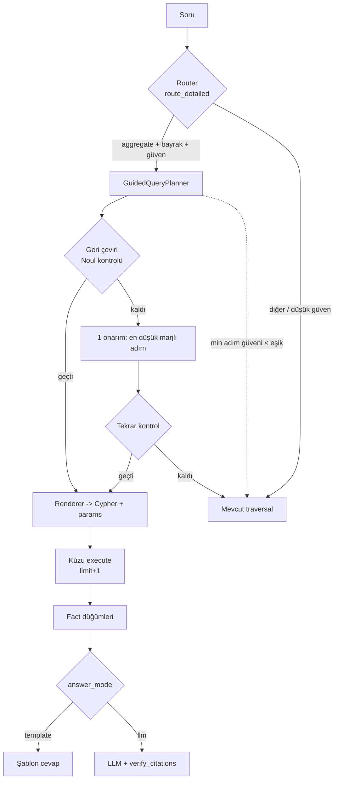
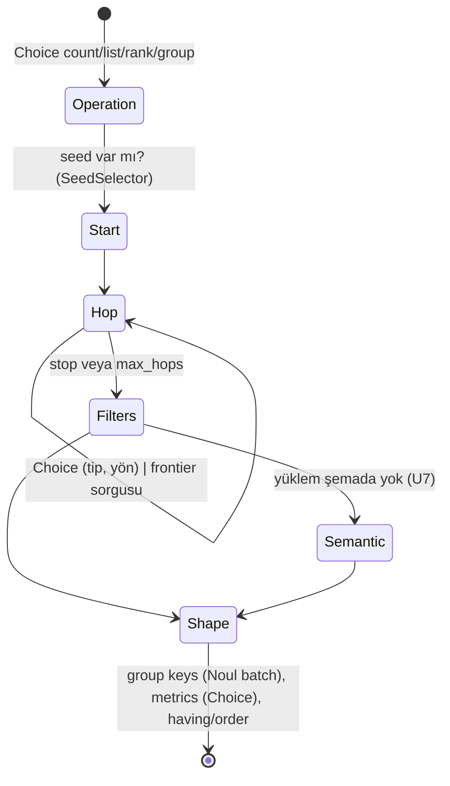
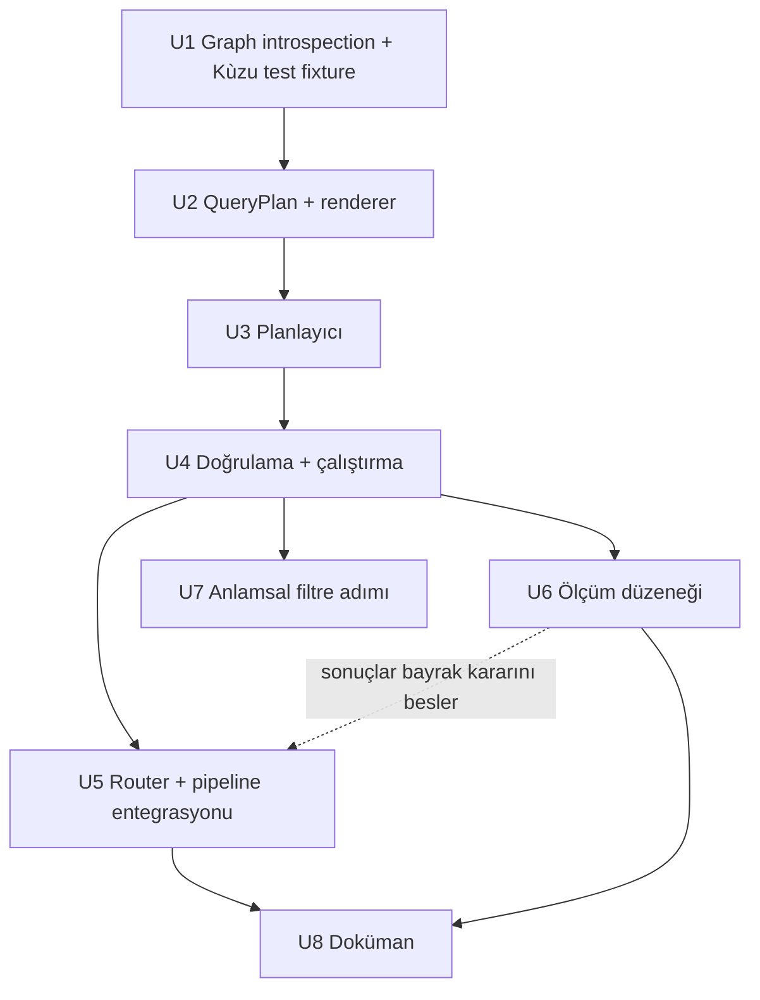

# Rehberli Sorgu Planlayıcı (Jev yöntemiyle graph üzerinde Cypher kurma) - Plan

**Target repo:** laya-jev-GraphRAG. Kod `graphrag_neo4j_laya/` altında; tüm yollar repo köküne göredir.

---

## Goal Capsule

- **Objective:** Agregasyon ve filtre gerektiren soruları, adayları koddan gelen ve Laya'nın seçtiği adım adım bir sorgu planıyla cevaplamak. Plan parametreli Cypher'a çevrilip Kùzu'da çalıştırılır.
- **Authority:** Bu plan > `graphrag_neo4j_laya/AGGREGATION_METHODS.md` (arka plan) > mevcut kod konvansiyonları.
- **Execution profile:** Python, pytest, CPU üzerinde Laya. İlk kez gerçek Kùzu destekli testler eklenir.
- **Stop conditions:** Kùzu 0.11.3'te plan şekillerinden biri için çözümsüz bir motor hatası çıkarsa; ya da ölçüm düzeneği, Laya'nın hop veya yön seçiminde %60'ın altında kaldığını gösterirse. İki durumda da entegrasyon (U5) öncesinde durup kullanıcıya dönülür.
- **Tail ownership:** Route bayrağı varsayılan olarak kapalı kalır. Bayrağı açma kararı, U6 ölçüm sonuçlarıyla kullanıcıya aittir.

---

## Product Contract

### Summary

Laya'nın graph üzerinde gezinerek tipli bir sorgu planı kurduğu, kodun bu planı parametreli Cypher'a çevirip Kùzu'da çalıştırdığı yeni bir `aggregate` rotası eklenir. Rota bir bayrak arkasında, kapalı başlar. Önce etiketli bir soru setiyle adım bazında ölçülür. Serbest text-to-Cypher, Kùzu dışındaki backend'ler ve şema değişiklikleri kapsam dışıdır.

### Problem Frame

Pipeline'ın her aşaması context'i bilerek daraltıyor: 2–3 seed, sadece giden kenarlar, skor eşiği, rerank ile budama, ilk 10 düğüm. Bu yüzden "kaç tane", "ilişki tipine göre", "en çok" gibi sorularda LLM eksik bir alt küme üzerinde sayım yapıyor. Citation kontrolü ise eksik ama doğru iddiaları `VERIFIED` geçiriyor (`graphrag_neo4j_laya/AGGREGATION_METHODS.md` §1).

Gelişmiş agregasyon ve filtre işlemleri ancak Cypher ile ifade edilebiliyor. Ama yerel 8B model serbest Cypher yazmakta yetersiz ve üretilen metin enjeksiyon riski taşıyor. Önceki analizdeki şablon yaklaşımı (`aggregate_edges`, `group_edges`) güvenli ama sabit şekillere bağlı: çok adımlı yol filtrelerini ifade edemiyor ve her yeni kalıp yeni kod gerektiriyor.

Laya bir sınıflandırıcı. Metin veya sayı üretemez, ama kodun sunduğu adaylardan seçim yapabilir. Pangu ("Don't Generate, Discriminate") KBQA'da tam bu ayrımla, küçük bir modelle üst seviye sonuç almış: sembolik bir ajan geçerli planlar üretiyor, model sadece aralarında ayırt ediyor.

### Requirements

**Plan kurma**

- R1. Planlayıcı başlangıç kümesini seçer: soru bir varlık adı içeriyorsa `SeedSelector`'dan gelen varlık, içermiyorsa tüm `Entity` düğümleri.
- R2. Her hop adımında adaylar, mevcut frontier'da gerçekten var olan `(ilişki tipi, yön)` çiftleri ve "dur" seçeneğidir. Laya bunlardan birini seçer. En fazla 3 hop yapılır.
- R3. Filtre adayları şemada var olan alanlardan gelir: `name`, `pagerank`, `communityId`, `type`. Filtre değerlerini kod üretir: sayılar sorudan regex ile, isimler seed'lerden, kategorik değerler DB'deki `DISTINCT` değerlerden. Laya sadece seçer.
- R4. İşlem (`count`, `list`, `rank`, `group`), gruplama anahtarları, metrikler (`count`, `count_distinct`, `sum`, `avg`, `min`, `max`), `having`, sıralama ve limit plan içinde ifade edilebilir.
- R5. Her adımın seçimi, olasılığı ve ikinci en iyi aday bir trace'e yazılır. Planın güveni, en zayıf adımın olasılığıdır.

**Güvenlik ve doğruluk**

- R6. Cypher'ı sadece kod render eder. Tanımlayıcılar (property adları, operatörler, fonksiyonlar) sabit whitelist'lerden gelir. Tüm değerler parametre olarak geçer. Kullanıcı metni sorguya asla girmez.
- R7. Plan çalıştırılmadan önce doğal dile geri çevrilir ve Laya ile soruya karşı kontrol edilir.
- R8. Sonuç, `limit` sınırına ulaşırsa kesilmiş olarak işaretlenir. Fact metni bu durumda tam liste iddiasında bulunmaz.

**Entegrasyon**

- R9. Router'a bir `aggregate` niyeti eklenir. Bu niyet yalnızca bayrak açıkken ve güven eşiğin üstündeyken kullanılır; aksi halde soru mevcut rotalara gider.
- R10. Agregasyon sonucu, fact düğümleri olarak mevcut sentez ve `verify_citations` akışına girer. Rerank ve hallucination gate bu yolda atlanır. Varsayılan cevap modu LLM'siz şablondur.
- R11. Router'ı atlayan açık bir API sunulur. Bununla bir soru doğrudan planlayıcıya verilebilir; ölçüm ve analitik kullanım için gereklidir.
- R12. Planlayıcı hiçbir durumda pipeline'ı çökertmez. DB veya model hatasında mevcut rotaya döner ve durumu loglar.

**Ölçüm**

- R13. Etiketli bir soru seti ve ölçüm düzeneği adım bazında doğruluk raporlar: işlem, başlangıç, hop, yön, dur, filtre, metrik, tüm planın tam eşleşmesi ve yanlış yönlendirme oranı.

**Anlamsal filtre**

- R14. Plan, şemada karşılığı olmayan bir yüklem ("teori mi?") için Yöntem 5 tarzı bir `semantic_filter` adımı içerebilir. Sonuç kesin ve belirsiz kümeler olarak aralık halinde raporlanır.

### Acceptance Examples

- AE1. **Given** quickstart graph'ı, **when** "Calculus'u kaç kişi geliştirdi?" sorulursa, **then** plan `Calculus` düğümünden başlar, gelen yönde bir hop seçer ve `count_distinct` hesaplar; cevap o ilişki tipi altında graph'ta kayıtlı kişi sayısını verir. Quickstart'taki hizalama hatası yüzünden Newton'un kenarı `BORN_IN` altında durduğu için beklenen sonuç 1 kişidir (Leibniz). Doğrulama setinde bu beklenti elle yazılır.
- AE2. **Given** quickstart graph'ı, **when** "Her ilişki tipinde kaç kenar var?" sorulursa, **then** plan tüm düğümlerden başlar, 1 hop yapar, `relation` anahtarına göre gruplar ve `count` hesaplar. Sonuç `AGGREGATION_METHODS.md`'deki roll-up değerleriyle aynıdır (`BORN_IN=3`, `DISCOVERED=2`, diğerleri 1).
- AE3. **Given** quickstart graph'ı, **when** "Einstein'ın doğduğu yerde doğan başka kim var?" sorulursa, **then** plan iki hop kurar (`BORN_IN` giden, sonra `BORN_IN` gelen) ve Einstein'ı sonuçtan çıkarır. Graph'ta böyle biri olmadığı için sonuç boş küme olur ve cevap "graph'ta kayıtlı kimse yok" der. Boş sonuç hata sayılmaz.
- AE4. **Given** bayrak açık, **when** "Newton ile Einstein nasıl bağlantılı?" sorulursa, **then** router `aggregate` seçmez, ya da düşük güvenle seçer ve soru `multi_hop` rotasına düşer.
- AE5. **Given** herhangi bir soru, **when** planın en zayıf adımı `aggregate_min_confidence` eşiğinin altında kalırsa, **then** planlayıcı sonuç döndürmez ve pipeline eski rotayla devam eder.

### Scope Boundaries

- Serbest text-to-Cypher ve LLM ile yedek sorgu üretimi kapsam dışı.
- Kùzu dışındaki backend'ler kapsam dışı. Render katmanı bir dialect sınırıyla yazılır, böylece ileride eklenebilir.
- Şema değişiklikleri kapsam dışı: tarih property'si, `RELATES_TO.support`, `entity_type`. Plan bu alanlar eklendiğinde whitelist'e girebilecek şekilde tasarlanır.
- Değişken uzunluklu yollar (`*1..3`) kullanılmaz. Hop'lar tek tek açık yazılır.
- Community özetleri (Yöntem 4) kapsam dışı.

#### Deferred to Follow-Up Work

- Neo4j, Memgraph ve AGE dialect'leri (Neo4j'de ilişki tipi tanımlayıcı olduğu için whitelist ile f-string gerekir).
- `kuzu` bağımlılığını `>=0.11,<0.12` aralığına sabitlemek, ya da bakımı süren bir çatala (Vela-Engineering/kuzu) geçişi değerlendirmek.
- `AblationModel`'e `noul` ve `choice` eklemek.
- Rota bayrağını varsayılan olarak açmak. Bu karar U6 sonuçlarına bağlı.

---

## Planning Contract

### Key Technical Decisions

- KTD1. **Plan metin değil, tipli bir ağaçtır.** Planlayıcı dataclass'lardan oluşan bir `QueryPlan` kurar; Cypher'ı yalnızca bir renderer üretir. Gerekçe: sözdizimi hatası imkânsız hale gelir, enjeksiyon yüzeyi whitelist'lerle sınırlanır, plan test edilebilir ve karşılaştırılabilir bir değer olur (Pangu'daki "geçerli-by-construction" ilkesi).
- KTD2. **Hop adayları canlı veriden gelir.** Adaylar şemadan değil, frontier üzerinde çalışan bir `DISTINCT r.type` + yön sorgusundan çıkarılır. Gerekçe: Neo4j'nin Text2Cypher analizinde yön ve yanlış ilişki tipi hataları başlıca başarısızlık nedenleri. Sadece var olan hamleleri sunmak bu sınıfı yapısal olarak kapatır. Kùzu'da `type` bir string property olduğu için değer parametre olarak geçer; tanımlayıcı whitelist'i gerekmez.
- KTD3. **Açıklamalar ilişki tipinin anlamını taşır.** Hop seçeneklerinin açıklamaları, veri setinin `schema` sözlüğünden (`examples/data/science_history.json`) veya `graphrag_neo4j_laya/graphrag/ingestion/ontology_aligner.py` içindeki `SCHEMA_EDGES`'ten gelir. Tanımsız bir tip için yedek açıklama tipin adıdır. Ayrıca yöne göre "X does it" veya "something does it to X" diye ifade edilir.
- KTD4. **Seçim greedy'dir, tek bir onarım adımı vardır.** Her adımda en olası seçenek alınır, ikinci aday trace'e yazılır. Geri çeviri kontrolü (R7) başarısız olursa, farkı en küçük adım ikinci adayla değiştirilerek tek bir alternatif plan denenir. Gerekçe: Pangu beam search kullanıyor, ama küçük graph ve ~33 ms'lik çağrı maliyetinde tek onarım basit kalıyor ve hatayı çoğunlukla yakalıyor. Beam genişliği ölçüm sonrasına bırakılır.
- KTD5. **Plan güveni en zayıf adımdır, çarpım değil.** Repodaki "en zayıf iddia karar verir" deseniyle tutarlı. Laya olasılıkları kalibre olmadığı için çarpım, uzun planları yapay olarak cezalandırır.
- KTD6. **Aynı state'i paylaşan sorular tek çağrıda sorulur.** Gruplama anahtarı ve filtre alanı soruları (her aday için bir `Noul`) `ask_batch` ile tek seferde gönderilir. Laya'da bu tek forward pass, Jev'de tek HTTP çağrısı demek. Her adımın context'i dar tutulur: soru + kısmi planın doğal dil hali. Gerekçe: dokümanlar, Laya'nın ilgisiz state'e duyarlı olduğunu söylüyor.
- KTD7. **Sayım semantiği varsayılan olarak farklı son düğümlerdir.** Açık hop'lar aynı düğüme birden fazla yoldan ulaşabilir. `count` işlemi son değişken üzerinde `count_distinct` olarak render edilir; kenar sayısı ayrı bir metrik olarak (`edge_count`) seçilir. Kùzu'daki DISTINCT sıralama hatası nedeniyle renderer DISTINCT agregasyonları her zaman `RETURN` listesinin sonuna koyar.
- KTD8. **Kesilme `limit + 1` ile anlaşılır.** Renderer `limit + 1` satır ister. Fazla satır geldiyse sonuç kesilmiş olarak işaretlenir ve fazlası atılır.
- KTD9. **Boş sonuç geçerlidir.** Execution-guided decoding literatürü, boş sonuçları budamanın doğru "sıfır" cevaplarını da sildiğini gösteriyor. Boş sonuç, "graph'ta kayıtlı yok" diye raporlanır.
- KTD10. **Router arayüzü geriye uyumlu genişler.** `route()` enum döndürmeye devam eder. Yanına güveni de döndüren bir `route_detailed()` eklenir. Pipeline, güven eşiği kontrolü için bunu kullanır.
- KTD11. **Varsayılan cevap modu LLM'siz şablondur.** Ondalık metrikleri Laya ile iddia bazında doğrulamak güvenilmez, üstelik diller arası eşleştirme sorunu var. `llm` modu bir ayarla açılır; o zaman `verify_citations`, satır başına oluşturulan fact düğümlerine karşı çalışır.

### High-Level Technical Design

Bu diyagramlar yön gösterir; bağlayıcı bir implementasyon spesifikasyonu değildir.

**Akış**



**Planlayıcı durum makinesi**



**Plan dilbilgisi (taslak)**

```text
QueryPlan  := start hops* filters* [semantic_filter] return
start      := ANCHOR(name) | ALL
hop        := (rel_type, "out" | "in")            # yalnız frontier'da var olanlar
filter     := (var, field ∈ FILTER_FIELDS, op ∈ FILTER_OPS, value from candidates)
return     := op ∈ {count, list, rank, group}
              keys ⊆ GROUP_KEYS(var)  metrics ⊆ METRIC_OPS × METRIC_FIELDS(var)
              having* order* limit
var        := v0 (başlangıç) … vN (son hop)
```

**Adım başına Laya çağrı bütçesi (tahmini)**

| Adım | Primitive | Çağrı |
| --- | --- | --- |
| İşlem | `Choice` (4) | 1 |
| Hop (her biri) | `Choice` (frontier adayları + stop) | ≤ 3 |
| Filtre alanları | `ask_batch` içinde alan başına `Noul` | 1 batch |
| Filtre operatörü + değer | `Choice` | filtre başına 2 |
| Gruplama anahtarları | `ask_batch` içinde anahtar başına `Noul` | 1 batch |
| Metrikler | `Choice` (op), `Choice` (alan) | 2 |
| Geri çeviri kontrolü | `Noul` | 1–2 |

Tipik bir soru ~8–12 çağrı yapar; 33 ms/çağrı ile ~0,3–0,4 s. Frontier sorguları da eklenince 1 saniyenin altında kalması beklenir.

### Assumptions

- Laya, Türkçe bir sorudaki niyeti İngilizce seçenek açıklamalarıyla eşleştirebilir. Bu ölçülmedi. U6'daki Türkçe alt küme bunu ölçer. Sonuç zayıf çıkarsa, seçenek açıklamalarına Türkçe karşılıklar eklemek ilk düzeltmedir.
- Kùzu 0.11.3, açık hop'lu `MATCH`, `WITH ... WHERE` ve `count(DISTINCT)` kombinasyonlarını U2'deki test şekilleri için doğru çalıştırır. Bilinen WITH + DISTINCT hataları (#6049, #5040) U2 entegrasyon testleriyle erken yakalanır.

### Sequencing



U6, U5'ten önce veya onunla paralel yapılabilir. Goal Capsule'daki stop condition U6 sonucuna bağlıdır.

---

## Implementation Units

### U1. Graph introspection metotları ve Kùzu test fixture'ı

- **Goal:** Planlayıcının ihtiyaç duyduğu canlı aday sorgularını ve salt-okur sorgu çalıştırmayı Kùzu istemcisine eklemek. İlk gerçek DB destekli test fixture'ını kurmak.
- **Requirements:** R2, R3, R6, R12
- **Dependencies:** yok
- **Files:**
  - `graphrag_neo4j_laya/graphrag/graph/base.py` (değiştir)
  - `graphrag_neo4j_laya/graphrag/graph/kuzu_client.py` (değiştir)
  - `graphrag_neo4j_laya/tests/conftest.py` (yeni)
  - `graphrag_neo4j_laya/tests/test_kuzu_introspection.py` (yeni)
- **Approach:**
  - `BaseGraphClient`'a abstract olmayan, varsayılanda `NotImplementedError` fırlatan üç metot eklenir. Böylece diğer backend'ler bozulmaz:
    - Frontier hamleleri: bir isim kümesi (veya "tümü") için `(type, direction, edge_count, distinct_neighbor_count)` listesi.
    - Kategorik değer adayları: bir alan için `DISTINCT` değerler, bir üst sınırla.
    - Salt-okur parametreli sorgu çalıştırma: satırları sütun adlarıyla sözlük olarak döndürür.
  - Salt-okur çalıştırıcı, kendisine gelen metnin sadece renderer'dan geldiğini varsayar. Yine de ikinci bir savunma hattı olarak yazma anahtar kelimelerini (`CREATE`, `SET`, `DELETE`, `MERGE`, `DROP`) reddeder.
  - `conftest.py`, geçici bir dizinde bir `KuzuClient` açar. Quickstart verisinden, `AGGREGATION_METHODS.md`'deki tabloyu üreten 12 kenarlı graph'ı Laya kullanmadan doğrudan `upsert_edge` ile kurar; hizalama hataları dahil. Pagerank ve community NetworkX ile hesaplanır.
- **Patterns to follow:** `kuzu_client.py`'deki `conn.execute(query, parameters=...)` kullanımı; `base.py`'deki `get_node_text` varsayılan metot deseni.
- **Test scenarios:**
  - Anchor `Calculus` için frontier: yalnız gelen yönde `DEVELOPED` (1 kenar, Leibniz) ve `BORN_IN` (1 kenar, Newton) döner. Giden yönde hiçbir şey dönmez.
  - Anchor `Isaac Newton`: giden `AUTHORED`, `BORN_IN` (2), `LEADS` döner.
  - "Tümü" frontier'ı: `AGGREGATION_METHODS.md`'deki roll-up ile aynı tip dağılımı.
  - Var olmayan bir anchor boş liste döndürür, hata vermez.
  - `communityId` için `DISTINCT` değer adayları `[0]`; kenarı budanmış `Banana Bread`'in `NULL` değeri listede yer almaz.
  - Salt-okur çalıştırıcı `CREATE` içeren bir metni `ValueError` ile reddeder.
  - Parametreli bir `MATCH` doğru sütun adlarıyla sözlük satırları döndürür.
- **Verification:** Fixture graph'ı testlerde kurulur ve frontier sonuçları dokümandaki sayılarla eşleşir.

### U2. QueryPlan modeli ve Cypher renderer

- **Goal:** Tipli plan ağacını ve onu parametreli Kùzu Cypher'ına çeviren saf fonksiyonu tanımlamak.
- **Requirements:** R4, R6, R8
- **Dependencies:** U1
- **Files:**
  - `graphrag_neo4j_laya/graphrag/retrieval/planner/__init__.py` (yeni)
  - `graphrag_neo4j_laya/graphrag/retrieval/planner/plan.py` (yeni)
  - `graphrag_neo4j_laya/graphrag/retrieval/planner/render_kuzu.py` (yeni)
  - `graphrag_neo4j_laya/tests/test_plan_render.py` (yeni)
- **Approach:**
  - Plan dataclass'ları: start, hop listesi, filtreler, isteğe bağlı anlamsal filtre, dönüş şekli (işlem, anahtarlar, metrikler, having, order, limit).
  - Whitelist sözlükleri tek bir yerde tutulur. Değişken başına geçerli alanlar: `name`, `pagerank`, `communityId`, ve kenarlar için `type`.
  - Plan ayrıca doğal dile çevrilebilir (şablonla), U4'teki geri çeviri kontrolü için.
  - Renderer arayüzü dialect'ten bağımsız bir fonksiyon imzası sunar; Kùzu implementasyonu ayrı bir modülde durur.
  - Kurallar: DISTINCT agregasyonlar sonda, `having` için `WITH … WHERE`, `limit + 1`, tüm değerler `$p0…$pN` olarak.
  - Geçersiz planlar (whitelist dışı alan, var olmayan değişken, `group` işlemi ama anahtar yok) render öncesinde doğrulanıp reddedilir.
- **Technical design:** Bkz. yukarıdaki plan dilbilgisi. Renderer, her hop için `(v{i})-[e{i}:RELATES_TO]->(v{i+1})` veya ters yönde `<-` üretir; ilişki tipini `e{i}.type = $p` filtresiyle bağlar.
- **Patterns to follow:** `graphrag_neo4j_laya/AGGREGATION_METHODS.md` içindeki "Önerilen genişletme: `group_edges`" bölümünün whitelist yapısı.
- **Test scenarios:**
  - AE1 planı beklenen Cypher'a ve parametrelere render olur; sorgu metninde kullanıcı değeri geçmez.
  - AE2 planı (tüm düğümler, 1 hop, `relation` ile grupla, `count`) çalışır ve `BORN_IN=3`, `DISCOVERED=2` sonucunu verir (fixture ile entegrasyon).
  - Çok seviyeli örnek (community × subject × relation, 6 metrik) çalışır ve dokümandaki 11 satırlık tabloyla birebir eşleşir. Bu, DISTINCT sıralama düzeltmesini de doğrular.
  - `having` (`count_distinct target > 1`) yalnızca Newton / `BORN_IN` satırını döndürür.
  - AE3 iki hop'lu planı çalışır, `name != $p` filtresiyle boş sonuç döndürür.
  - `limit=2` ve 3 satırlık bir sonuçta, sonuç kesilmiş olarak işaretlenir ve 2 satır döner.
  - Whitelist dışı bir alan (`description`), bilinmeyen bir operatör veya tanımlanmamış bir değişken referansı render öncesinde reddedilir.
  - Tırnak ve Cypher anahtar kelimesi içeren bir filtre değeri (`"x' OR 1=1 //"`) yalnızca parametre olarak geçer ve sonuç boştur.
  - Geri çeviri metni AE1 için "entities that have DEVELOPED to Calculus, counted distinct" gibi, tipi, yönü ve işlemi içeren bir cümledir.
- **Verification:** Renderer testleri Kùzu fixture'ı üzerinde çalışır ve `AGGREGATION_METHODS.md`'deki bütün sayılar yeniden üretilir.

### U3. Rehberli sorgu planlayıcı

- **Goal:** Soruyu, Laya'nın koddan gelen adaylar arasından adım adım seçim yaptığı bir `QueryPlan`'e çevirmek ve her adımı trace'e yazmak.
- **Requirements:** R1, R2, R3, R4, R5
- **Dependencies:** U1, U2
- **Files:**
  - `graphrag_neo4j_laya/graphrag/retrieval/planner/planner.py` (yeni)
  - `graphrag_neo4j_laya/graphrag/retrieval/planner/candidates.py` (yeni)
  - `graphrag_neo4j_laya/config/settings.py` (değiştir)
  - `graphrag_neo4j_laya/tests/test_planner.py` (yeni)
- **Approach:**
  - Adımlar sırasıyla: işlem → başlangıç (seed varsa anchor) → hop döngüsü (frontier sorgusu + `Choice`, "dur" dahil) → filtreler → dönüş şekli. Anlamsal filtre adımı U7'de eklenir.
  - `candidates.py` sorudan kod ile değer adayları çıkarır: sayılar (tam sayı, ondalık, "0.1" / "0,1"), seed isimleri, DB `DISTINCT` değerleri. Laya'ya hiçbir zaman değer ürettirilmez.
  - Frontier boşsa veya `max_hops` dolduysa "dur" zorlanır.
  - Adım context'i: `"User question: … \nPlan so far: <kısmi planın doğal dil hali>"`.
  - Çoklu `Noul` soruları `ask_batch` ile gönderilir.
  - Çıktı: plan, trace (adım, seçenekler, seçilen, olasılık, ikinci aday, marj) ve plan güveni (en zayıf adım).
  - Ayarlar: `aggregate_route_enabled` (False), `aggregate_min_confidence`, `aggregate_max_hops` (3), `aggregate_row_limit` (200), `aggregate_answer_mode` ("template").
  - Decision model her fonksiyonda `get_decision_model()` ile alınır, böylece testlerde mock'lanabilir.
- **Execution note:** Önce AE1 ve AE2 için, sırayla yanıt veren scripted bir mock decision model ile uçtan uca planlayıcı testi yazılsın; adım mantığı bu testler üzerinden şekillensin.
- **Patterns to follow:** `graphrag_neo4j_laya/graphrag/retrieval/router.py`'deki `choice_detailed` kullanımı; `ontology_aligner.py`'deki düşük güvende yedek seçeneğe dönüş; `tests/test_laya.py`'deki `patch("<module>.get_decision_model")` deseni.
- **Test scenarios:**
  - AE1: scripted seçimlerle plan `Calculus`'tan başlar, gelen yönde `DEVELOPED` hop'u yapar ve `count_distinct` metriğini taşır.
  - AE2: seed yokken başlangıç "tümü" olur; `relation` anahtarı Noul batch'inde seçilen tek anahtardır.
  - AE3: iki hop kurulur, Einstein'ı dışlayan `name !=` filtresi eklenir.
  - Frontier boşken planlayıcı "dur" seçeneğini Laya'ya sormadan zorlar.
  - `max_hops=3` dolduğunda dördüncü hop sorulmaz.
  - Sorudaki "0,1" ve "0.1" ifadeleri aynı sayısal adaya dönüşür; soruda sayı yoksa sayısal filtre adımı atlanır.
  - Trace her adım için seçilen, olasılık ve ikinci adayı içerir; plan güveni trace'teki en düşük olasılığa eşittir.
  - Decision model bir adımda istisna fırlatırsa planlayıcı `None` döndürür ve bir uyarı loglar; istisna dışarı sızmaz.
  - `ask_batch` gruplama anahtarı adımında tek bir çağrı olarak kullanılır (mock üzerindeki çağrı sayısı).
- **Verification:** Scripted mock ile tüm AE planları üretilir. Hatalar planlayıcının dışına sızmaz.

### U4. Plan doğrulama, onarım ve çalıştırma

- **Goal:** Planı soruya karşı doğrulamak, gerekirse tek bir onarım denemek, çalıştırmak ve sonucu fact düğümlerine çevirmek.
- **Requirements:** R5, R7, R8, R10, R12
- **Dependencies:** U2, U3
- **Files:**
  - `graphrag_neo4j_laya/graphrag/retrieval/planner/executor.py` (yeni)
  - `graphrag_neo4j_laya/graphrag/retrieval/planner/facts.py` (yeni)
  - `graphrag_neo4j_laya/tests/test_planner_executor.py` (yeni)
- **Approach:**
  - Geri çeviri kontrolü: `Noul("User question: … / Query meaning: …", "Does this query answer the question?")`. Eşik altında kalırsa, trace'te marjı en küçük adım ikinci adayla değiştirilir, plan yeniden kurulur ve bir kez daha kontrol edilir.
  - Çalıştırma U1'deki salt-okur metotla yapılır. DB hatasında `None` döner.
  - Fact oluşturma: işleme göre tek bir özet fact (`count`, `list`, `rank`) veya satır başına bir fact (`group`). Kesilme ve boş sonuç metne yansır ("first N of at least N+1", "no matching entities recorded in the graph").
  - Şablon cevap üreticisi, fact'lerden deterministik bir cevap üretir.
  - Sonuç nesnesi: plan, Cypher, parametreler, satırlar, kesilme bayrağı, güven, trace.
- **Patterns to follow:** `graphrag_neo4j_laya/graphrag/pipeline.py`'deki node dict şekli (`name`, `text`, `score`); `jev.py`'deki "asla dışarı fırlatma" deseni.
- **Test scenarios:**
  - Geri çeviri kontrolü geçen bir plan tek bir `Noul` çağrısıyla çalıştırılır.
  - Kontrol kalırsa, en küçük marjlı adım değiştirilmiş plan denenir. İkinci plan geçerse o çalıştırılır; o da kalırsa `None` döner.
  - `group` sonucu, her satır için ayrı bir fact düğümü üretir. Metin, anahtar değerlerini ve metrikleri içerir.
  - Kesilmiş sonuçta fact metni "complete" kelimesini içermez.
  - AE3'ün boş sonucu "no matching" fact'i ve buna uygun bir şablon cevap üretir.
  - DB istisnası `None` döndürür ve bir uyarı loglanır.
- **Verification:** Fixture üzerinde AE1–AE3 sonuçları beklenen fact metinlerini ve şablon cevapları üretir.

### U5. Router ve pipeline entegrasyonu

- **Goal:** `aggregate` niyetini router'a eklemek, pipeline'da bayrak ve güven kontrolüyle ayrı bir dal açmak, ve router'ı atlayan açık bir API sunmak.
- **Requirements:** R9, R10, R11, R12
- **Dependencies:** U4
- **Files:**
  - `graphrag_neo4j_laya/graphrag/retrieval/router.py` (değiştir)
  - `graphrag_neo4j_laya/graphrag/pipeline.py` (değiştir)
  - `graphrag_neo4j_laya/tests/test_router.py` (yeni)
  - `graphrag_neo4j_laya/tests/test_pipeline_aggregate.py` (yeni)
- **Approach:**
  - `QueryIntent.AGGREGATE` ve `_ROUTE_OPTIONS` içine bir açıklama eklenir. `route_detailed()` niyet ve güveni birlikte döndürür; `route()` onu sarmalar.
  - Bayrak kapalıyken router `aggregate` seçeneğini hiç sunmaz. Böylece mevcut yönlendirme davranışı birebir korunur.
  - Pipeline'da, `aggregate` niyeti güven eşiğinin üstündeyse planlayıcı çalıştırılır. Sonuç `None` ise ikinci en olası niyetle mevcut akışa dönülür.
  - Aggregate dalı rerank, conflict çözümü ve gate adımlarını atlar. `template` modunda şablon cevap döner; `llm` modunda sentez ve `verify_citations` fact'lere karşı çalışır.
  - `query_aggregate(question)` public metodu router'ı atlayarak planlayıcı sonucunu (trace dahil) döndürür.
  - Ablation backend'inde `noul` ve `choice` olmadığı için planlayıcı devre dışı kalır; bu durum bir kez uyarı olarak loglanır.
- **Patterns to follow:** `pipeline.py`'deki niyet dalları; `settings.py`'deki `Field` tanımları.
- **Test scenarios:**
  - Bayrak kapalıyken router'a verilen seçenek sözlüğü mevcut üç rotayla aynıdır (regresyon).
  - Covers AE4. Bayrak açık, router `aggregate`'i düşük güvenle seçer: pipeline mevcut rotaya düşer, planlayıcı çağrılmaz.
  - Covers AE5. Planlayıcı güveni eşik altında: pipeline eski rotayla bir cevap üretir.
  - Aggregate dalında `rerank_context` ve `hallucination_gate` çağrılmaz (mock çağrı sayıları sıfır).
  - `llm` modunda `verify_citations`, fact düğümleriyle çağrılır.
  - `query_aggregate` bayraktan bağımsız çalışır ve trace'i döndürür.
  - Ablation backend'inde aggregate niyeti mevcut rotaya düşer ve uyarı yalnızca bir kez loglanır.
- **Verification:** Mevcut `tests/test_laya.py` ve `tests/test_astar.py` değişmeden geçer. Bayrak kapalıyken `GraphRAGPipeline.query` davranışı değişmez.

### U6. Etiketli soru seti ve ölçüm düzeneği

- **Goal:** Planlayıcının adım bazındaki isabetini gerçek Laya ile ölçmek ve bayrak kararına veri sağlamak.
- **Requirements:** R13
- **Dependencies:** U3, U4
- **Files:**
  - `graphrag_neo4j_laya/examples/data/aggregate_eval.json` (yeni)
  - `graphrag_neo4j_laya/graphrag/benchmarks/aggregate_planner_eval.py` (yeni)
  - `graphrag_neo4j_laya/tests/test_aggregate_eval_harness.py` (yeni)
- **Approach:**
  - Set: ~30 soru. 10 basit agregasyon, 6 gruplu/filtreli, 4 iki hop'lu, 10 agregasyon olmayan (yanlış yönlendirme kontrolü için). Soruların üçte biri Türkçe. Her soru için beklenen niyet, plan (alan bazında) ve fixture üzerindeki beklenen sonuç elle yazılır.
  - Düzenek quickstart'taki env ayarlama desenini izler (settings import'undan önce env) ve fixture graph'ını kurar.
  - Rapor: adım başına doğruluk (işlem, başlangıç, hop tipi, yön, dur, filtre, anahtarlar, metrikler), tam plan eşleşmesi, sonuç eşleşmesi, yanlış yönlendirme oranı, dil kırılımı, soru başına gecikme ve çağrı sayısı. Çıktı konsola bir tablo, diske JSON olarak yazılır.
  - Bayrağı açmak için hedefler: tam sonuç eşleşmesi ≥ %80, agregasyon olmayan sorularda yanlış yönlendirme %0, hop yönü doğruluğu ≥ %90. Bu hedefler DoD değil, U5 bayrağının açılma kararına girdidir.
- **Execution note:** Düzenek önce scripted mock ile birim testiyle doğrulanır; sonra gerçek Laya ile manuel çalıştırılır ve sonuç rapora eklenir.
- **Patterns to follow:** `graphrag_neo4j_laya/examples/laya_kuzu_quickstart.py` (env ayarı, graph kurulumu); `graphrag/benchmarks/laya_vs_jev.py` (bağımsız script yapısı).
- **Test scenarios:**
  - Scripted mock beklenen planları döndürürken rapor %100 doğruluk gösterir.
  - Bir sorunun yalnızca yönü yanlışsa, rapor sadece yön metriğinde düşüş gösterir ve sonuç eşleşmesini "yanlış" sayar.
  - Agregasyon olmayan bir soru `aggregate`'e yönlenirse yanlış yönlendirme sayacı artar.
  - Soru seti dosyasındaki her kayıt şema kontrolünden geçer (beklenen alanlar mevcut, değişken referansları geçerli).
- **Verification:** Düzenek gerçek Laya ile CPU'da uçtan uca çalışır ve raporu üretir. İlk sonuçlar `AGGREGATION_METHODS.md`'nin Yöntem 6 bölümüne işlenir (U8).

### U7. Anlamsal filtre adımı

- **Goal:** Şemada karşılığı olmayan yüklemleri ("bir teori mi?") plan içinde aday bazlı Laya kararlarıyla uygulamak.
- **Requirements:** R14
- **Dependencies:** U3, U4
- **Files:**
  - `graphrag_neo4j_laya/graphrag/retrieval/planner/semantic_filter.py` (yeni)
  - `graphrag_neo4j_laya/graphrag/retrieval/planner/planner.py` (değiştir)
  - `graphrag_neo4j_laya/graphrag/retrieval/planner/executor.py` (değiştir)
  - `graphrag_neo4j_laya/tests/test_semantic_filter.py` (yeni)
- **Approach:**
  - Yüklem, kapalı bir tür listesinden (`person`, `theory`, `place`, `work`, `organisation`, `phenomenon`) `Choice` ile seçilir, ya da "yüklem yok" seçilir. Serbest metin yüklem yoktur.
  - Çalıştırma iki aşamalıdır: önce yüklem olmadan aday değişken değerleri DB'den çekilir. Her aday için `Noul` sorulur (context: ad + açıklama) ve bantlanır: ≥ 0.70 evet, ≤ 0.30 hayır, arası belirsiz. Sonra kesin küme `IN` filtresiyle asıl plana eklenir; belirsiz küme ile ikinci bir çalıştırma yapılır.
  - Fact metni ve cevap, sayıyı ve metrikleri `[kesin, kesin + belirsiz]` aralığı olarak verir.
  - Aday sayısı bir ayarla sınırlanır (varsayılan 200). Aşılırsa adım reddedilir ve eski rotaya dönülür.
- **Patterns to follow:** `graphrag_neo4j_laya/AGGREGATION_METHODS.md` Yöntem 5 (`count_matching`, `FilteredCount`).
- **Test scenarios:**
  - Scripted olasılıklarla "kaç teori var?" `[2, 3]` aralığını ve beklenen isim listelerini verir.
  - Belirsiz aday yoksa aralık tek bir sayıya iner ve cevap aralık belirtmez.
  - Anlamsal filtre + `group` birleşimi, kesin kümeye `IN` filtresi uygulanmış gruplu sonuç döndürür.
  - Aday sayısı sınırı aşılırsa adım reddedilir ve planlayıcı `None` döndürür.
  - Tür listesinde "yüklem yok" seçilirse adım atlanır ve plan değişmez.
- **Verification:** Fixture üzerinde "kaç teori var?" sorusu aralıklı bir fact ve cevap üretir. U6 setine 3 anlamsal filtre sorusu eklenir.

### U8. Dokümantasyon

- **Goal:** Yöntemi karar dokümanına ve README'ye işlemek.
- **Requirements:** R9, R13
- **Dependencies:** U5, U6
- **Files:**
  - `graphrag_neo4j_laya/AGGREGATION_METHODS.md` (değiştir)
  - `graphrag_neo4j_laya/README_TR.md` (değiştir)
  - `graphrag_neo4j_laya/README.md` (değiştir)
- **Approach:**
  - `AGGREGATION_METHODS.md`'ye "Yöntem 6: Rehberli sorgu planlayıcı" bölümü eklenir: fikir, Pangu ile ilişkisi, yapılabilirlik matrisine yeni bir sütun (çok adımlı yol filtreleri artık yapılabilir), U6'dan ölçüm sonuçları, bu plana bağlantı.
  - README'lere bayrak ayarı, `query_aggregate` kullanımı ve ölçüm düzeneğinin nasıl çalıştırılacağı kısa bir bölüm olarak eklenir.
- **Test expectation:** none — yalnız doküman.
- **Verification:** Yapılabilirlik matrisi ve Yöntem 6 bölümü, U6'nın gerçek ölçüm sayılarını içerir; tahmini değer içermez.

---

## Risks & Dependencies

| Risk | Etki | Azaltma |
| --- | --- | --- |
| Kùzu Ekim 2025'te arşivlendi (son sürüm 0.11.3); upstream düzeltme gelmeyecek | Motor hatası kalıcı olabilir | Dialect sınırı (KTD1); U2 entegrasyon testleri bilinen WITH/DISTINCT hatalarını erken yakalar; sürüm sabitleme ve çatal değerlendirmesi ertelenen iş olarak kayıtlı |
| Adım hatalarının birikmesi (5 adımda %90 isabet → ~%59) | Yanlış plan | En zayıf adım güveni + eşik (KTD5), tek onarım (KTD4), eski rotaya dönüş |
| "Dur" kararı zor olabilir | Fazla veya eksik hop | Frontier boşsa ya da `max_hops` dolduysa zorunlu dur; U6'da ayrı metrik |
| Türkçe soru ile İngilizce seçenek açıklamaları | Hop ve metrik seçiminde isabet düşer | U6'da dil kırılımı; ilk düzeltme olarak açıklamalara Türkçe karşılık |
| Laya olasılıkları kalibre değil | Eşikler yanıltıcı olabilir | Eşikler ayarlanabilir; U6 sonuçlarıyla belirlenir |
| Hizalama hataları sonucu bozar (Newton → Calculus `BORN_IN`) | Doğru plan, "yanlış" görünen cevap | Beklenen sonuçlar fixture'daki gerçek veriye göre yazılır; bu, planlayıcının değil ingestion'ın hatası olarak raporlanır |
| Ablation backend'inde `noul`/`choice` yok | Planlayıcı çağrılamaz | U5'te devre dışı kalır ve uyarı loglanır; `AblationModel` düzeltmesi ertelendi |

---

## System-Wide Impact

- **Router davranışı:** Bayrak kapalıyken değişmez (U5 regresyon testi). Bayrak açıkken `aggregate` seçeneği diğer rotaların seçilme olasılıklarını da etkiler; bu U6'daki yanlış yönlendirme metriğiyle izlenir.
- **Test altyapısı:** İlk kez gerçek Kùzu destekli testler ve bir `conftest.py` eklenir. Test süresi uzar, ama fixture küçük ve Laya gerektirmiyor.
- **Güvenlik yüzeyi:** DB'ye giden yeni sorgular yalnızca renderer'dan ve salt-okur çalıştırıcıdan geçer. Enjeksiyon testleri U2'de.

---

## Sources & Research

- `graphrag_neo4j_laya/AGGREGATION_METHODS.md`: problem analizi, `group_edges` whitelist tasarımı, Yöntem 5, Kùzu DISTINCT hatası, fixture sayıları.
- Pangu, "Don't Generate, Discriminate" (Gu et al., ACL 2023): geçerli planları sembolik ajan kurar, model ayırt eder; STOP diğer hamleler gibi puanlanır. https://aclanthology.org/2023.acl-long.270/ — KTD1, KTD4.
- Neo4j Text2Cypher hata analizi: hataların çoğu sözdizimsel olarak geçerli ama anlamsal olarak yanlış; yön hataları ayrıca vurgulanıyor. https://medium.com/neo4j/neo4j-text2cypher-analyzing-model-struggles-and-dataset-improvements-0b965fd3ebfa — KTD2.
- Execution-guided decoding (Wang et al., 2018): boş sonuçları budamak doğru sıfır cevapları da siler. https://arxiv.org/abs/1807.03100 — KTD9.
- SyntaxSQLNet: bileşen başına slot doldurma, U2/U3'ün yapısal karşılığı. https://arxiv.org/abs/1810.05237
- Kùzu arşivlendi (10 Ekim 2025, v0.11.3); bilinen açık hatalar #5228, #5040, #6049, #4334. Arşiv haberi tek kaynaktan doğrulandı: https://biggo.com/news/202510130126_KuzuDB-embedded-graph-database-archived — Risks.
- TypeSafe dokümanları: Choice/Score/Noul tek forward pass; küçük, bağımsız sorular sormak ve bunları kodda birleştirmek öneriliyor. https://docs.typesafe.ai/introduction — KTD6.
- Kod: `graphrag_neo4j_laya/graphrag/models/base_decision.py` (`choice_detailed`, `ask_batch`), `graphrag_neo4j_laya/graphrag/models/laya.py` (`ask_batch` tek forward pass), `graphrag_neo4j_laya/graphrag/retrieval/router.py`, `graphrag_neo4j_laya/graphrag/pipeline.py` (niyet dalları, Phase 4), `graphrag_neo4j_laya/graphrag/graph/kuzu_client.py` (şema, yalnız giden `get_neighbors`), `graphrag_neo4j_laya/examples/laya_kuzu_quickstart.py`.

---

## Verification Contract

| Kapı | Komut (`graphrag_neo4j_laya/` içinden) | Uygulandığı yer |
| --- | --- | --- |
| Birim + Kùzu entegrasyon testleri | `python -m pytest tests/` | Tüm üniteler |
| Regresyon | Mevcut `tests/test_laya.py` ve `tests/test_astar.py` değişmeden geçer | U1, U5 |
| Ölçüm (manuel, gerçek Laya, CPU) | `python -m graphrag.benchmarks.aggregate_planner_eval` | U6, U7 |
| Uçtan uca duman testi | `python examples/laya_kuzu_quickstart.py` bayrak kapalıyken aynı cevapları verir | U5 |

---

## Definition of Done

- U1–U8 tamamlandı; her ünitenin test senaryoları yazıldı ve geçiyor.
- AE1–AE5 testlerle kapsanıyor.
- Bayrak varsayılanda kapalı ve bayrak kapalıyken mevcut pipeline davranışı değişmedi.
- Ölçüm düzeneği gerçek Laya ile en az bir kez çalıştırıldı; sonuçlar `AGGREGATION_METHODS.md`'ye işlendi.
- Renderer dışında Cypher üreten yeni bir kod yolu yok; tüm yeni DB sorguları parametreli.
- Denenip bırakılan yaklaşımlardan kalan kod ve deneysel dosyalar diff'ten temizlendi.
