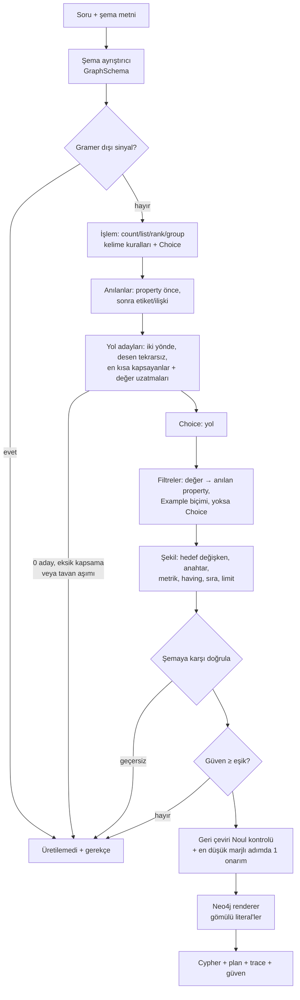
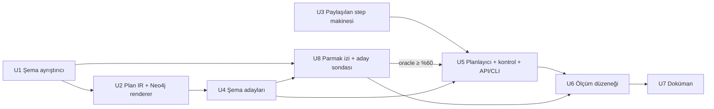

# Şemadan Cypher Üreten Rehberli Planlayıcı (text-to-Cypher, Pangu yöntemiyle) - Plan

**Target repo:** laya-jev-GraphRAG. Kod `graphrag_neo4j_laya/` altında; tüm yollar repo köküne göredir.

---

## Goal Capsule

- **Objective:** Doğal dilde bir soru ve metin olarak verilen bir graph şemasından çalıştırılabilir bir Neo4j Cypher sorgusu üretmek. Adayları kod şemadan üretir, Laya aralarından seçer, Cypher'ı yalnızca renderer yazar.
- **Authority:** Bu plan > `docs/plans/2026-09-25-001-feat-guided-query-planner-plan.md` (mevcut planlayıcının kararları) > mevcut kod konvansiyonları.
- **Execution profile:** Python, pytest, CPU üzerinde Laya. Canlı veritabanı gerekmez; tüm testler şema metni ve `tests/scripted_model.py` ile çalışır.
- **Stop conditions:** Mevcut planlayıcı testleri (`graphrag_neo4j_laya/tests/test_planner*.py`, `test_plan_render.py`) U3'ten sonra kırılırsa durulur. U8'deki model gerektirmeyen sondada doğru yol, gramerin kapsadığı alt kümenin %60'ından azında aday kümesine giriyorsa U5'e geçilmeden durulur. U6'da durma metriği (KTD9'da tanımlı) %40'ın altında kalırsa da durulur. Her durumda kullanıcıya dönülür.
- **Tail ownership:** Modül bağımsız bir API ve CLI olarak teslim edilir. Pipeline'a veya router'a bağlanmaz. Bağlama kararı U6 sonuçlarıyla kullanıcıya aittir.

---

## Product Contract

### Summary

Mevcut rehberli planlayıcının makinesini (seçim, trace, tek onarım adımı, geri çeviri kontrolü) kullanan, ama adaylarını canlı Kùzu graph'ı yerine metin olarak verilen bir şemadan üreten kardeş bir planlayıcı eklenir. Çıktı, değerleri sorguya gömülmüş bir Neo4j Cypher sorgusudur. İlk sürüm çok etiketli tipli yolları, property filtrelerini ve count/list/rank/group şekillerini kapsar. Ölçüm, Neo4j'nin açık text2cypher veri setinden gramerin kapsadığı bir alt küme üzerinde yapısal karşılaştırmayla yapılır.

### Problem Frame

Mevcut planlayıcı (`graphrag_neo4j_laya/graphrag/retrieval/planner/`) tek bir şemaya sabitlenmiş durumda. Tüm düğümler `Entity`, tüm kenarlar `RELATES_TO` ve bir `type` string'i. Alan whitelist'i yalnızca `name`, `pagerank` ve `communityId` içeriyor. Hop adayları da canlı graph'taki frontier sorgusundan geliyor. Bu yüzden başka bir graph'a, örneğin Neo4j'nin FinCEN demo veritabanına soru soramıyor. Önceki plan serbest text-to-Cypher'ı ve Kùzu dışı backend'leri bilerek kapsam dışında bırakmıştı.

Text-to-Cypher görevinin standart biçimi, bir soru ile birlikte etiketleri, tipli property'leri ve `(:A)-[:R]->(:B)` desenlerini listeleyen bir şema metnidir. Neo4j'nin `text2cypher-2024v1` veri seti (Apache 2.0, ~44 bin örnek) tam bu biçimi kullanır. Kullanıcının verdiği örnek de bu biçimdedir. Yerel 8B model serbest Cypher yazmakta zayıf, Laya ise metin üretemez. Pangu'nun "üretme, ayırt et" ilkesi burada da geçerli: şema, geçerli planların uzayını tamamen tanımlar. Bu yüzden kod her adayı şemadan türetebilir, model de yalnızca seçer.

Mevcut planlayıcıdan temel fark şu: canlı DB yok. Frontier sorgusu, çalıştırarak doğrulama ve değer arama yapılamaz. Yön ve ilişki tipi hatalarını mevcut planlayıcıda canlı veri kapatıyordu (önceki plan KTD2). Burada bu işi şema desenleri yapar.

### Requirements

- R1. Girdi bir soru ve Neo4j biçiminde bir şema metnidir. Şemada "Node properties" (etiket başına `prop: TYPE` ile isteğe bağlı `Example`/`Min`/`Max`), "Relationship properties" ve "The relationships" (`(:A)-[:R]->(:B)`) bölümleri bulunur. Çıktı tek bir Cypher string'idir, ya da gerekçesiyle birlikte "üretilemedi" sonucudur.
- R2. Sorgudaki her etiket, ilişki tipi, yön ve property şemadan gelir. Şemada olmayan bir tanımlayıcı veya desen içeren bir plan render edilemez.
- R3. Değerler (sayılar, string'ler) yalnızca sorunun metninden gelir ve sorguya güvenli şekilde gömülür. String'ler kaçışlanır, tanımlayıcılar gerektiğinde backtick ile yazılır.
- R4. Laya yalnızca kodun sunduğu seçenekler arasından seçer (`choice_detailed`, `noul_detailed`). Hiçbir adımda metin üretmez.
- R5. Desteklenen şekiller: tipli çok hop'lu yol (en fazla ayarlı hop sayısı kadar), property filtresi (`= <> < <= > >= IN NOT IN`), `count`, `list`, `rank` (top-k ile `ORDER BY … DESC/ASC LIMIT k`) ve `group` (anahtar + metrik, isteğe bağlı HAVING). Metrikler `count`, `count(DISTINCT)`, `sum`, `avg`, `min`, `max` şeklindedir. Sayısal metrikler yalnızca `INTEGER`/`FLOAT` property'lerde kullanılabilir.
- R6. Gramerin dışında kalan bir soru (en kısa yol, OPTIONAL MATCH, tarih aritmetiği gibi) yanlış bir sorgu yerine "üretilemedi" sonucu verir. Plan güveni ayarlı eşiğin altında kaldığında da aynısı olur.
- R7. Her sonuç planı, adım trace'ini (seçenek, olasılık, ikinci aday), güveni ve planın İngilizce açıklamasını taşır.
- R8. Mevcut Kùzu planlayıcının ve `aggregate` rotasının davranışı değişmez.
- R9. Neo4j text2cypher veri setinin gramerce kapsanan bir alt kümesinde yapısal eşleşme oranı ölçülür ve JSON olarak kaydedilir.

### Acceptance Examples

Hepsi kullanıcının verdiği FinCEN şemasıyla.

- AE1. **Covers:** R1, R2, R5
  - **Given:** "Which 3 countries have the most entities linked as beneficiaries in filings?"
  - **Then:** Üretilen sorgu şununla yapısal olarak eşdeğerdir: `MATCH (f:Filing)-[:BENEFITS]->(e:Entity)-[:COUNTRY]->(c:Country)`, `c.name`'e göre grupla, `count(e)` hesapla, azalan sırala, `LIMIT 3`. Değişken ve alias adları farklı olabilir.
- AE2. **Covers:** R3, R5
  - **Given:** "How many filings have an amount greater than 1000000?"
  - **Then:** `MATCH (f:Filing) WHERE f.amount > 1000000 RETURN count(f)` ile eşdeğer.
- AE3. **Covers:** R3
  - **Given:** "List the names of entities whose country is 'CHN'."
  - **Then:** `MATCH (e:Entity) WHERE e.country = 'CHN' RETURN e.name` ile eşdeğer. Tırnak içindeki bir değer, içinde `'` veya `\` olsa bile doğru kaçışlanır.
- AE4. **Covers:** R6
  - **Given:** "What is the shortest path between Barclays and CIMB Bank?"
  - **Then:** Sonuç "üretilemedi" olur ve gerekçesi trace'te görünür. Sorgu döndürülmez.

### Scope Boundaries

- LLM ile serbest Cypher üretimi yok. Model hiçbir adımda metin üretmez.
- Şema metni dışında bir şema kaynağı yok. Canlı DB'den şema okuma ve çalıştırarak doğrulama da yok.
- Parametreli sorgu varyantı üretilmez, değerler sorguya gömülür.
- İlk sürümde `OPTIONAL MATCH`, `CALL`/alt sorgular, `UNION`, değişken uzunluklu yollar, `CONTAINS`/`STARTS WITH`, tarih, `POINT` ve string fonksiyonları, ilişki property'leri üzerinde filtre ve çoklu `MATCH` desteklenmez.
- Mevcut `aggregate` rotasına, router'a ve pipeline'a dokunulmaz.

#### Deferred to Follow-Up Work

- Çalıştırma tabanlı ölçüm (demo.neo4jlabs.com'daki salt okunur veritabanlarına karşı sonuç karşılaştırma).
- `CONTAINS`/`STARTS WITH` ve tarih karşılaştırmaları. Veri setinde sık geçiyorlar; gramere eklenmeleri U6 sonuçlarına göre önceliklendirilir.
- Router'da "şema verilmiş soru" için bir rota ve pipeline entegrasyonu.
- Kùzu planlayıcısını da bu şema modeline taşıyıp iki planlayıcıyı birleştirmek.

---

## Planning Contract

### Key Technical Decisions

- KTD1. **Kardeş planlayıcı, genelleştirme değil.** Yeni kod `graphrag_neo4j_laya/graphrag/retrieval/text2cypher/` altına ayrı bir paket olarak yazılır. Mevcut `planner/` paketinde yalnızca davranışı değiştirmeyen bir çıkarma yapılır (U3). Gerekçe: Kùzu planlayıcısındaki kuralların neredeyse hepsi etiketli sette ölçülerek ayarlandı (`planner.py` içindeki "Measured:" yorumları). `QueryPlan`'ı çok etiketli hale getirmek bu kuralların hepsine dokunur. Birleştirme ertelendi (Scope Boundaries).
- KTD2. **Yol adayları bütün olarak şemadan sayılır.** Canlı frontier olmadığı için hop-hop seçim yapılmaz. Bunun yerine `max_hops`'a kadar tüm yollar kodla sayılır. Bir yolda aynı desen iki kez kullanılamaz, ama etiketler tekrar edebilir: `(:Entity)-[:FILED]->(:Filing)-[:BENEFITS]->(:Entity)` gibi öz-birleşimler ifade edilebilir. Her desen iki yönde de yürünür. Adım, desenin yönünde render edilir (`->` veya `<-`), böylece `Entity<-ORIGINATOR-Filing-BENEFITS->Entity` gibi V şeklindeki yollar da aday olur. Birbirinin tam tersi olan yollar tekilleştirilir. Anılanların hepsini kapsayan yollar arasından yalnızca en kısa olanlar tutulur. Kalan yollar İngilizce açıklamalarıyla tek bir `Choice` olarak sunulur, tek aday kalırsa seçim zorunlu olur. Aday sayısı `text2cypher_max_path_candidates`'ı aşıyorsa soru belirsiz sayılır ve plan üretilemedi sonucu verir. Gerekçe: şema küçük (demo şemalarında 3–15 desen), yol uzayı sonlu. Bütün yolu seçmek, hop-hop seçimin "stop" hatasını ve yön hatasını ortadan kaldırır. Yön seçilmez.
- KTD3. **Anılan etiketler, ilişkiler ve property'ler sözcüksel eşleşmeyle bulunur.** Etiket, ilişki ve property adları CamelCase ve `_` üzerinden parçalanır. Bir soru sözcüğü, tekil hali bir ad parçasına eşitse o adla eşleşir ("countries"→`Country`, "filings"→`Filing`). Ortak önek yalnızca yedek olarak kullanılır: en az 5 harf olmalı ve iki sözcüğün de en az %75'ini kapsamalı ("beneficiaries"→`BENEFITS`, ortak önek `benefi`). "count" ise `Country`'ye bağlanmaz. Bir sözcük hem bir property'ye hem bir etiket veya ilişkiye uyuyorsa ve sorudaki bir değer ona bağlanıyorsa ("whose country is 'CHN'") property anılması sayılır. Yol kapsama hesabına girmez. Bu, mevcut planlayıcının "sorudan okunabileni kod okur, gerisini model seçer" desenidir (`planner/candidates.py`). Hiçbir etiket eşleşmezse planlayıcı soru belirsiz diye reddeder.
- KTD4. **Değerler yalnızca sorudan gelir. Property'yi önce kod okur, okuyamazsa model seçer.** Sayılar text2cypher'e özel bir çıkarıcıyla alınır: virgülden sonra tam üç rakam geliyorsa virgül binlik ayırıcıdır ("1,000,000" → 1000000). Mevcut `extract_numbers` Türkçe ondalık virgül için yazıldığından burada kullanılmaz. String adayları tırnak içi ifadeler ve büyük harfle başlayan sözcük dizileridir. Property şu sırayla bağlanır. (1) Soru property'nin adını değerin hemen yanında anıyorsa o property ("amount greater than"). (2) Değer bir `Example` değeriyle aynı biçimdeyse o property (3 harfli büyük harf kodu, `country: "CHN"`). (3) Hiçbiri değilse yoldaki uygun tipli property'ler arasından `Choice`. Değerin en iyi biçim eşleşmesi yolda değil de yola bir desen uzaklıktaki bir etiketteyse ("entities in China" → `Country.name`, örnek `"Afghanistan"`), o desenle uzatılmış yol da yol adaylarına eklenir ve seçimi model yapar.
- KTD5. **Sayım varsayılanı satır sayımıdır.** `count(v)` kullanılır, `count(DISTINCT v)` yalnızca soru "distinct/different/unique" dediğinde seçilir. Gerekçe: veri setinin ve kullanıcı örneğinin konvansiyonu bu (AE1'de `COUNT(e)`). Bu, Kùzu planlayıcısının KTD7'sinden (varsayılan distinct) bilinçli bir sapmadır.
- KTD6. **Renderer değerleri gömer, tanımlayıcıları yalnızca şemadan alır.** String'ler tek tırnakla yazılır, `\` ve `'` kaçışlanır. Sayılar Python sayı tipinden yazılır, başka tipte değer render edilemez. Etiket, ilişki ve property adları şemada yoksa render reddedilir. `[A-Za-z_][A-Za-z0-9_]*` dışındaki adlar backtick ile yazılır, adın içindeki backtick iki katına çıkarılır. Şema metni kullanıcıdan geldiği için whitelist tek başına yetmez. Gerekçe: parametre yok (kapsam kararı), bu yüzden enjeksiyon yüzeyi tanımlayıcı whitelist'i (şema) ve literal kaçışıyla kapanır.
- KTD7. **Çıktı biçimi kanoniktir.** Biçim: `MATCH <yol> [WHERE …] [WITH … WHERE <having>] RETURN … [ORDER BY …] [LIMIT n]`. Değişkenler `v0…vN`, alias'lar okunur biçimdedir (`country_name`, `count_entity`). Karşılaştırma yapısaldır (U6), bu yüzden örnekteki `WITH … ORDER BY … LIMIT … RETURN` yazımına birebir uymak gerekmez.
- KTD8. **Step makinesi paylaşılır.** `planner.py` içindeki `StepTrace`, `choose`/`forced`/`yes` mantığı ve `executor.py` içindeki `_repair_step` + geri çeviri kontrolü deseni tekrar yazılmaz. `StepTrace` ile seçim/trace mantığı davranış değiştirmeden paylaşılan bir modüle taşınır. Güven "en zayıf adım", onarım "en düşük marjlı adımı ikinci adayla yeniden kur" olarak kalır (önceki plan KTD4, KTD5). Varsayılanlar: `text2cypher_min_confidence` 0.3 (`aggregate_min_confidence` ile aynı), `text2cypher_max_path_candidates` 8. Bu tavan, yol seçiminin en düşük olasılığını tek düze dağılımda 1/8'in altına düşürmez. Bu sayede güven eşiği, seçenek sayısından kaynaklanan sistematik retlere dönüşmez. U6 güven ile doğruluk ilişkisini raporlar, eşik de oradan kalibre edilir.
- KTD9. **Ölçüm yapısaldır, DB gerektirmez.** Referans ve üretilen sorgudan hafif bir parmak izi çıkarılır. Parmak izinin bileşenleri: (kaynak, ilişki, hedef) desenleri, filtreler, dönen anahtarlar, agregasyon fonksiyonu ve hedefi, sıralama yönü ve limit. Her değişken önce etiketine ve yoldaki konumuna çözülür. Filtreler, anahtarlar ve agregasyon hedefleri (etiket, konum, property) üçlüsüyle tutulur, yalnızca property adıyla tutulmaz. Değişken ve alias adları böylece önemsizleşir. Desen içi eşitlikler (`(e:Entity {country: 'CHN'})`) WHERE eşitliğine, yönsüz desenler (`-[:R]-`) şemadaki yöne normalize edilir. Scope Boundaries'teki dışlamalardan birini içeren referans gramer dışı sayılır: `OPTIONAL MATCH`, `CALL`, `UNION`, değişken uzunluklu yol, `CONTAINS`/`STARTS WITH`, ilişki property filtresi, çoklu `MATCH`, tarih/`POINT`/string fonksiyonu. Parmak izinin okuyamadığı referans da gramer dışı sayılır. Elenme oranları nedenleriyle birlikte raporlanır.
  - **Durma metriği:** Tam parmak izi eşleşmesi. Payda, şeması ayrıştırılabilen tüm örneklenmiş gramer içi örneklerdir. "Üretilemedi" sonuçları payda içinde kalır ve kaçırma sayılır. Şema ayrıştırma hataları ayrı bir oran olarak raporlanır.
  - **Oracle:** Altın yolun, filtre property'sinin ve değerin aday kümesinde bulunma oranı durma metriğinin yanında raporlanır. Böylece aday üretimi hataları Laya'nın seçim hatalarından ayrılır.
  - **Veri:** Test split'inin parquet dosyası `huggingface_hub.hf_hub_download` ile indirilip pandas ile okunur. Bunun için `pyarrow` yeni bir bağımlılık olarak eklenir. Örnekleme, `data_source`'a göre tabakalandırılır; tek bir kaynağın şema biçimi veya soru üslubu sonucu belirlemesin.
  - **Gerekçe:** kullanıcı kararı (DB gerektirmeyen ölçüm).

### High-Level Technical Design

**Akış**



**Plan dilbilgisi (taslak)**

```text
SchemaPlan := path filters* shape
path       := Label (Rel Label){0..max_hops}   # her (Label, Rel, Label) şemada bir desen, yön desenden
filter     := (var, prop ∈ props(label(var)), op, literal)   # literal tipi prop tipine uyar
shape      := count(target) | list(target.prop) |
              group(keys ⊆ var.prop, metrics) [having] |
              rank(keys, metric, dir, k)
metric     := count(var) | count(DISTINCT var) | agg(var.prop)   # agg ∈ sum/avg/min/max, prop sayısal
```

**AE1'in adım adım izi**

| Adım | Kaynak | Sonuç |
| --- | --- | --- |
| İşlem | "most" üst derece → `rank` zorunlu | rank |
| Anılanlar | countries→Country, entities→Entity, filings→Filing, beneficiaries→BENEFITS | 3 etiket, 1 ilişki |
| Yol adayları | Hepsini kapsayan yollar: 2 hop'luk `Filing-BENEFITS->Entity-COUNTRY->Country` ve 3 hop'luk `Entity-FILED->Filing-BENEFITS->Entity-COUNTRY->Country`. En kısası tutulur. | `Filing-BENEFITS->Entity-COUNTRY->Country` (tek aday, zorunlu) |
| Filtre | sayı "3" top-k'ya harcanır | yok |
| Anahtar | "Which … countries" → `Country` etiketi zorunlu. Property için Choice: name / code / tld | `v2.name` |
| Metrik | "most" ipucunun yönettiği isim "entities" → `Entity` (v1) | `count(v1)` |
| Sıra/limit | `small_limit` → 3, azalan | `ORDER BY … DESC LIMIT 3` |

### Sequencing



U3, U1–U2 ile paralel yapılabilir. U8'in aday sondası U5'ten önce çalışır: aday üretimi altın yolu bulamıyorsa planlayıcıyı kurmanın anlamı yoktur (Goal Capsule stop condition).

---

## Implementation Units

### U1. Şema metni ayrıştırıcı

**Goal:** Neo4j biçimindeki şema metnini tipli bir `GraphSchema` değerine çevirmek.

**Requirements:** R1, R2

**Dependencies:** yok

**Files:**
- `graphrag_neo4j_laya/graphrag/retrieval/text2cypher/__init__.py` (yeni)
- `graphrag_neo4j_laya/graphrag/retrieval/text2cypher/schema.py` (yeni)
- `graphrag_neo4j_laya/tests/fixtures/fincen_schema.txt` (yeni; kullanıcının verdiği şema)
- `graphrag_neo4j_laya/tests/test_text2cypher_schema.py` (yeni)

**Approach:** Model, etiket → property → (tip, örnek, min, max) eşlemesi, ilişki tipi → property'ler ve `(src, rel, dst)` desen listesinden oluşur. Ayrıştırıcı hem markdown biçimli (`- **Country**`, `` - `code`: STRING Example: "AFG" ``) hem de düz (`Country {code: STRING}`) yazımları kabul eder. Veri setinde ikisi de var. Tanınmayan satırlar atlanır ve bir uyarı listesinde tutulur. Tip adları sabit bir kümeye normalize edilir (`STRING, INTEGER, FLOAT, BOOLEAN, DATE, DATE_TIME, POINT, LIST`); sayısal olanlar `INTEGER` ve `FLOAT`'tır. Boş "Relationship properties" bölümü geçerlidir.

**Patterns to follow:** `graphrag_neo4j_laya/graphrag/graph/relation_schema.py` (şema dosyası ayrıştırma ve dataclass biçimi).

**Test scenarios:**
- FinCEN şeması: 3 etiket, `Filing` için 24 property, 5 desen. `amount` INTEGER ve sayısal, `location` POINT.
- `Example: "AFG"` ve `Min: …, Max: …` değerleri doğru property'ye bağlanır.
- Boş "Relationship properties:" bölümü hatasız ayrıştırılır ve ilişki property'leri boş kalır.
- Düz yazımlı bir şema da aynı modeli üretir.
- Desen satırı olmayan bir şema ayrıştırılır ama desen listesi boş kalır. Bozuk bir satır uyarı listesine düşer, istisna fırlatılmaz.
- Boş string girdi boş bir şema ve uyarı döndürür.

**Verification:** FinCEN şeması ve bir düz yazım örneği testlerde beklenen modeli üretir.

### U2. Şema planı ve Neo4j renderer

**Goal:** Şemaya karşı doğrulanan tipli bir plan ile bu planı gömülü literal'li Cypher'a çeviren renderer.

**Requirements:** R2, R3, R5

**Dependencies:** U1

**Files:**
- `graphrag_neo4j_laya/graphrag/retrieval/text2cypher/plan.py` (yeni)
- `graphrag_neo4j_laya/graphrag/retrieval/text2cypher/render_neo4j.py` (yeni)
- `graphrag_neo4j_laya/graphrag/retrieval/text2cypher/describe.py` (yeni)
- `graphrag_neo4j_laya/tests/test_text2cypher_render.py` (yeni)

**Approach:** Plan yapısı şöyle: etiket sırası + adım başına (ilişki, yön), filtreler, işlem, anahtarlar, metrikler, having, sıra, limit. Operatör ve metrik adları `planner/plan.py` içindeki `FILTER_OPS`, `METRIC_OPS`, `NUMERIC_METRIC_OPS` sabitlerinden gelir, `collect` hariç tutulur. Doğrulama şunları kontrol eder: her adım bir şema deseni mi, her property o etiketin property'si mi, sayısal metrik sayısal property'de mi, literal tipi property tipine uyuyor mu. Renderer KTD6 ve KTD7'yi uygular. `limit` yalnızca `rank` ve açıkça limit isteyen sorularda yazılır. Mevcut renderer'daki `limit + 1` kesilme mantığı burada yoktur, çünkü sorgu çalıştırılmıyor. `describe.py`, planı mevcut `planner/describe.py` üslubunda İngilizce'ye çevirir. Hem planlayıcı bağlamı hem geri çeviri kontrolü bu metni kullanır.

**Patterns to follow:** `graphrag_neo4j_laya/graphrag/retrieval/planner/plan.py` (`validate_plan`), `render_kuzu.py` (`_shape`, projeksiyon sırası), `describe.py`.

**Test scenarios:**
- Covers AE1. Elle kurulan rank planı `MATCH (v0:Filing)-[:BENEFITS]->(v1:Entity)-[:COUNTRY]->(v2:Country)` ile başlar, `count(v1)` içerir, `ORDER BY … DESC LIMIT 3` ile biter.
- Covers AE2. `amount > 1000000` filtresi `WHERE v0.amount > 1000000` olarak render edilir.
- Covers AE3. `O'Brien \ Co` değeri `'O\'Brien \\ Co'` olarak kaçışlanır. `' OR 1=1 //` gibi bir değer tek bir literal içinde kalır.
- `in` operatörü liste literal'i üretir. `not_in`, `NOT … IN [...]` üretir.
- Having'li bir group planı `WITH … WHERE` biçiminde render edilir.
- Hata: şemada olmayan desen (`Country-[:BENEFITS]->Entity`), olmayan property, STRING property üzerinde `sum`, INTEGER property'ye string literal, ters yönlü desen. Hepsi `ValueError` verir.
- Boşluk içeren bir property adı backtick ile yazılır.
- `describe` çıktısı AE1 planı için etiketleri ve ilişkiyi adlarıyla anar.

**Verification:** Tüm AE planları beklenen Cypher'ı üretir. Geçersiz her plan render öncesinde reddedilir.

### U3. Paylaşılan step makinesi

**Goal:** Seçim/trace/onarım mantığını, mevcut planlayıcının davranışını değiştirmeden iki planlayıcının kullanabileceği bir modüle taşımak.

**Requirements:** R4, R7, R8

**Dependencies:** yok

**Files:**
- `graphrag_neo4j_laya/graphrag/retrieval/planner/steps.py` (yeni)
- `graphrag_neo4j_laya/graphrag/retrieval/planner/planner.py` (değişir)
- `graphrag_neo4j_laya/graphrag/retrieval/planner/executor.py` (değişir)
- `graphrag_neo4j_laya/tests/test_planner_steps.py` (yeni)

**Approach:** `StepTrace`, `_Planning.forced`/`choose`/`yes` ve `_repair_step` bir temel sınıfa ve yardımcı fonksiyonlara taşınır. `_Planning` bu temel sınıftan türer, bağlam metnini (`context()`) alt sınıf tanımlar. `planner.py` ve `executor.py` içindeki eski adlar (`StepTrace`, `PlannerResult`, `_parse_metric`, `GuidedQueryPlanner`) import edilebilir kalır, çünkü testler ve `aggregate_planner_eval.py` bunları kullanıyor. `_repair_step` şu anda adı `key:` ile başlayan adımları sabit olarak atlıyor. Bu Kùzu'ya özgü bir kural. Paylaşılan sürümde atlanacak adım önekleri bir parametre olur. Kùzu çağrısı `("key:",)` geçirir, text2cypher kendi listesini verir.

**Execution note:** Önce mevcut planlayıcı testlerinin temiz geçtiğini kaydet. Taşımadan sonra aynı testler hiç değişmeden geçmeli.

**Test scenarios:**
- Tek seçenekte `choose` çağrılmadan `forced` kaydı düşer, probability 1.0 olur.
- Override edilen adım override değerini seçer ve `overridden=True` olur.
- `yes`, eşik 0.5'te doğru tarafı seçer ve ikinci adayı kaydeder.
- `_repair_step` zorunlu adımları ve verilen önekle başlayan adımları atlar, en küçük marjlı adımı döndürür. Önek listesi boşken `key:` adımları da onarılabilir.
- Entegrasyon: `tests/test_planner.py`, `test_planner_executor.py` ve `test_pipeline_aggregate.py` değişmeden geçer.

**Verification:** Mevcut test paketi değişmeden yeşil kalır. Yeni modülün kendi testleri de geçer.

### U4. Şemadan aday üretimi

**Goal:** Soru ve şemadan etiket/ilişki anılmalarını, yol adaylarını, property ve değer adaylarını kodla üretmek.

**Requirements:** R2, R4, R5, R6

**Dependencies:** U1, U2

**Files:**
- `graphrag_neo4j_laya/graphrag/retrieval/text2cypher/candidates.py` (yeni)
- `graphrag_neo4j_laya/tests/test_text2cypher_candidates.py` (yeni)

**Approach:**
- Sözcüksel eşleşme (KTD3): önce tekil eşitlik, sonra koşullu önek yedeği. Eşleşme property, etiket ve ilişki adlarının hepsine uygulanır. Değer bağlanan bir property anılması, aynı sözcüğün etiket veya ilişki anılmasının yerini alır.
- Yol sayımı (KTD2): her desen iki yönde yürünür, bir yolda aynı desen bir kez kullanılır, tam ters yollar tekilleştirilir. Anılan etiketlerin ve ilişkilerin hepsini kapsayan yollardan en kısalar tutulur. Hiçbiri hepsini kapsamıyorsa en çok anılanı kapsayanlar "eksik kapsama" işaretiyle döner ve hangi anılanın dışarıda kaldığı kaydedilir. U5, dışarıda kalan bir etiket varsa reddeder. Yalnızca bir ilişki anılması dışarıda kaldıysa devam eder, çünkü ilişki eşleşmesi daha zayıf bir sinyaldir. Değer uzatmaları (KTD4) bu kümeye eklenir.
- Kelime kuralları `planner/candidates.py` içinden kullanılır: `asks_for_a_ranking`, `asks_per_group`, `asks_for_a_number`, `small_limit`. Karşılaştırma için `comparison_from_wording` sarmalanır ve veri setinde sık geçen "above/over/exceeding" (>), "below/under" (<), "equal to/is" (=), "not" (<>) ifadeleri eklenir. `sets_a_threshold` işlemi zorlamak için kullanılmaz (U5). Sayılar KTD4'teki text2cypher çıkarıcısıyla alınır.
- Değer adayları (KTD4): tırnak içi ifadeler, büyük harfle başlayan diziler (cümle başındaki soru sözcüğü hariç), sayılar. Her aday için anılan property'lere yakınlık ve şemadaki `Example` biçimiyle eşleşme puanı hesaplanır.
- Operasyon ipucunun yönettiği isim: "how many X", "number of X", "most/least X", "names of X", "list X", "which X", "each/per X" kalıplarındaki X, bağlandığı etiketle döner. U5 hedef değişkeni ve grup anahtarını buradan okur.
- Gramer dışı sinyaller (R6): "shortest path", "optional", "average time between", tarih ifadeleri. Bu sinyaller erken bir "üretilemedi" gerekçesi olarak döner.

**Patterns to follow:** `graphrag_neo4j_laya/graphrag/retrieval/planner/candidates.py` (fonksiyon başına tek soru, regex sabitleri, "Measured:" gerekçe yorumları).

**Test scenarios:**
- Covers AE1. Anılanlar `{Country, Entity, Filing}` ve `{BENEFITS}` olur. 3 hop'luk `Entity-FILED->Filing-BENEFITS->Entity-COUNTRY->Country` da kapsar ama en kısa kuralıyla elenir. Geriye yalnızca `Filing-BENEFITS->Entity-COUNTRY->Country` kalır. İpucu isimleri: "which" → `Country`, "most" → `Entity`.
- Covers AE3. "country" sözcüğüne `'CHN'` değeri bağlandığı için `Entity.country` property anılması sayılır, `Country` ve `COUNTRY` anılması sayılmaz. Tek düğümlü `Entity` yolu aday olarak kalır. İpucu ismi: "names of" → `Entity`.
- Covers AE2. "amount" → `Filing.amount` property anılması. `1000000` bu property'ye yakınlıkla bağlanır.
- "Which entities filed filings?" `Entity-FILED->Filing` verir, `ORIGINATOR` yolu elenir.
- Hiç etiket anmayan bir soru tüm tek etiketli ve tek hop'lu yolları aday bırakır, sayı tavanı aşılmaz.
- `max_hops=1` ile AE1'de hiçbir yol hepsini kapsamaz. En çok anılanı kapsayan `Filing-BENEFITS->Entity` "eksik kapsama" işaretiyle döner ve dışarıda kalan `Country` kaydedilir.
- V şeklindeki yol: "Which entities originated filings that benefit entities in the same country?" için `Entity<-ORIGINATOR-Filing-BENEFITS->Entity` aday olur. Tam tersi olan yol ayrıca listelenmez.
- Değer uzatması: "How many filings benefit entities in China?" için `Filing-BENEFITS->Entity` yolunun yanında `Filing-BENEFITS->Entity-COUNTRY->Country` da aday olur, çünkü "China" en iyi `Country.name` biçimine uyar.
- "Count the filings with an amount over 5000" `Country` veya `COUNTRY` anmaz. Sayı `5000`, operatör `>` olur.
- "greater than 1,000,000" `1000000` verir, `1.0` vermez.
- Değerler: `'CHN'` → string adayı, `country` property'sine öncelikli. "Barclays Bank Plc" büyük harf dizisi olarak yakalanır. Cümle başındaki "Which" yakalanmaz.
- "greater than 1000000" `>` ve `1000000` verir.
- Covers AE4. "shortest path" gramer dışı gerekçesi döndürür.
- Kısa ad koruması: 3 harfli bir etiket (`Tld` gibi) rastgele sözcüklerle eşleşmez.

**Verification:** AE1–AE4 soruları için aday kümeleri beklendiği gibidir. Laya çağrısı yapılmaz.

### U5. Şema güdümlü planlayıcı, kontrol ve API

**Goal:** Adımları sırayla çalıştırıp plan kurmak, doğrulamak, geri çeviriyle kontrol edip gerekirse bir kez onarmak ve Cypher döndürmek.

**Requirements:** R1, R4, R6, R7

**Dependencies:** U2, U3, U4

**Files:**
- `graphrag_neo4j_laya/graphrag/retrieval/text2cypher/planner.py` (yeni)
- `graphrag_neo4j_laya/graphrag/retrieval/text2cypher/api.py` (yeni)
- `graphrag_neo4j_laya/graphrag/retrieval/text2cypher/__main__.py` (yeni; CLI)
- `graphrag_neo4j_laya/config/settings.py` (değişir)
- `graphrag_neo4j_laya/tests/test_text2cypher_planner.py` (yeni)

**Approach:** Adım sırası: gramer dışı kontrolü → işlem → yol → filtreler → şekil (hedef değişken, anahtar, metrik, having, sıra/limit) → doğrulama. Kod bir adımı sorudan okuyabiliyorsa o adım zorunlu olur, okuyamıyorsa Laya seçer. Mevcut planlayıcının "sorudan okunabileni kod okur" kuralları bu adımlara uyarlanır. Hedef değişken (neyin sayıldığı veya listelendiği), U4'ün döndürdüğü operasyon ipucu isminin etiketidir. AE1'de "most entities" → `Entity`, AE2'de "how many filings" → `Filing`, AE3'te "names of entities" → `Entity`. `rank` ve `group` işlemlerinde grup anahtarının etiketi de aynı şekilde "which/each/per X" isminden gelir. İpucu ismi okunamıyorsa ya da o etiket yolda birden fazla konumdaysa, yoldaki değişkenler arasından `Choice` ile seçilir. Eşik kuralı: karşılaştırma sözcüğü yoldaki bir etiketin sayısal property anılmasına bağlanıyorsa ("amount greater than 1000000") sayı bir WHERE filtresi olur. Karşılaştırılan şey bir sayım veya agregasyonsa ("with more than 5 filings") group + HAVING olur. Kùzu planlayıcısındaki "her eşik group'a gider" kuralı alınmaz. `list` işleminde dönen property, soru bir property anıyorsa odur, yoksa etiketin `name` property'si, o da yoksa `Choice` ile seçilir. Onarım ve kontrol U3'teki makineyle yapılır. `api.text_to_cypher(question, schema_text)` bir sonuç nesnesi döndürür: cypher (veya None), plan, trace, confidence, description, reason. Fonksiyon hiçbir zaman istisna fırlatmaz. Ayarlar: `text2cypher_max_hops` (varsayılan 3), `text2cypher_min_confidence` (varsayılan 0.3), `text2cypher_max_path_candidates` (varsayılan 8). CLI soruyu ve bir şema dosya yolunu alıp Cypher'ı yazdırır, `-v` ile trace'i de gösterir. CLI mantığı bir `main(argv)` fonksiyonundadır, böylece test aynı süreç içinde model patch'lenerek çalıştırılabilir.

**Patterns to follow:** `graphrag_neo4j_laya/graphrag/retrieval/planner/planner.py` (`GuidedQueryPlanner.plan`, hata yutma), `executor.py` (`_run` içindeki kontrol + onarım akışı), `config/settings.py` içindeki "Guided query planner" bloğu.

**Test scenarios:**
- Covers AE1. `ScriptedModel`'in anahtar adımında `v2.name`'i seçtiği senaryoda üretilen Cypher, U2'deki beklenen metinle aynıdır. Trace'te işlem ve yol adımları zorunlu olarak görünür.
- Covers AE2. İşlem `count` olur, group olmaz. Filtre `WHERE v0.amount > 1000000` olur. Filtre property'si `amount`, soru onu andığı için zorunludur. `Filing`'in diğer sayısal property'leri (`number`, enlem/boylam) sunulmaz.
- Eşik ile HAVING ayrımı: "Which entities benefit from more than 5 filings?" group + `HAVING count > 5` üretir, WHERE üretmez.
- Eksik kapsama: `max_hops=1` ile AE1 sorusu için Cypher None olur, reason dışarıda kalan `Country` etiketini adıyla anar.
- Yol adayı sayısı tavanı (8) aşarsa Cypher None ve reason "ambiguous path" olur, Laya çağrılmaz.
- Covers AE3. `list` + string filtresi. Yol tek düğümlü `Entity` olur. `country` property'si, değerin anılan property'ye bağlanmasıyla zorunludur. Dönen property "names" anılmasından `name` olur.
- Covers AE4. Cypher None olur, reason gramer dışı gerekçesini içerir, Laya çağrısı yapılmaz.
- Güven eşik altında (ScriptedModel prob=0.3) olduğunda Cypher None ve reason "low confidence" olur.
- Onarım: geri çeviri ilk planı düşük, ikinci adayla kurulanı yüksek puanlarsa onarılmış plan döner ve `repaired=True` olur.
- Bozuk şema (desen yok) veya model istisnası durumunda istisna fırlatılmaz, None ve gerekçe döner.
- CLI: `main([...])` fixture şema dosyası ve AE1 sorusuyla aynı süreçte çağrıldığında stdout'a tek satır Cypher yazar (ScriptedModel patch'lenerek).

**Verification:** AE1–AE4 uçtan uca geçer. Mevcut test paketi etkilenmez.

### U6. Text2cypher ölçüm düzeneği

**Goal:** Neo4j text2cypher veri setinin gramerce kapsanan alt kümesinde yapısal eşleşmeyi ölçmek (KTD9).

**Requirements:** R9

**Dependencies:** U5, U8

**Files:**
- `graphrag_neo4j_laya/graphrag/benchmarks/text2cypher_eval.py` (yeni)
- `graphrag_neo4j_laya/examples/data/text2cypher_local.json` (yeni; AE1–AE4 ve ~15 elle etiketlenmiş FinCEN sorusu)
- `graphrag_neo4j_laya/tests/test_text2cypher_eval_harness.py` (yeni)

**Approach:** Düzenek, U8'deki veri yükleyicisini ve parmak izini kullanır. Referansı gramer içinde olan örneklerden `data_source`'a göre tabakalı bir örneklem alır (varsayılan 300, sabit tohum). Her örnek için sorgu üretir ve şunları kaydeder:
- KTD9'daki durma metriği (tam parmak izi eşleşmesi, üretilemedi sonuçları kaçırma sayılır)
- bileşen bazında eşleşme (yol, filtre, anahtar, agregasyon, sıra/limit)
- oracle oranı (altın yol, filtre property'si ve değer aday kümesinde mi)
- üretilemedi oranı ve gerekçe dağılımı
- şema ayrıştırma hata oranı
- elenme oranları, nedenleriyle
- güven kovalarına göre doğruluk (eşik kalibrasyonu için)

Terminal tablosu ve JSON çıktısı `aggregate_planner_eval.py` biçimindedir. Yerel set de aynı düzenekle, ağ gerekmeden çalışır.

**Patterns to follow:** `graphrag_neo4j_laya/graphrag/benchmarks/aggregate_planner_eval.py` (argparse, özet tablo, JSON kaydı), `tests/test_aggregate_eval_harness.py`.

**Test scenarios:**
- Düzenek yerel set üzerinde ScriptedModel ile uçtan uca çalışır, özet alanlarını doğru hesaplar ve JSON yazar.
- Durma metriği paydası: 4 gramer içi örnekten 1'i üretilemedi, 2'si eşleşti ise oran %50 olur, %67 olmaz.
- Tabakalı örnekleme: iki `data_source`'lu sahte bir veri setinde örneklem her kaynaktan orantılı pay alır.
- Ağ yokken HF indirmesi başarısız olursa açık bir hata mesajı verilir, yerel set yine de çalışır.

**Verification:** Yerel set ölçümü CI'da ağ olmadan çalışır. HF alt kümesi ölçümü elle çalıştırılıp sonucu `graphrag_neo4j_laya/benchmarks/results/text2cypher_eval.json` olarak kaydedilir.

### U8. Parmak izi, veri yükleyici ve aday sondası

**Goal:** Ölçümün temelini (parmak izi, HF veri yükleyici) kurmak. Aday üretiminin altın yolu bulup bulmadığını, Laya'ya ve planlayıcıya gerek kalmadan, U5'ten önce ölçmek.

**Requirements:** R9

**Dependencies:** U1, U4

**Files:**
- `graphrag_neo4j_laya/graphrag/retrieval/text2cypher/fingerprint.py` (yeni)
- `graphrag_neo4j_laya/graphrag/benchmarks/text2cypher_data.py` (yeni; HF indirme + önbellek + gramer içi filtre)
- `graphrag_neo4j_laya/graphrag/benchmarks/text2cypher_candidate_probe.py` (yeni)
- `graphrag_neo4j_laya/requirements.txt`, `graphrag_neo4j_laya/pyproject.toml` (değişir; `pyarrow`)
- `graphrag_neo4j_laya/tests/test_text2cypher_fingerprint.py` (yeni)
- `graphrag_neo4j_laya/tests/test_text2cypher_probe.py` (yeni)

**Approach:** `fingerprint`, KTD9'daki bileşenleri regex tabanlı hafif bir okuyucuyla bir Cypher metninden çıkarır. Değişkenleri etiket ve konuma çözer, desen içi eşitlikleri ve yönsüz desenleri normalize eder. Scope Boundaries'teki her dışlamayı ve okuyamadığı her yapıyı nedenini belirterek "gramer dışı" işaretler. Veri yükleyici, test split'inin parquet dosyasını `hf_hub_download` ile yerel önbelleğe indirir ve pandas ile okur. Sonda, gramer içi her örnekte U4'ün aday kümesini üretir. Altın parmak izindeki yolun, filtre property'lerinin ve değerlerin bu kümede olup olmadığını sayar. Laya çağrılmaz. Sonuç JSON olarak kaydedilir. Yol oracle oranı %60'ın altındaysa Goal Capsule'daki stop condition tetiklenir.

**Patterns to follow:** `graphrag_neo4j_laya/graphrag/benchmarks/aggregate_planner_eval.py`.

**Test scenarios:**
- Kullanıcının örnek sorgusu ile KTD7 biçimindeki karşılığı aynı parmak izini verir: değişken ve alias adları farklı, `WITH … ORDER BY … LIMIT … RETURN` ile `RETURN … ORDER BY … LIMIT` aynı sayılır.
- `count(e)` ile `count(DISTINCT e)` farklı parmak izi verir. `>` ile `>=` farklı sayılır. `'CHN'` ile `"CHN"` aynı sayılır.
- Etiket bağlılığı: `WHERE e.name = 'X'` (Entity) ile `WHERE c.name = 'X'` (Country) farklı parmak izi verir.
- `MATCH (e:Entity {country: 'CHN'})` ile `MATCH (e:Entity) WHERE e.country = 'CHN'` aynı sayılır. Şemada `->` olan bir desenin `-[:COUNTRY]-` yazımı yönlü yazımla aynı sayılır.
- Gramer dışı: `OPTIONAL MATCH`, `CALL`, `UNION`, `*1..3`, `CONTAINS`, `STARTS WITH`, `WHERE r.x = 1` (ilişki property'si), iki ayrı `MATCH`, `date(...)`, `point(...)`, `toLower(...)` içeren referansların her biri kendi nedeniyle gramer dışı işaretlenir.
- Sonda, AE1 ve AE3 için altın yolu aday kümesinde bulur. Altın yolu içermeyen yapay bir aday kümesi oracle'ı 0 yapar.
- Ağ yokken HF indirmesi başarısız olursa açık bir hata mesajı verilir.

**Verification:** Parmak izi ve sonda testleri ağ olmadan geçer. HF alt kümesinde sonda elle çalıştırılır, yol oracle oranı U5'e geçmeden önce raporlanır.

### U7. Doküman

**Goal:** Modülün ne yaptığını, gramerini, sınırlarını ve ölçüm sonuçlarını anlatmak.

**Requirements:** R6, R9

**Dependencies:** U6, U8

**Files:**
- `graphrag_neo4j_laya/README.md` (değişir; kısa bölüm)
- `graphrag_neo4j_laya/README_TR.md` (değişir; kısa bölüm)
- `graphrag_neo4j_laya/ARCHITECTURE.md` (değişir)

**Approach:** API ve CLI kullanımı, desteklenen şekiller, bilinçli kapsam dışı yapılar ve U6'daki ölçüm sonuçları anlatılır. Kùzu planlayıcısı ile ilişkisi de açıklanır: aynı makine, farklı aday kaynağı.

**Test expectation:** none -- yalnızca doküman.

**Verification:** README'deki CLI örneği fixture şemayla birebir çalışır.

---

## Risks & Dependencies

| Risk | Etki | Azaltma |
| --- | --- | --- |
| Veri setindeki sorguların büyük kısmı gramer dışı (CONTAINS, tarih, OPTIONAL MATCH) | Kapsama oranı düşük görünür | Kapsama oranı ayrı raporlanır. Eşleşme yalnızca kapsanan alt kümede ölçülür. Ertelenen yapılar sıklığa göre önceliklendirilir. |
| Sözcüksel eşleşme etiketleri kaçırır veya yanlış bağlar (eş anlamlılar, `ACTED_IN`/`HAS_*` gibi adlar) | Yanlış yol adayları veya gereksiz ret | Tekil eşitlik önce, önek yedeği sıkı koşullu. U8 sondası aday üretimini U5'ten önce ölçer. U6 bileşen bazında hata dağılımı verir. |
| String değerlerin hangi property'ye ait olduğu belirsiz | Yanlış filtre | `Example` biçim eşleşmesi, değilse `Choice` ile seçim. Geri çeviri kontrolü ve onarım. |
| U3 taşıması mevcut planlayıcıyı bozar | R8 ihlali | Davranışı koruyan taşıma ve değişmeyen test paketi. Stop condition. |
| Regex tabanlı parmak izi karmaşık referansları yanlış okur, gramer içi alt kümeyi de kendisi belirler | Ölçüm gürültüsü, alt küme kayması | Okunamayan referans nedeniyle gramer dışı sayılır. Parmak izinin kendi testleri var. Gramer içi alt kümeden 30 örnek elle kontrol edilir. |
| Referans sorgular bütün düğüm veya fazladan kolon döndürüyor (`RETURN e`, `RETURN e.name, e.country`) | Anlamca doğru plan eşleşmiyor sayılır | Bileşen bazında eşleşme ayrı raporlanır. Elle kontrolde sıklığı ölçülür, gerekirse parmak izi dönüş bileşenini gevşetir. |
| HF veri seti ağ ve boyut bağımlılığı | CI'da çalışmaz | Yerel set CI için, HF alt kümesi elle çalıştırılır. |

### Assumptions

- Laya, İngilizce yol açıklamaları arasında soruya uygun olanı seçebilir. Bu, Kùzu planlayıcısındaki hop seçimiyle aynı türden bir karar. U6 yol bileşeni doğruluğunu ayrıca raporlar.
- Veri setindeki şema metinleri U1'in kabul ettiği iki yazımdan birindedir. U6 ayrıştırılamayan şemaların oranını raporlar.

---

## System-Wide Impact

- Yeni paket bağımsızdır. Router, pipeline ve `aggregate` rotası değişmez.
- U3, `planner.py` ve `executor.py`'yi davranış değiştirmeden yeniden düzenler. `aggregate_planner_eval.py`'nin import ettiği adlar korunur.
- `config/settings.py`'ye üç yeni ayar eklenir.
- `pyarrow` yeni bağımlılık olarak `requirements.txt` ve `pyproject.toml`'a eklenir. Yalnızca ölçüm düzeneği için gerekir. `huggingface_hub` ve `pandas` zaten listede.

---

## Sources & Research

- Mevcut planlayıcı: `graphrag_neo4j_laya/graphrag/retrieval/planner/` ve `docs/plans/2026-09-25-001-feat-guided-query-planner-plan.md`.
- Neo4j `text2cypher-2024v1` veri seti (Hugging Face, Apache 2.0): kolonları `question`, `schema`, `cypher`, `data_source`, `database_reference_alias`, `instance_id`. 39.554 train ve 4.833 test örneği var. Kaynakları sentetik üreteçler, RAG-Eval ve Cy-Spider. Kullanıcının örneği bu veri setindeki FinCEN demo şemasının biçiminde.
- Pangu ("Don't Generate, Discriminate"): önceki plandaki gerekçe aynen geçerli.

---

## Verification Contract

Komutlar `graphrag_neo4j_laya/` içinden çalıştırılır.

| Kapı | Komut | Beklenen |
| --- | --- | --- |
| Yeni testler | `python -m pytest tests/test_text2cypher_*.py tests/test_planner_steps.py` | Hepsi geçer |
| Regresyon | `python -m pytest` | Mevcut paket U3 öncesiyle aynı sonucu verir |
| Aday sondası (elle, U5 öncesi) | `python -m graphrag.benchmarks.text2cypher_candidate_probe --split test --sample 300` | Yol oracle oranı raporlanır. %60 altı stop condition'dır. |
| Yerel ölçüm | `python -m graphrag.benchmarks.text2cypher_eval --local` | AE1–AE4 eşleşir, JSON yazılır |
| HF alt kümesi (elle) | `python -m graphrag.benchmarks.text2cypher_eval --split test --sample 300 --out benchmarks/results/text2cypher_eval.json` | KTD9'daki durma metriği, oracle ve bileşen oranları raporlanır. Durma metriği %40 altındaysa stop condition'dır. |
| CLI | `python -m graphrag.retrieval.text2cypher "<AE1 sorusu>" --schema tests/fixtures/fincen_schema.txt` | AE1'e eşdeğer tek satır Cypher |

---

## Definition of Done

- U1–U8 tamamlanır. Verification Contract'taki kapılar geçer.
- AE1–AE4 hem birim düzeyinde (ScriptedModel) hem yerel ölçümde karşılanır.
- Mevcut planlayıcı, `aggregate` rotası ve pipeline testleri değişmeden geçer (R8).
- HF alt kümesi ölçüm sonucu `graphrag_neo4j_laya/benchmarks/results/text2cypher_eval.json` olarak kaydedilir ve U7'de özetlenir.
- Pipeline entegrasyonu yapılmaz. Kararı ölçüm sonuçlarıyla kullanıcı verir.
