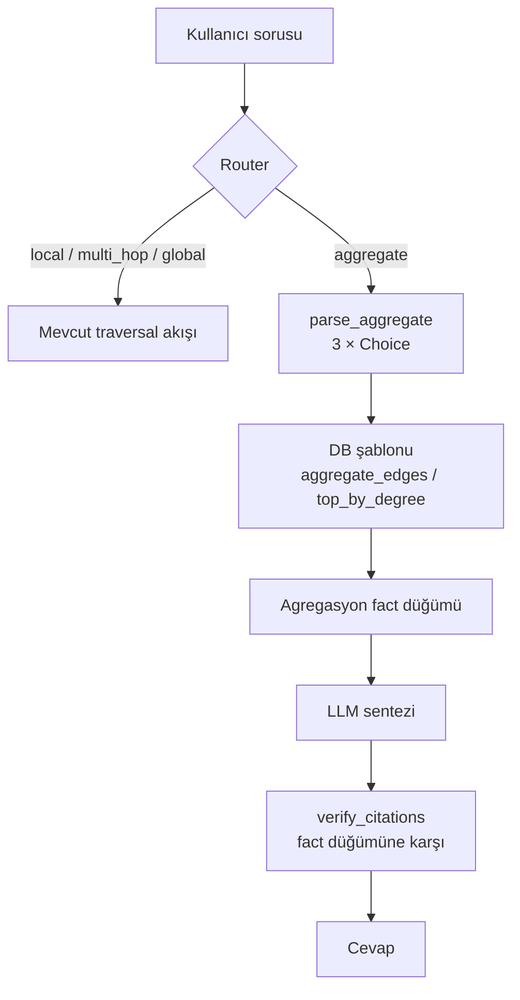
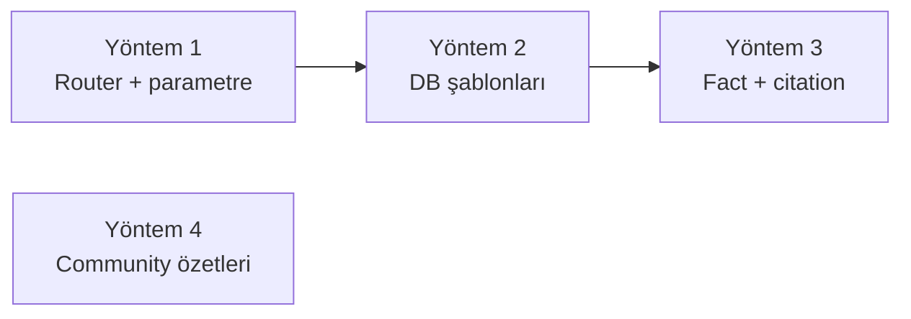

# Agregasyon Soruları İçin Çözüm Yöntemleri

> Tarih: 2026-09-25 · Durum: karar dokümanı (henüz implementasyon yok)

Pipeline şu an "kaç tane", "en çok", "hepsini listele" gibi agregasyon sorularına güvenilir cevap veremiyor. Bu doküman dört çözüm yöntemini örneklerle anlatıyor ve aralarında seçim yapmayı kolaylaştırıyor.

Dört yöntem birbirinin alternatifi değil:

- **1, 2 ve 3 aynı zincirin halkalarıdır.** Tek başına hiçbiri işe yaramaz. Asıl seçim, zincirin ne kadarını kuracağımız.
- **4 başka bir soru tipini çözer:** tematik ve genel sorular. Kesin sayım yapmaz.

Tüm örnekler quickstart verisini kullanıyor: `examples/data/science_history.json`, 14 varlık ve 14 triple. Bunlardan 2 triple kasıtlı olarak yanlış ve edge verification sırasında budanıyor ("Newton baked Banana Bread", "LIGO was born in Ulm"). Sayımlar kalan 12 kenara göre verildi.

---

## 1. Problem: pipeline neden sayamıyor

Her aşama context'i bilerek daraltıyor. Sayımı ise LLM, bu eksik alt küme üzerinde yapıyor.

| Aşama | Kod | Kısıt | Agregasyona etkisi |
| --- | --- | --- | --- |
| Intent routing | `graphrag/retrieval/router.py:35` | Sadece `local`, `multi_hop`, `global` | "Kaç tane" sorusunun kendi rotası yok |
| Seed seçimi | `config/settings.py:132` | `seed_final_top_k=2` (quickstart'ta 3) | Tarama en fazla 2–3 düğümden başlıyor |
| BFS (`local`) | `graphrag/retrieval/traversal/bfs.py:73` | 1-hop, **sadece giden** kenar, skor ≥ 0.6 | Gelen kenarlar hiç görülmüyor; eşik altı kenarlar sayılmıyor |
| A* (`global`) | `graphrag/pipeline.py:180` | `max_depth=2`, `max_paths=3`, early termination | İlk "yeterli" yolda duruyor |
| Rerank | `graphrag/retrieval/post_traversal.py:32` | En düşük %20 atılıyor | Sayılacak öğelerin bir kısmı siliniyor |
| Gate + citation | `graphrag/retrieval/post_traversal.py:224`, `:289` | İlk 10 düğüm | 10'dan büyük liste doğrulanamıyor |
| Graph arayüzü | `graphrag/graph/base.py` | Sadece `get_neighbors` ve `vector_search` | DB tarafında `COUNT` / `ORDER BY` yapılamıyor |
| Şema | `graphrag/graph/kuzu_client.py:45` | Tüm düğümler tek tip `Entity`; tür bilgisi tutulmuyor | "Kaç fizikçi var?" sorusu veri seviyesinde cevapsız |

### Somut başarısızlık örnekleri (quickstart verisi)

**Soru:** "Calculus'u kaç kişi geliştirdi?" (Doğru cevap: 2, Isaac Newton ve Gottfried Leibniz.)

1. Seed seçimi `Calculus` düğümünü bulur.
2. BFS `get_neighbors("Calculus")` çağırır. Bu metot sadece **giden** kenarları döndürür (`kuzu_client.py:92`). `Calculus` düğümünün giden kenarı yok, bu yüzden sonuç boş liste.
3. Context sadece `Calculus: <açıklama>` satırından oluşur. Açıklamada iki kişi de geçiyorsa cevap tesadüfen doğru çıkar. Geçmiyorsa gate çekimser kalır.

**Soru:** "Isaac Newton'un kaç ilişkisi var?" (Doğru cevap: 4. AUTHORED Principia, DEVELOPED Calculus, LEADS Royal Society, BORN_IN Woolsthorpe.)

- BFS her kenarı ayrı ayrı soruyla skorlar: "Bu fact soruya ne kadar ilgili?" `BORN_IN Woolsthorpe` kenarı "ilişki sayısı" sorusu için düşük skor alabilir ve 0.6 altında kalıp budanır.
- LLM "3 ilişki" der. Bu 3 iddianın her biri context'te var, dolayısıyla citation kontrolü geçer ve **yanlış cevap `VERIFIED` olarak döner**.

Asıl tehlike bu: citation kontrolü "iddia context'te var mı" diye sorar, "context eksiksiz mi" diye sormaz.

### Kapsam dışı tutulan alternatif: text-to-Cypher

LLM'e serbest Cypher yazdırmak en esnek yol. Ama bu repoda iki nedenle önerilmiyor:

- **Model yetersiz.** Yerel 8B model (Llama-3.1 NF4) şema bilgisine rağmen sık sık hatalı sorgu üretir.
- **Enjeksiyon riski.** Üretilen sorgu doğrudan DB'de çalışır, hem sızıntı hem yazma riski var. `age_client.py:157` zaten f-string ile Cypher kurduğu için bu yüzey genişlerdi.

Yöntem 2'deki şablon yaklaşımı esnekliğin bir kısmından vazgeçip bu iki riski kapatıyor.

---

## 2. Yöntem 1: Router'a `aggregate` niyeti eklemek

### Ne yapar

Soruyu, traversal yerine "DB'de say" yoluna yönlendirir. Tek başına sadece bir etiket üretir. Asıl işi yapabilmek için Yöntem 2'ye ihtiyaç duyar.

### Nasıl çalışır

**Adım 1: yeni rota.** `router.py` içindeki `_ROUTE_OPTIONS` sözlüğüne bir seçenek eklenir:

```python
class QueryIntent(str, Enum):
    LOCAL     = "local"
    MULTI_HOP = "multi_hop"
    GLOBAL    = "global"
    AGGREGATE = "aggregate"

_ROUTE_OPTIONS = {
    "local":     "The question asks about one specific fact of one entity.",
    "multi_hop": "The question asks how two or more entities are connected, requiring a chain of facts.",
    "global":    "The question asks for a broad summary or overview of a whole topic.",
    "aggregate": (
        "The question asks to count, rank, total or list ALL items of some kind "
        "(how many, which has the most, list every)."
    ),
}
```

**Adım 2: parametre çıkarımı.** "Say" demek yetmez; neyin sayılacağı da bilinmeli. Burada repodaki mevcut yapı işe yarıyor: ilişki tipleri `OntologyAligner` şemasında **kapalı bir küme** (`AUTHORED`, `BORN_IN`, `DEVELOPED`, …). Kapalı küme, `Choice` primitive'inin tam kullanım alanı. Bu yüzden serbest metin çıkarımına gerek kalmaz; üç ayrı `Choice` çağrısı yeter:

```python
@dataclass
class AggregateSpec:
    operation: str       # "count" | "list" | "rank"
    anchor:    str|None  # seed selector'dan gelen varlık (ör. "Calculus"), rank için None
    rel_type:  str|None  # ontoloji şemasından (ör. "DEVELOPED"), "any" → None
    direction: str       # "out" | "in"

def parse_aggregate(query: str, anchor: str|None, schema: dict[str, str]) -> AggregateSpec:
    m = get_decision_model()
    ctx = f"User question: {query}\nAnchor entity: {anchor}"
    op  = m.choice(ctx, "What operation does the question ask for?", {
        "count": "a number of items", "list": "every matching item", "rank": "the item with the most/least",
    })
    rel = m.choice(ctx, "Which relationship is being aggregated?", {**schema, "any": "all relationships"})
    dir = m.choice(ctx, f"Is '{anchor}' the subject or the object of that relationship?", {
        "out": f"{anchor} does it (subject)", "in": f"something does it to {anchor} (object)",
    })
    return AggregateSpec(op, anchor, None if rel == "any" else rel, dir)
```

Anchor varlık mevcut `SeedSelector` ile bulunur. `rank` işleminde anchor olmaz, seed seçimi atlanır.

### Örnekler (quickstart)

| Soru | operation | anchor | rel_type | direction |
| --- | --- | --- | --- | --- |
| Calculus'u kaç kişi geliştirdi? | count | Calculus | DEVELOPED | in |
| Newton'un kaç ilişkisi var? | count | Isaac Newton | any | out |
| Newton hangi eserleri yazdı? (hepsi) | list | Isaac Newton | AUTHORED | out |
| En çok bağlantısı olan varlık hangisi? | rank | — | any | out |
| Kimler bir yerde doğmuş? | list | — | BORN_IN | out |

### Riskler

- **Yanlış yönlendirme.** "Newton ile Einstein nasıl bağlantılı?" sorusu `aggregate` rotasına düşerse eskiden çalışan bir soru bozulur. Laya olasılıkları kalibre değil (model kartı uyarıyor), bu yüzden bir güven eşiği gerekir: `confidence < X` ise eski rotaya dönülür.
- **Yön seçimi zayıf halka.** "Calculus'u kim geliştirdi" sorusunda `in` yönünü seçmek Laya için zor bir ayrım olabilir. Önce ölçülmesi gerekiyor.
- **Maliyet.** Her agregasyon sorusu 1 router çağrısı ve 3 `Choice` çağrısı yapar. Mevcut BFS'teki kenar başına `score` çağrılarıyla kıyaslayınca ihmal edilebilir.

### Artı / eksi

- Artı: küçük değişiklik (~40 satır), mevcut primitive'lerle uyumlu, kapalı ontoloji sayesinde güvenli.
- Eksi: tek başına değer üretmez. Router'daki her yeni seçenek diğer rotaların doğruluğunu da etkiler.

---

## 3. Yöntem 2: `BaseGraphClient`'a şablonlu agregasyon metotları

### Ne yapar

Sayımı ve sıralamayı LLM yerine veritabanına yaptırır. Tam ve deterministik sonuç verir; traversal, eşik ve rerank budamasını tamamen atlar.

### Arayüz

```python
# graphrag/graph/base.py
class BaseGraphClient(ABC):
    @abstractmethod
    def aggregate_edges(
        self,
        anchor:    str | None,
        rel_type:  str | None,
        direction: str = "out",          # "out" | "in"
        limit:     int = 200,
    ) -> list[dict[str, str]]:
        """Return EVERY matching edge as {source, type, target}. No scoring, no pruning."""

    @abstractmethod
    def top_by_degree(self, rel_type: str | None, k: int = 5) -> list[dict[str, Any]]:
        """Return the k entities with the most outgoing edges: {name, degree}."""
```

`count` işlemi için ayrı bir metot gerekmez; `len(aggregate_edges(...))` yeterli. Ama büyük graph'ta `COUNT` sorgusu satırları taşımadığı için daha verimlidir. `limit` değerini aşan sonuçta hem gerçek sayı hem örnek liste döndürmek için ileride `count_edges` eklenebilir.

### Backend implementasyonları

**Kùzu.** İlişki tipi `RELATES_TO` üzerinde bir `type` property'si (`kuzu_client.py:46`). Tamamen parametrik:

```python
def aggregate_edges(self, anchor, rel_type, direction="out", limit=200):
    a, b = ("a", "b") if direction == "out" else ("b", "a")
    where = []
    if anchor:   where.append(f"{a}.name = $anchor")
    if rel_type: where.append("r.type = $rel")
    q = (
        "MATCH (a:Entity)-[r:RELATES_TO]->(b:Entity) "
        + (f"WHERE {' AND '.join(where)} " if where else "")
        + "RETURN a.name, r.type, b.name ORDER BY a.name, b.name LIMIT $limit"
    )
    res = self.conn.execute(q, parameters={"anchor": anchor, "rel": rel_type, "limit": limit})
    ...

def top_by_degree(self, rel_type, k=5):
    q = ("MATCH (a:Entity)-[r:RELATES_TO]->(:Entity) "
         + ("WHERE r.type = $rel " if rel_type else "")
         + "RETURN a.name, count(r) AS deg ORDER BY deg DESC LIMIT $k")
```

**Neo4j.** İlişki tipi gerçek bir Cypher tipi (`neo4j_client.py:141`, `[r:{rel_type}]`). Cypher tipleri parametre olarak geçilemez, bu yüzden f-string gerekir. Güvenlik tek şarta bağlı: `rel_type` mutlaka ontoloji şemasındaki whitelist'e karşı kontrol edilmeli:

```python
if rel_type and rel_type not in self._allowed_rel_types:
    raise ValueError(f"unknown relation type {rel_type!r}")
rel = f":{rel_type}" if rel_type else ""
q = f"MATCH (a:Entity)-[r{rel}]->(b:Entity) WHERE a.name = $anchor RETURN a.name, type(r), b.name"
```

**Memgraph ve AGE.** Neo4j ile aynı desen. AGE'de hem `anchor` hem `rel_type` f-string'e giriyor; `anchor` için de parametre kullanılmalı veya kaçış yapılmalı.

### Örnek: "Calculus'u kaç kişi geliştirdi?"

```python
spec = AggregateSpec("count", "Calculus", "DEVELOPED", "in")
db.aggregate_edges("Calculus", "DEVELOPED", direction="in")
# → [{"source": "Gottfried Leibniz", "type": "DEVELOPED", "target": "Calculus"},
#    {"source": "Isaac Newton",      "type": "DEVELOPED", "target": "Calculus"}]
# count = 2
```

Mevcut pipeline bu soruda boş BFS sonucu üretiyordu. Şablon ise gelen kenarları da gördüğü için doğru sonucu verir.

### Örnek: "En çok bağlantısı olan varlık hangisi?"

```python
db.top_by_degree(rel_type=None, k=3)
# → [{"name": "Isaac Newton", "degree": 4}, {"name": "General Relativity", "degree": 3}, ...]
```

### Açık bir veri sorunu: varlık türü yok

"Kaç fizikçi var?" ya da "kaç teori var?" sorularını hiçbir şablon cevaplayamaz, çünkü şema düğüm türü tutmuyor. Tüm düğümler `Entity` etiketli ve bir tür property'si yok. Bunu çözmenin iki yolu var:

- **Ingestion'da tür yazmak.** `entity_extractor.py` zaten NER yapıyor; çıkan türü `entity_type` property'si olarak yazmak. Tür kümesi kapalı tutulursa sınıflandırma yine `Choice` ile yapılabilir.
- **Sadece ilişki üzerinden sormak.** "Kaç kişi bir şey geliştirdi?" sorusu şu anki şemayla da cevaplanabilir: `DEVELOPED` kenarlarının kaynaklarını saymak yeterli.

Önerilen: ilk sürüm ikinci yolla sınırlı kalsın. Tür yazmak ayrı bir iş olarak planlansın.

### Riskler

- **Kapsam dar.** Şablonlar sadece önceden tanımlı kalıpları cevaplar: tek varlık × tek ilişki × yön, ve derece sıralaması. "2000'den sonra kaç ödül" gibi filtreler (tarih property'si yok) desteklenmez.
- **Dört backend'in bakımı.** Her şablon Kùzu, Neo4j, Memgraph ve AGE için ayrı yazılıp test edilmeli.
- **Sonuç tam ama yalnızca graph kadar tam.** Edge verification ingestion sırasında zayıf triple'ları budadıysa, sayım o budanmış graph'ın sayımıdır. Cevap metni bunu belirtmeli ("graph'ta kayıtlı 2 kişi").

### Artı / eksi

- Artı: tam ve deterministik sonuç, LLM sayım hatası sıfır, enjeksiyon riski yok (whitelist ile), çok hızlı.
- Eksi: dar kalıp seti, backend başına kod, yeni kalıp eklemek kod değişikliği gerektiriyor.

---

## 4. Yöntem 3: DB sonucunu fact olarak LLM'e vermek ve citation'ı ona karşı doğrulamak

### Ne yapar

Yöntem 2'nin sonucunu, pipeline'ın mevcut Phase 4 (sentez ve citation) akışına bağlar. Böylece cevap doğal dilde gelir ve citation kontrolü sayıyı gerçekten doğrular.

### Akış



Rerank ve hallucination gate bu yolda **atlanır**. İkisinin de amacı gürültülü traversal çıktısını temizlemek. DB sonucu ise zaten tam ve kesin; rerank edilmesi doğrudan veri kaybı olur.

### Fact düğümü

DB sonucu, context'e tek bir düğüm olarak eklenir. Bu düğüm hem sayıyı hem de öğelerin tam listesini içerir:

```python
def _aggregate_fact(spec: AggregateSpec, rows: list[dict]) -> dict:
    items = ", ".join(r["source"] if spec.direction == "in" else r["target"] for r in rows)
    rel = spec.rel_type or "any relation"
    text = (
        f"Database count (complete): {len(rows)} entities have {rel} "
        f"{'to' if spec.direction == 'in' else 'from'} {spec.anchor}: {items}."
    )
    return {"name": "Graph database aggregate", "text": text, "score": 1.0}
```

Örnek çıktı:

```
- Graph database aggregate: Database count (complete): 2 entities have DEVELOPED to Calculus: Gottfried Leibniz, Isaac Newton.
```

Sentez prompt'u aynı kalır. LLM "Calculus'u 2 kişi geliştirdi: Gottfried Leibniz ve Isaac Newton." der. `verify_citations` her iddiayı bu fact'e karşı kontrol eder. LLM "3 kişi" derse iddia fact ile çelişir ve cevap `[⚠️ UNVERIFIED]` olarak işaretlenir. **Eksik sayım artık doğrulamadan geçemez.**

### Deterministik alternatif: LLM'siz şablon cevap

Sentez adımı tamamen atlanabilir. Bu durumda cevap doğrudan bir şablondan üretilir:

```python
return f"{len(rows)}: {items}"
```

- Artı: halüsinasyon imkânsız, citation kontrolüne gerek yok, sıfır LLM maliyeti.
- Eksi: cevap doğal dil değil; soru Türkçe, veri İngilizceyse kullanıcıya İngilizce öğe listesi döner.

Önerilen: iki mod bir bayrakla sunulsun. Quickstart zaten LLM'siz `ExtractiveSynthesizer` kullandığı için, orada şablon mod varsayılan olabilir.

### Dil kısıtı

README'de belgelendiği gibi Laya diller arası iddia eşleştiremiyor. Doğru bir Türkçe iddia İngilizce context'e karşı ~0.01 skor alıyor. Bu yüzden Türkçe soruya LLM Türkçe cevap verirse, sayı doğru olsa bile cevap `UNVERIFIED` işaretlenir. Bu sorun bu yönteme özel değil ama burada da geçerli.

### Artı / eksi

- Artı: mevcut Phase 4 yeniden kullanılıyor; citation kontrolü ilk kez "tamlık" bilgisi taşıyan bir fact'e karşı çalışıyor; kod değişikliği küçük (~30 satır, `pipeline.py` içinde yeni bir dal).
- Eksi: Yöntem 1 ve 2 olmadan anlamsız; LLM modunda dil kısıtı sürüyor.

---

## 5. Yöntem 4: Gerçek community özetleri ile `global` rotası

### Ne yapar

Router'ın vaat ettiği ama implement edilmemiş "community summary synthesis" yolunu kurar (`router.py:9`). Microsoft GraphRAG'daki global search yaklaşımına benzer. **Kesin sayım için değil**, tematik ve genel sorular içindir:

- "Bu graph hangi bilim alanlarını kapsıyor?"
- "Kütleçekimi ile ilgili ana fikirler neler?"

### Mevcut durum

- `communityId` her backend'de yazılıyor, ama kullanan kod yok.
- Algoritma backend'e göre değişiyor:
    - Neo4j: GDS Leiden, WCC fallback'i ile
    - Memgraph: MAGE `community_detection`
    - Kùzu: sadece **WCC**, yani bağlı bileşenler (`kuzu_client.py:138`)
- Kùzu'da WCC çok kaba bir bölümleme verir. Quickstart graph'ı büyük ihtimalle 1–3 bileşenden oluşuyor (Newton, Einstein ve LIGO `Universal Gravitation` ve `Gravitational Waves` üzerinden bağlı). Bu yüzden anlamlı topluluklar için Kùzu'da da Leiden/Louvain gerekir. NetworkX'teki `louvain_communities` fonksiyonu yeterli.

### Ingestion adımı (offline)

```python
for cid, members in communities.items():
    edges = [e for e in all_edges if e.source in members]
    prompt = (
        "Summarise this group of related entities in 3-5 sentences.\n"
        + "\n".join(f"- {e.source} {e.type} {e.target}" for e in edges)
    )
    summary = llm.generate(prompt)
    db.upsert_node(f"community:{cid}", label="Community",
                   properties={"description": summary, "size": len(members)})
```

Özetin kendisi de bir halüsinasyon kaynağı. Bu yüzden özet üretildikten sonra, mevcut `verify_citations` fonksiyonuyla o topluluğun kenarlarına karşı doğrulanmalı. Doğrulamayı geçemeyen özet saklanmamalı.

### Sorgu adımı (map-reduce)

1. **Map:** her topluluk özeti soruyla `Score` primitive'i ile skorlanır; en ilgili N tanesi alınır.
2. **Reduce:** seçilen özetler LLM'e verilir ve tek bir cevap sentezlenir.
3. **Citation:** cevap, özetlere karşı doğrulanır.

### Örnek

**Soru:** "Bu graph'ta kütleçekimiyle ilgili hangi fikirler var?"

- Map: "Newton ve klasik mekanik" topluluğu 0.91 skor alır; "Einstein ve görelilik" topluluğu 0.88.
- Reduce: "Evrensel Kütleçekimi (Newton, Principia), Genel Görelilik (Einstein) ve onun tahmini olan kütleçekim dalgaları (LIGO ile tespit edildi)."

**Agregasyon için neden uygun değil:** "Kaç teori var?" sorusunda LLM özetleri okuyup sayar. Özetler bilgi sıkıştırdığı için bu sayı yaklaşık kalır ve doğrulanamaz.

### Riskler

- **Ingestion maliyeti.** Topluluk başına bir LLM çağrısı ve bir doğrulama gerekir. Yerel 8B model CPU'da çok yavaş kalır, pratikte GPU şart.
- **Bayatlama.** Graph değiştiğinde etkilenen toplulukların özetleri yeniden üretilmeli. Artımlı güncelleme için ayrı bir mekanizma lazım.
- **Kalite algoritmaya bağlı.** Özet kalitesi tamamen topluluk bölümlemesinin kalitesine bağlı; Kùzu'daki WCC ile düşük kalır.
- **Küçük graph'ta değer düşük.** 14 varlıklık quickstart'ta etkisi ölçülemez. Değerlendirme için daha büyük bir veri seti gerekiyor.

### Artı / eksi

- Artı: tematik sorular için tek gerçek çözüm; router'daki eksik vaadi tamamlıyor; `communityId` altyapısı hazır.
- Eksi: en büyük iş (ingestion + depolama + sorgu + doğrulama); kesin sayım vermiyor; LLM bağımlı ve pahalı.

---

## 6. Karşılaştırma

### Yöntemler arası bağımlılık



1 → 2 → 3 tek bir özelliktir; biri çıkarılırsa zincir kopar. Ancak 2 + 3, Yöntem 1 olmadan da denenebilir: `pipeline.query_aggregate(spec)` gibi açık bir API ile router'ı atlayarak. Yöntem 4 bağımsızdır.

### Tablo

| Kriter | 1: Router | 2: DB şablonları | 3: Fact + citation | 4: Community özetleri |
| --- | --- | --- | --- | --- |
| Çözdüğü soru | Yönlendirme | Kesin sayım, liste, sıralama | Doğal dil cevap + doğrulama | Tematik, genel sorular |
| Sonuç doğruluğu | Laya'ya bağlı (ölçülmedi) | Tam (graph kadar) | 2'nin doğruluğunu korur | Yaklaşık |
| Tek başına değer | Yok | Sınırlı (API ile) | Yok | Var |
| Tahmini kod | ~40 satır | ~60 satır × 4 backend | ~30 satır | ~200+ satır |
| Çalışma maliyeti | 1 + 3 `Choice` | 1 DB sorgusu | 0–1 LLM + N `Noul` | Ingestion: topluluk başına LLM; sorgu: N `Score` + 1 LLM |
| Ana risk | Yanlış yönlendirme, eski rotaları bozma | Dar kalıp seti | Dil kısıtı | Maliyet, bayatlama |
| Veri değişikliği gerekir mi | Hayır | Tür soruları için evet (`entity_type`) | Hayır | Evet (Community düğümleri) |

---

## 7. Öneri ve doğrulama planı

### Öneri

1. **İlk adım: 1 + 2 + 3 tek paket olarak.** Başlangıçta sadece Kùzu backend'i ve üç kalıp: `count`, `list`, `rank`. Diğer backend'ler ölçüm olumlu çıktıktan sonra eklenir.
2. **Yöntem 4'ü şimdilik erteleyin.** Tematik sorular gerçek bir kullanım senaryosunda ortaya çıkarsa ve daha büyük bir veri seti hazır olduğunda ele alınsın.
3. **Varlık türü (`entity_type`)** ayrı bir iş olarak planlansın. "Kaç X var" türündeki sorular bunu bekliyor.

### Doğrulama planı (kod yazmadan önce)

En belirsiz kısım Laya'nın yönlendirme ve parametre çıkarımında ne kadar isabetli olduğu. Bu önce ölçülmeli:

1. Quickstart verisi üzerinde ~20 soruluk bir set hazırlanır:
    - 10 agregasyon sorusu (yukarıdaki tablodaki örnekler dahil)
    - 10 mevcut soru tipi (yanlış yönlendirme kontrolü için)
    - Her biri için beklenen rota ve `AggregateSpec` elle yazılır
2. Sadece router ve `parse_aggregate` çalıştırılır; DB ve LLM gerekmez. Ölçülecekler:
    - Rota doğruluğu (hedef ≥ %90)
    - `rel_type` doğruluğu
    - `direction` doğruluğu (en riskli alan)
    - Mevcut soru tiplerinden `aggregate` rotasına kaçanların oranı (hedef %0)
3. Sonuç iyiyse 2 + 3 implement edilir. `direction` zayıf çıkarsa bunun yerine her iki yön birden sorgulanıp LLM'e verilebilir.

### Açık sorular

- Hedef backend yalnızca Kùzu mu, yoksa ilk sürümde Neo4j de gerekli mi?
- Agregasyon cevapları LLM ile mi sentezlensin, yoksa şablon modu mu varsayılan olsun?
