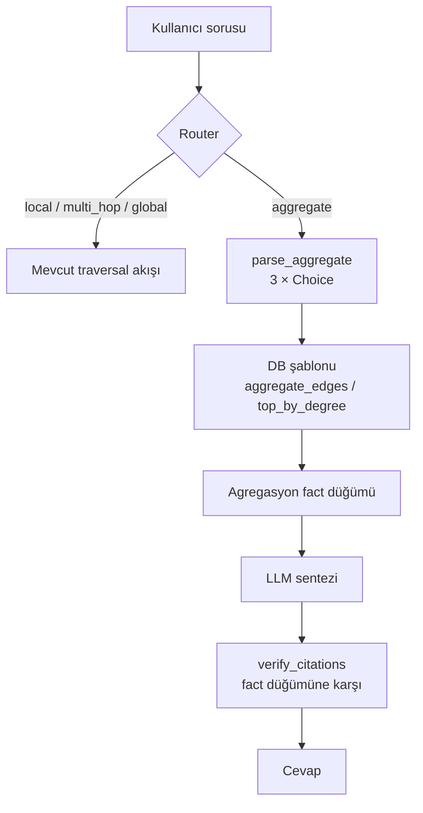
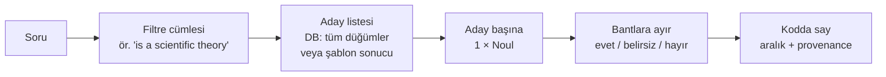
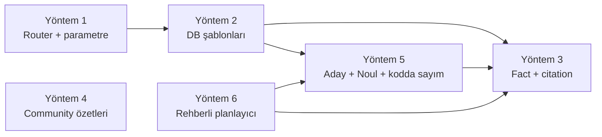

# Agregasyon Soruları İçin Çözüm Yöntemleri

> Tarih: 2026-09-25 · Durum: karar dokümanı. Yöntem 6 implement edildi ve ölçüldü; router rotası kapalı (bkz. bölüm 7).

Pipeline şu an "kaç tane", "en çok", "hepsini listele" gibi agregasyon sorularına güvenilir cevap veremiyor. Bu doküman altı çözüm yöntemini örneklerle anlatıyor ve aralarında seçim yapmayı kolaylaştırıyor. Yöntem 5, üç dış Jev projesinin incelenmesinden çıktı (bkz. dokümanın sonundaki Ek).

Yöntemler birbirinin alternatifi değil:

- **1, 2 ve 3 aynı zincirin halkalarıdır.** Tek başına hiçbiri işe yaramaz. Asıl seçim, zincirin ne kadarını kuracağımız.
- **4 başka bir soru tipini çözer:** tematik ve genel sorular. Kesin sayım yapmaz.
- **6, 1–3'ün şablonlarının yerine geçer:** sorguyu graph üzerinde adım adım kurar ve çok adımlı yol filtrelerini de ifade eder. Yöntem 3 ve 5'i içinde kullanır.
- **5, şablonların ifade edemediği filtreleri çözer:** "kaç teori var", "hangileri fizikle ilgili". Yöntem 2'nin üstüne eklenen bir ara adımdır; sonucu güven aralığıyla verir.

Tüm örnekler quickstart verisini kullanıyor: `examples/data/science_history.json`, 14 varlık ve 14 triple. Bunlardan 2 triple kasıtlı olarak yanlış ve edge verification sırasında budanıyor ("Newton baked Banana Bread", "LIGO was born in Ulm"). Sayımlar kalan 12 kenara göre verildi.

---

## 1. Problem: pipeline neden sayamıyor

Her aşama context'i bilerek daraltıyor. Sayımı ise LLM, bu eksik alt küme üzerinde yapıyor.

| Aşama | Kod | Kısıt | Agregasyona etkisi |
| --- | --- | --- | --- |
| Intent routing | `graphrag/retrieval/router.py:35` | Sadece `local`, `multi_hop`, `global` | "Kaç tane" sorusunun kendi rotası yok |
| Seed seçimi | `config/settings.py:132` | `seed_final_top_k=2` (quickstart'ta 3) | Tarama en fazla 2–3 düğümden başlıyor |
| BFS (`local`) | `graphrag/retrieval/traversal/bfs.py:73` | 1-hop, **sadece giden** kenar, skor ≥ 0.6 | Gelen kenarlar hiç görülmüyor; eşik altı kenarlar sayılmıyor |
| A* (`global`) | `graphrag/pipeline.py:180` | `max_depth=2`, `max_paths=3`, early termination | İlk "yeterli" yolda duruyor |
| Rerank | `graphrag/retrieval/post_traversal.py:32` | En düşük %20 atılıyor | Sayılacak öğelerin bir kısmı siliniyor |
| Gate + citation | `graphrag/retrieval/post_traversal.py:224`, `:289` | İlk 10 düğüm | 10'dan büyük liste doğrulanamıyor |
| Graph arayüzü | `graphrag/graph/base.py` | Sadece `get_neighbors` ve `vector_search` | DB tarafında `COUNT` / `ORDER BY` yapılamıyor |
| Şema | `graphrag/graph/kuzu_client.py:45` | Tüm düğümler tek tip `Entity`; tür bilgisi tutulmuyor | "Kaç fizikçi var?" sorusu veri seviyesinde cevapsız |

### Somut başarısızlık örnekleri (quickstart verisi)

**Soru:** "Calculus'u kaç kişi geliştirdi?" (Doğru cevap: 2, Isaac Newton ve Gottfried Leibniz.)

1. Seed seçimi `Calculus` düğümünü bulur.
2. BFS `get_neighbors("Calculus")` çağırır. Bu metot sadece **giden** kenarları döndürür (`kuzu_client.py:92`). `Calculus` düğümünün giden kenarı yok, bu yüzden sonuç boş liste.
3. Context sadece `Calculus: <açıklama>` satırından oluşur. Açıklamada iki kişi de geçiyorsa cevap tesadüfen doğru çıkar. Geçmiyorsa gate çekimser kalır.

**Soru:** "Isaac Newton'un kaç ilişkisi var?" (Doğru cevap: 4. AUTHORED Principia, DEVELOPED Calculus, LEADS Royal Society, BORN_IN Woolsthorpe.)

- BFS her kenarı ayrı ayrı soruyla skorlar: "Bu fact soruya ne kadar ilgili?" `BORN_IN Woolsthorpe` kenarı "ilişki sayısı" sorusu için düşük skor alabilir ve 0.6 altında kalıp budanır.
- LLM "3 ilişki" der. Bu 3 iddianın her biri context'te var, dolayısıyla citation kontrolü geçer ve **yanlış cevap `VERIFIED` olarak döner**.

Asıl tehlike bu: citation kontrolü "iddia context'te var mı" diye sorar, "context eksiksiz mi" diye sormaz.

### Kapsam dışı tutulan alternatif: text-to-Cypher

LLM'e serbest Cypher yazdırmak en esnek yol. Ama bu repoda iki nedenle önerilmiyor:

- **Model yetersiz.** Yerel 8B model (Llama-3.1 NF4) şema bilgisine rağmen sık sık hatalı sorgu üretir.
- **Enjeksiyon riski.** Üretilen sorgu doğrudan DB'de çalışır, hem sızıntı hem yazma riski var. `age_client.py:157` zaten f-string ile Cypher kurduğu için bu yüzey genişlerdi.

Yöntem 2'deki şablon yaklaşımı esnekliğin bir kısmından vazgeçip bu iki riski kapatıyor.

---

## 2. Yöntem 1: Router'a `aggregate` niyeti eklemek

### Ne yapar

Soruyu, traversal yerine "DB'de say" yoluna yönlendirir. Tek başına sadece bir etiket üretir. Asıl işi yapabilmek için Yöntem 2'ye ihtiyaç duyar.

### Nasıl çalışır

**Adım 1: yeni rota.** `router.py` içindeki `_ROUTE_OPTIONS` sözlüğüne bir seçenek eklenir:

```python
class QueryIntent(str, Enum):
    LOCAL     = "local"
    MULTI_HOP = "multi_hop"
    GLOBAL    = "global"
    AGGREGATE = "aggregate"

_ROUTE_OPTIONS = {
    "local":     "The question asks about one specific fact of one entity.",
    "multi_hop": "The question asks how two or more entities are connected, requiring a chain of facts.",
    "global":    "The question asks for a broad summary or overview of a whole topic.",
    "aggregate": (
        "The question asks to count, rank, total or list ALL items of some kind "
        "(how many, which has the most, list every)."
    ),
}
```

**Adım 2: parametre çıkarımı.** "Say" demek yetmez; neyin sayılacağı da bilinmeli. Burada repodaki mevcut yapı işe yarıyor: ilişki tipleri `OntologyAligner` şemasında **kapalı bir küme** (`AUTHORED`, `BORN_IN`, `DEVELOPED`, …). Kapalı küme, `Choice` primitive'inin tam kullanım alanı. Bu yüzden serbest metin çıkarımına gerek kalmaz; üç ayrı `Choice` çağrısı yeter:

```python
@dataclass
class AggregateSpec:
    operation: str       # "count" | "list" | "rank"
    anchor:    str|None  # seed selector'dan gelen varlık (ör. "Calculus"), rank için None
    rel_type:  str|None  # ontoloji şemasından (ör. "DEVELOPED"), "any" → None
    direction: str       # "out" | "in"

def parse_aggregate(query: str, anchor: str|None, schema: dict[str, str]) -> AggregateSpec:
    m = get_decision_model()
    ctx = f"User question: {query}\nAnchor entity: {anchor}"
    op  = m.choice(ctx, "What operation does the question ask for?", {
        "count": "a number of items", "list": "every matching item", "rank": "the item with the most/least",
    })
    rel = m.choice(ctx, "Which relationship is being aggregated?", {**schema, "any": "all relationships"})
    dir = m.choice(ctx, f"Is '{anchor}' the subject or the object of that relationship?", {
        "out": f"{anchor} does it (subject)", "in": f"something does it to {anchor} (object)",
    })
    return AggregateSpec(op, anchor, None if rel == "any" else rel, dir)
```

Anchor varlık mevcut `SeedSelector` ile bulunur. `rank` işleminde anchor olmaz, seed seçimi atlanır.

### Örnekler (quickstart)

| Soru | operation | anchor | rel_type | direction |
| --- | --- | --- | --- | --- |
| Calculus'u kaç kişi geliştirdi? | count | Calculus | DEVELOPED | in |
| Newton'un kaç ilişkisi var? | count | Isaac Newton | any | out |
| Newton hangi eserleri yazdı? (hepsi) | list | Isaac Newton | AUTHORED | out |
| En çok bağlantısı olan varlık hangisi? | rank | — | any | out |
| Kimler bir yerde doğmuş? | list | — | BORN_IN | out |

### Kapsam sınırı ve genişletme: `group` işlemi ve filtre parametreleri

Bu haliyle `AggregateSpec` sadece **tek anchor × tek ilişki × yön** filtresini ve `count` / `list` / `rank` işlemlerini ifade eder. Gruplama (`GROUP BY`), sayısal metrikler (`SUM` / `AVG` / `MIN` / `MAX`, `COUNT DISTINCT`) ve property filtreleri (`communityId = 0`, `pagerank > 0.1`) spec'te yer almaz. Bu yüzden Yöntem 2'deki `group_edges` şablonuna parametre üretemez.

Genişletmek için spec'e üç alan eklenir:

```python
@dataclass
class AggregateSpec:
    operation: str               # "count" | "list" | "rank" | "group"
    anchor:    str | None
    rel_type:  str | None
    direction: str
    keys:      list[str]    = ()   # yalnız "group": GROUP_KEYS alt kümesi
    metrics:   list[Metric] = ()   # yalnız "group"
    filters:   list[Filter] = ()   # tüm işlemlerde
```

Her alan farklı bir primitive ile çıkarılır:

| Alan | Primitive | Neden |
| --- | --- | --- |
| `operation` | `Choice` (4 seçenek) | Kapalı küme |
| `keys` | Anahtar başına 1 `Noul` ("Soru sonucu <anahtar>'a göre ayırmak istiyor mu?") | Çoklu seçim; `Choice` tek seçenek döndürür |
| `metrics.op` | `Choice` | Kapalı küme (`METRIC_OPS`) |
| `metrics.field` | `Choice` | Kapalı küme (`METRIC_FIELDS`) |
| `filters.field` / `op` | `Choice` | Kapalı küme |
| `filters.value` | **Kod** üretir, model seçer | Laya sayı üretemez (bkz. Yöntem 5, jev-extract ilkesi). Sayısal değerler sorudan regex ile çıkarılır, isim değerleri `SeedSelector` ile bulunur, model sadece adaylar arasından seçer. |

Sınırlar:

- **Maliyet artar.** `group` sorusu 1 router çağrısı + 1 `Choice` + |GROUP_KEYS| `Noul` + metrik ve filtre başına 2 `Choice` yapar. Yine de traversal'daki kenar başına skorlamanın altında kalır.
- **Doğal dil karşılığı zayıf.** Çok seviyeli, çok metrikli bir sorgu kullanıcı sorusundan çok analitik bir rapordur. Bu tür sorgular için router yerine doğrudan `pipeline.query_aggregate(spec)` API'si daha güvenilir (bkz. §7).
- **Serbest değerli filtreler.** Sorudaki değer, koddaki bir aday kümesine eşlenemiyorsa ("fizikle ilgili olanlar") bu bir yapısal filtre değil, anlamsal filtredir. Yöntem 5'e yönlendirilir.

### Riskler

- **Yanlış yönlendirme.** "Newton ile Einstein nasıl bağlantılı?" sorusu `aggregate` rotasına düşerse eskiden çalışan bir soru bozulur. Laya olasılıkları kalibre değil (model kartı uyarıyor), bu yüzden bir güven eşiği gerekir: `confidence < X` ise eski rotaya dönülür.
- **Yön seçimi zayıf halka.** "Calculus'u kim geliştirdi" sorusunda `in` yönünü seçmek Laya için zor bir ayrım olabilir. Önce ölçülmesi gerekiyor.
- **Maliyet.** Her agregasyon sorusu 1 router çağrısı ve 3 `Choice` çağrısı yapar. Mevcut BFS'teki kenar başına `score` çağrılarıyla kıyaslayınca ihmal edilebilir.

### Artı / eksi

- Artı: küçük değişiklik (~40 satır), mevcut primitive'lerle uyumlu, kapalı ontoloji sayesinde güvenli.
- Eksi: tek başına değer üretmez. Router'daki her yeni seçenek diğer rotaların doğruluğunu da etkiler.

---

## 3. Yöntem 2: `BaseGraphClient`'a şablonlu agregasyon metotları

### Ne yapar

Sayımı ve sıralamayı LLM yerine veritabanına yaptırır. Tam ve deterministik sonuç verir; traversal, eşik ve rerank budamasını tamamen atlar.

### Arayüz

```python
# graphrag/graph/base.py
class BaseGraphClient(ABC):
    @abstractmethod
    def aggregate_edges(
        self,
        anchor:    str | None,
        rel_type:  str | None,
        direction: str = "out",          # "out" | "in"
        limit:     int = 200,
    ) -> list[dict[str, str]]:
        """Return EVERY matching edge as {source, type, target}. No scoring, no pruning."""

    @abstractmethod
    def top_by_degree(self, rel_type: str | None, k: int = 5) -> list[dict[str, Any]]:
        """Return the k entities with the most outgoing edges: {name, degree}."""
```

`count` işlemi için ayrı bir metot gerekmez; `len(aggregate_edges(...))` yeterli. Ama büyük graph'ta `COUNT` sorgusu satırları taşımadığı için daha verimlidir. `limit` değerini aşan sonuçta hem gerçek sayı hem örnek liste döndürmek için ileride `count_edges` eklenebilir.

### Backend implementasyonları

**Kùzu.** İlişki tipi `RELATES_TO` üzerinde bir `type` property'si (`kuzu_client.py:46`). Tamamen parametrik:

```python
def aggregate_edges(self, anchor, rel_type, direction="out", limit=200):
    a, b = ("a", "b") if direction == "out" else ("b", "a")
    where = []
    if anchor:   where.append(f"{a}.name = $anchor")
    if rel_type: where.append("r.type = $rel")
    q = (
        "MATCH (a:Entity)-[r:RELATES_TO]->(b:Entity) "
        + (f"WHERE {' AND '.join(where)} " if where else "")
        + "RETURN a.name, r.type, b.name ORDER BY a.name, b.name LIMIT $limit"
    )
    res = self.conn.execute(q, parameters={"anchor": anchor, "rel": rel_type, "limit": limit})
    ...

def top_by_degree(self, rel_type, k=5):
    q = ("MATCH (a:Entity)-[r:RELATES_TO]->(:Entity) "
         + ("WHERE r.type = $rel " if rel_type else "")
         + "RETURN a.name, count(r) AS deg ORDER BY deg DESC LIMIT $k")
```

**Neo4j.** İlişki tipi gerçek bir Cypher tipi (`neo4j_client.py:141`, `[r:{rel_type}]`). Cypher tipleri parametre olarak geçilemez, bu yüzden f-string gerekir. Güvenlik tek şarta bağlı: `rel_type` mutlaka ontoloji şemasındaki whitelist'e karşı kontrol edilmeli:

```python
if rel_type and rel_type not in self._allowed_rel_types:
    raise ValueError(f"unknown relation type {rel_type!r}")
rel = f":{rel_type}" if rel_type else ""
q = f"MATCH (a:Entity)-[r{rel}]->(b:Entity) WHERE a.name = $anchor RETURN a.name, type(r), b.name"
```

**Memgraph ve AGE.** Neo4j ile aynı desen. AGE'de hem `anchor` hem `rel_type` f-string'e giriyor; `anchor` için de parametre kullanılmalı veya kaçış yapılmalı.

### Örnek: "Calculus'u kaç kişi geliştirdi?"

```python
spec = AggregateSpec("count", "Calculus", "DEVELOPED", "in")
db.aggregate_edges("Calculus", "DEVELOPED", direction="in")
# → [{"source": "Gottfried Leibniz", "type": "DEVELOPED", "target": "Calculus"},
#    {"source": "Isaac Newton",      "type": "DEVELOPED", "target": "Calculus"}]
# count = 2
```

> Gerçek demo verisinde bu sayı **1**: Newton → Calculus kenarı `DEVELOPED` yerine
> `BORN_IN` olarak hizalandığı için yalnız Leibniz kayıtlı (bkz. aşağıdaki hizalama notu).

Mevcut pipeline bu soruda boş BFS sonucu üretiyordu. Şablon ise gelen kenarları da gördüğü için doğru sonucu verir.

### Örnek: "En çok bağlantısı olan varlık hangisi?"

```python
db.top_by_degree(rel_type=None, k=3)
# → [{"name": "Isaac Newton", "degree": 4}, {"name": "General Relativity", "degree": 3}, ...]
```

### Örnek: "Her bilim insanının bağlantılarını türüne göre özetle: kaç bağlantısı var ve bağlandığı konular ne kadar merkezi?"

Çok seviyeli, çok metrikli agregasyon. Teknik ifadesi şu: topluluk → varlık → ilişki tipi seviyesinde kenar sayısı ve hedef `pagerank` istatistikleri. Sorunun parçaları sorguya şöyle karşılık gelir:

- "Her bilim insanının" → `s.name` (seviye 2), topluluk içinde (`s.communityId`, seviye 1)
- "türüne göre" → `r.type` (seviye 3)
- "kaç bağlantısı var" → `COUNT(*)`, kaç farklı hedef → `COUNT(DISTINCT t.name)`
- "konular ne kadar merkezi" → `t.pagerank` üzerinde `SUM` / `AVG` / `MIN` / `MAX`

Aynı agregasyon kalıbına düşen diğer doğal sorular aşağıda, "Doğal dil karşılıkları" bölümünde.

> **Mevcut şablonlarla yapılamaz.** Bu sorgu elle yazılmış Cypher'dır. Yukarıdaki iki şablon (`aggregate_edges`, `top_by_degree`) bunu ifade edemez:
>
> - `aggregate_edges` sadece `{source, type, target}` döndürür. `pagerank` ve `communityId` gelmediği için `SUM` / `AVG` / `MIN` / `MAX` hesaplanamaz.
> - `top_by_degree` tek anahtarla (`a.name`) gruplar ve sadece `count` yapar.
> - Yöntem 1'in `AggregateSpec` yapısında gruplama anahtarı ve metrik alanı yoktur.
>
> Kısmi geçici çözüm var: `aggregate_edges(None, None)` ile tüm kenarlar çekilip Python'da `(Subject, RelationType)` bazında `EdgeCount` ve `DistinctTargets` sayılabilir. Ancak Community seviyesi ve pagerank metrikleri eksik kalır, `limit=200` de sonucu kırpar.
>
> Bu örnek, aşağıda önerilen `group_edges` şablonunun hedef çıktısıdır (bkz. "Önerilen genişletme").

```cypher
MATCH (s:Entity)-[r:RELATES_TO]->(t:Entity)
RETURN
    s.communityId            AS Community,        // seviye 1
    s.name                   AS Subject,          // seviye 2
    r.type                   AS RelationType,     // seviye 3

    SUM(t.pagerank)          AS TotalTargetRank,
    COUNT(*)                 AS EdgeCount,
    AVG(t.pagerank)          AS AvgTargetRank,
    MIN(t.pagerank)          AS MinTargetRank,
    MAX(t.pagerank)          AS MaxTargetRank,
    COUNT(DISTINCT t.name)   AS DistinctTargets   // sonda olmalı, aşağıya bakın
ORDER BY Community, Subject, RelationType;
```

Cypher'da `GROUP BY` yok. `RETURN` içindeki toplama dışı alanlar (`Community`, `Subject`, `RelationType`) otomatik olarak gruplama anahtarı olur.

> **Kùzu 0.11.3 hatası:** `COUNT(DISTINCT ...)` listede başka agregasyonlardan önce gelirse, ondan sonraki tüm agregasyonlar sessizce `0` / `NULL` döner (hata yok). DISTINCT agregasyonu en sona koymak geçici çözüm. Bir `group_edges` şablonu yazılırsa bu sıralamayı kendisi zorlamalı.

Sonuçlar, quickstart'ın ürettiği `examples/.kuzu_demo` üzerinde çalıştırıldı (pagerank 4 haneye yuvarlandı):

| Community | Subject | RelationType | TotalTargetRank | EdgeCount | Avg | Min | Max | DistinctTargets |
| --- | --- | --- | --- | --- | --- | --- | --- | --- |
| 0 | Albert Einstein | BORN_IN | 0.0764 | 1 | 0.0764 | 0.0764 | 0.0764 | 1 |
| 0 | Albert Einstein | DISCOVERED (*) | 0.0764 | 1 | 0.0764 | 0.0764 | 0.0764 | 1 |
| 0 | General Relativity | EXPLAINS | 0.0753 | 1 | 0.0753 | 0.0753 | 0.0753 | 1 |
| 0 | General Relativity | EXTENDS | 0.1306 | 1 | 0.1306 | 0.1306 | 0.1306 | 1 |
| 0 | General Relativity | PREDICTED | 0.1209 | 1 | 0.1209 | 0.1209 | 0.1209 | 1 |
| 0 | Gottfried Leibniz | DEVELOPED | 0.1106 | 1 | 0.1106 | 0.1106 | 0.1106 | 1 |
| 0 | Isaac Newton | AUTHORED | 0.0650 | 1 | 0.0650 | 0.0650 | 0.0650 | 1 |
| 0 | Isaac Newton | BORN_IN (*) | 0.1757 | 2 | 0.0878 | 0.0650 | 0.1106 | 2 |
| 0 | Isaac Newton | LEADS | 0.0650 | 1 | 0.0650 | 0.0650 | 0.0650 | 1 |
| 0 | LIGO | DISCOVERED | 0.1209 | 1 | 0.1209 | 0.1209 | 0.1209 | 1 |
| 0 | Principia Mathematica | RELATED_TO | 0.1306 | 1 | 0.1306 | 0.1306 | 0.1306 | 1 |

(*) Hizalama hataları: Einstein → General Relativity `DEVELOPED` yerine `DISCOVERED`, Newton → Calculus ise `DEVELOPED` yerine `BORN_IN` olarak hizalanmış. Bu yüzden Newton'un `BORN_IN` grubunda iki hedef (Woolsthorpe, Calculus) var. "introduced the law of" `RELATED_TO`'ya düştü.

Çıkarımlar:

- **Seviye 1 tek grup.** Topluluk tespiti WCC; graph `Universal Gravitation` üzerinden tek parça bağlı olduğu için tüm kenarlar `communityId = 0`. `Banana Bread` düğümü kenarı budandığı hâlde tabloda kalıyor ve `communityId`/`pagerank` değeri `NULL`; `MATCH ...-[r]->...` onu zaten dışarıda bırakıyor.
- **Küçük veride 3 seviye dejenere oluyor.** 11 gruptan 10'unda tek kenar var, `AVG = MIN = MAX`. Metriklerin ayrıştığı tek grup Newton/`BORN_IN` ve o da bir hizalama hatasından kaynaklanıyor.
- **Agregasyon, hizalama hatalarını görünür kılıyor.** Aynı özne için `BORN_IN` altında `DistinctTargets > 1` çıkması (bir kişi tek yerde doğar) iyi bir veri kalitesi kontrolü. Kardinalitesi 1 olması beklenen ilişki türleri için bu sorgu bir sağlık kontrolüne dönüştürülebilir.
- **Roll-up, bir seviyeyi `RETURN`'den çıkarmakla yapılır.** Community + Subject seviyesinde Newton `EdgeCount=4`, General Relativity 3, Einstein 2. Community + RelationType seviyesinde `BORN_IN=3`, `DISCOVERED=2`, diğerleri 1. Yalnız Community seviyesinde tek grup, 12 kenar.
- **Daha anlamlı bir metrik hesaplanıyor ama saklanmıyor.** Laya'nın kenar doğrulama skoru (`P`, `examples/laya_kuzu_quickstart.py:90`) hesaplanıyor, fakat `upsert_edge` bu skoru kenara yazmıyor. `RELATES_TO` tablosuna bir `support DOUBLE` kolonu eklenirse `AVG(r.support)` / `MIN(r.support)` "hangi özne/ilişki grubunun kanıtı en zayıf" sorusunu cevaplayabilir.
- **Şablona dönüştürülebilir.** Gruplama anahtarları sabit bir whitelist'ten seçilirse (`communityId`, `name`, `type`), bu sorgu `aggregate_edges` ile aynı güvenlik modeline sahip bir `group_edges(keys, metrics)` şablonu olur.

#### Doğal dil karşılıkları

Kullanıcılar bu sorguyu nadiren tek parça sorar. Genelde bir gruplama anahtarı, bir metrik ve bazen bir anchor içeren daha dar sorular gelir. Şemada varlık tipi (`Person`, `City`) yok. Bu yüzden "bilim insanı" rolü `BORN_IN` kenarının kaynağı, "şehir" rolü hedefi, "eser" rolü ise `AUTHORED` hedefi üzerinden çıkarılıyor. Aşağıdaki sorular `examples/.kuzu_demo` üzerinde çalıştırıldı.

| # | Doğal soru | Kalıp | Demo sonucu |
| --- | --- | --- | --- |
| 1 | "Hangi şehirde kaç bilim insanı doğmuş?" | `BORN_IN` hedefine göre grupla, `COUNT(DISTINCT kaynak)` | Ulm 1, Woolsthorpe 1, Calculus 1 (*) |
| 2 | "Bilim insanlarının yazdığı eserleri doğum yerlerine göre say." | 2 kenar tipi: `BORN_IN` ile grupla, `AUTHORED` için `OPTIONAL MATCH` + `COUNT` | Calculus/Newton 1 (*), Ulm/Einstein 0, Woolsthorpe/Newton 1 |
| 3 | "Einstein'la aynı şehirde doğan başka bilim insanı var mı? Varsa kaçar eser yazmışlar?" | Anchor, 2 atlama (`e→şehir←p`, `p ≠ e`), ardından `AUTHORED` sayımı | Boş sonuç. Ulm'da başka kimse yok |
| 4 | "Kim kaç katkı yapmış? Keşif, geliştirme ve yazılan eserleri ayrı ayrı göster." | İlişki tipi whitelist'i (`IN [...]`), özneye göre `COUNT` + `collect(r.type)` | Einstein, Leibniz, Newton, LIGO: 1'er |
| 5 | "Evrensel Kütleçekimi'ne hangi kavramlar hangi ilişkiyle bağlanıyor?" | Gelen kenarlar, ilişki tipine göre grupla | `EXTENDS`: General Relativity, `RELATED_TO`: Principia Mathematica |
| 6 | "En merkezi konularla ilgilenen üç varlık hangisi?" | Özneye göre grupla, `AVG(t.pagerank)` ile sırala, `LIMIT 3` | Principia 0.1306, LIGO 0.1209, Leibniz 0.1106 |
| 7 | "Bilim insanlarının çalışmaları başka hangi kavramlara yol açmış?" | 2 atlama (`kişi→çalışma→kavram`), `(kişi, çalışma)` ikilisine göre `COUNT` | Einstein/General Relativity 3 (`EXTENDS`, `EXPLAINS`, `PREDICTED`), Newton/Principia Mathematica 1 (`RELATED_TO`) |
| 8 | "Birden fazla yerde doğmuş görünen biri var mı?" | `BORN_IN` için özneye göre grupla, `COUNT(DISTINCT t) > 1` | Newton 2 (Woolsthorpe, Calculus). Veri kalitesi kontrolü |

(*) `Calculus` şehir değil. Newton → Calculus `DEVELOPED` kenarı `BORN_IN` olarak yanlış hizalandığı için şehir listesine giriyor (bkz. yukarıdaki hizalama notu). Soru 8 tam da bu hatayı yakalar.

Soru 2 ve 3'ün Cypher karşılığı (Kùzu 0.11.3'te doğrulandı):

```cypher
// 2: doğum yerine göre eser sayısı
MATCH (p:Entity)-[b:RELATES_TO]->(c:Entity) WHERE b.type = 'BORN_IN'
OPTIONAL MATCH (p)-[a:RELATES_TO]->(w:Entity) WHERE a.type = 'AUTHORED'
RETURN c.name AS City, p.name AS Scientist, COUNT(w) AS Works
ORDER BY City, Scientist;

// 3: anchor ile aynı şehirde doğanlar ve eser sayıları
MATCH (e:Entity {name: 'Albert Einstein'})-[b1:RELATES_TO]->(c:Entity)<-[b2:RELATES_TO]-(p:Entity)
WHERE b1.type = 'BORN_IN' AND b2.type = 'BORN_IN' AND p.name <> e.name
OPTIONAL MATCH (p)-[a:RELATES_TO]->(w:Entity) WHERE a.type = 'AUTHORED'
RETURN c.name AS City, p.name AS Scientist, COUNT(w) AS Works;
```

Bu soruların hiçbiri mevcut iki şablonla tam karşılanamıyor. 1, 5, 6 ve 8 tek atlamalı olduğu için `group_edges` ile karşılanabilir. 2, 3 ve 7 ise iki kenar tipini zincirliyor, yani `group_edges`'in de ötesinde bir yol (path) şablonu ya da guided planner gerektiriyor.

### Önerilen genişletme: `group_edges` ve yapısal filtreler

Mevcut iki şablon üç agregasyonu karşılıyor: `count`, `list` ve çıkış derecesine göre `rank`. Filtre olarak da yalnızca anchor, ilişki tipi ve yön destekleniyor. Aşağıdaki şablon, çok seviyeli gruplamayı, sayısal metrikleri ve property filtrelerini aynı whitelist güvenlik modeliyle ekler.

```python
# graphrag/graph/base.py
GROUP_KEYS = {"community": "s.communityId", "subject": "s.name", "relation": "r.type",
              "target": "t.name", "target_community": "t.communityId"}
METRIC_FIELDS = {"target_pagerank": "t.pagerank", "source_pagerank": "s.pagerank"}  # + "support": "r.support" (kolon eklenirse)
METRIC_OPS = {"count", "count_distinct", "sum", "avg", "min", "max"}
FILTER_FIELDS = {"subject": "s.name", "target": "t.name", "relation": "r.type",
                 "community": "s.communityId", "target_pagerank": "t.pagerank"}
FILTER_OPS = {"=", "!=", "<", "<=", ">", ">=", "in"}

@dataclass
class Metric:
    op:    str              # METRIC_OPS
    field: str | None       # METRIC_FIELDS; count için None, count_distinct için GROUP_KEYS

@dataclass
class Filter:
    field: str              # FILTER_FIELDS
    op:    str              # FILTER_OPS
    value: Any              # her zaman parametre olarak geçer, sorguya gömülmez

@abstractmethod
def group_edges(
    self,
    keys:    list[str],                 # GROUP_KEYS; boş liste = tek toplam satır
    metrics: list[Metric],
    where:   list[Filter] = (),         # agregasyondan ÖNCE (WHERE)
    having:  list[Filter] = (),         # agregasyondan SONRA; field = metrik takma adı
    order:   list[tuple[str, str]] = (),  # (alan, "asc" | "desc")
    limit:   int = 200,
) -> list[dict[str, Any]]:
    """Group matching edges by `keys` and compute `metrics`. Every name is whitelisted."""
```

Uygulama kuralları:

- **Güvenlik.** Alan, operatör ve anahtar adları yalnızca yukarıdaki sözlüklerden gelir; kullanıcı metni sorguya asla girmez. Filtre değerleri her zaman `$p0`, `$p1`, … parametresi olarak geçer.
- **Kùzu DISTINCT sırası.** Şablon `count_distinct` metriklerini `RETURN` listesinin sonuna kendisi taşımalı (bkz. yukarıdaki Kùzu 0.11.3 hatası).
- **`HAVING` karşılığı.** Cypher'da `HAVING` yok. `WITH <anahtarlar>, <metrikler> WHERE <having>` ile yazılır.
- **Roll-up.** Ayrı bir özellik gerekmez; `keys` listesinden bir seviye çıkarmak yeterli.
- **Kesilme bilgisi.** Sonuç `limit` değerine ulaşırsa bu, dönüş değerinde işaretlenmeli (`truncated=True`). Böylece Yöntem 3 "tam liste" iddiasında bulunmaz.

Örnek çağrılar (quickstart):

| Soru | Çağrı |
| --- | --- |
| Yukarıdaki çok seviyeli tablo | `group_edges(["community","subject","relation"], [sum(target_pagerank), count, avg(...), min(...), max(...), count_distinct(target)])` |
| Hangi özne/ilişki çiftinde birden fazla hedef var? (veri sağlık kontrolü) | `group_edges(["subject","relation"], [count_distinct(target)], having=[Filter("count_distinct_target", ">", 1)])` → Newton / `BORN_IN` |
| Pagerank'ı 0.1'den büyük hedeflere giden kenar sayısı, ilişki tipine göre | `group_edges(["relation"], [count], where=[Filter("target_pagerank", ">", 0.1)])` |
| Topluluk 0'da en çok kenarı olan 3 özne | `group_edges(["subject"], [count], where=[Filter("community","=",0)], order=[("count","desc")], limit=3)` |

Bu şablon `top_by_degree`'yi de kapsar: `group_edges(["subject"], [count], order=[("count","desc")], limit=k)`. Giriş derecesi için `keys=["target"]` kullanılır.

### Açık bir veri sorunu: varlık türü yok

"Kaç fizikçi var?" ya da "kaç teori var?" sorularını hiçbir şablon cevaplayamaz, çünkü şema düğüm türü tutmuyor. Tüm düğümler `Entity` etiketli ve bir tür property'si yok. Bunu çözmenin iki yolu var:

- **Ingestion'da tür yazmak.** `entity_extractor.py` zaten NER yapıyor; çıkan türü `entity_type` property'si olarak yazmak. Tür kümesi kapalı tutulursa sınıflandırma yine `Choice` ile yapılabilir.
- **Sadece ilişki üzerinden sormak.** "Kaç kişi bir şey geliştirdi?" sorusu şu anki şemayla da cevaplanabilir: `DEVELOPED` kenarlarının kaynaklarını saymak yeterli.

- **Sorgu anında sınıflandırmak.** Adayları DB'den çekip her birine Laya ile "bu bir teori mi?" diye sormak. Bu, Yöntem 5.

Önerilen: ilk sürüm ikinci yolla sınırlı kalsın. Tür soruları için önce Yöntem 5 denensin. Ingestion'da tür yazmak, Yöntem 5 yavaş kalırsa planlansın.

### Riskler

- **Kapsam dar.** İlk iki şablon sadece önceden tanımlı kalıpları cevaplar: tek varlık × tek ilişki × yön, ve derece sıralaması. `group_edges` gruplamayı, metrikleri ve property filtrelerini ekler, ama yalnızca şemada **var olan** alanlar üzerinde çalışır (`name`, `description`, `pagerank`, `communityId`, `type`). "2000'den sonra kaç ödül" gibi filtreler için önce veriye tarih property'si yazılmalı. Çok adımlı yol filtreleri de ("Einstein'ın doğduğu şehirde doğan herkes") kapsam dışındadır. İşlem bazında tam liste için bkz. §7 "İşlem bazında yapılabilirlik".
- **Dört backend'in bakımı.** Her şablon Kùzu, Neo4j, Memgraph ve AGE için ayrı yazılıp test edilmeli.
- **Sonuç tam ama yalnızca graph kadar tam.** Edge verification ingestion sırasında zayıf triple'ları budadıysa, sayım o budanmış graph'ın sayımıdır. Cevap metni bunu belirtmeli ("graph'ta kayıtlı 2 kişi").

### Artı / eksi

- Artı: tam ve deterministik sonuç, LLM sayım hatası sıfır, enjeksiyon riski yok (whitelist ile), çok hızlı.
- Eksi: dar kalıp seti, backend başına kod, yeni kalıp eklemek kod değişikliği gerektiriyor.

---

## 4. Yöntem 3: DB sonucunu fact olarak LLM'e vermek ve citation'ı ona karşı doğrulamak

### Ne yapar

Yöntem 2'nin sonucunu, pipeline'ın mevcut Phase 4 (sentez ve citation) akışına bağlar. Böylece cevap doğal dilde gelir ve citation kontrolü sayıyı gerçekten doğrular.

### Akış



Rerank ve hallucination gate bu yolda **atlanır**. İkisinin de amacı gürültülü traversal çıktısını temizlemek. DB sonucu ise zaten tam ve kesin; rerank edilmesi doğrudan veri kaybı olur.

### Fact düğümü

DB sonucu, context'e tek bir düğüm olarak eklenir. Bu düğüm hem sayıyı hem de öğelerin tam listesini içerir:

```python
def _aggregate_fact(spec: AggregateSpec, rows: list[dict]) -> dict:
    items = ", ".join(r["source"] if spec.direction == "in" else r["target"] for r in rows)
    rel = spec.rel_type or "any relation"
    text = (
        f"Database count (complete): {len(rows)} entities have {rel} "
        f"{'to' if spec.direction == 'in' else 'from'} {spec.anchor}: {items}."
    )
    return {"name": "Graph database aggregate", "text": text, "score": 1.0}
```

Örnek çıktı:

```
- Graph database aggregate: Database count (complete): 2 entities have DEVELOPED to Calculus: Gottfried Leibniz, Isaac Newton.
```

Sentez prompt'u aynı kalır. LLM "Calculus'u 2 kişi geliştirdi: Gottfried Leibniz ve Isaac Newton." der. `verify_citations` her iddiayı bu fact'e karşı kontrol eder. LLM "3 kişi" derse iddia fact ile çelişir ve cevap `[⚠️ UNVERIFIED]` olarak işaretlenir. **Eksik sayım artık doğrulamadan geçemez.**

### Deterministik alternatif: LLM'siz şablon cevap

Sentez adımı tamamen atlanabilir. Bu durumda cevap doğrudan bir şablondan üretilir:

```python
return f"{len(rows)}: {items}"
```

- Artı: halüsinasyon imkânsız, citation kontrolüne gerek yok, sıfır LLM maliyeti.
- Eksi: cevap doğal dil değil; soru Türkçe, veri İngilizceyse kullanıcıya İngilizce öğe listesi döner.

Önerilen: iki mod bir bayrakla sunulsun. Quickstart zaten LLM'siz `ExtractiveSynthesizer` kullandığı için, orada şablon mod varsayılan olabilir.

### Gruplu ve sayısal sonuçlar (`group_edges`)

`_aggregate_fact` tek bir liste cümlesi üretir. Çok satırlı, çok metrikli bir `group_edges` sonucunu karşılamaz. Üç ek gerekir:

- **Tablo fact'i.** Her grup satırı ayrı bir fact olarak eklenir. Böylece citation kontrolü iddia başına tek satıra bakar: `"Group (subject=Isaac Newton, relation=BORN_IN): count=2, distinct targets=2, avg target pagerank=0.0878."`
- **Sayısal hücrelerde şablon modu zorunlu.** Laya, "0.0878" ile "0.0880" arasındaki farkı iddia doğrulamasında güvenilir biçimde ayırt edemez. Bu yüzden ondalık metrik içeren cevaplar LLM'siz şablon moduyla üretilmeli. Sadece `count` gibi tam sayılı özetlerde LLM modu kullanılabilir.
- **Kesilme.** `truncated=True` dönen sonuçta fact metni "complete" yerine "first N of at least N" demeli. Aksi halde eksik liste yine `VERIFIED` geçer.

### Dil kısıtı

README'de belgelendiği gibi Laya diller arası iddia eşleştiremiyor. Doğru bir Türkçe iddia İngilizce context'e karşı ~0.01 skor alıyor. Bu yüzden Türkçe soruya LLM Türkçe cevap verirse, sayı doğru olsa bile cevap `UNVERIFIED` işaretlenir. Bu sorun bu yönteme özel değil ama burada da geçerli.

### Artı / eksi

- Artı: mevcut Phase 4 yeniden kullanılıyor; citation kontrolü ilk kez "tamlık" bilgisi taşıyan bir fact'e karşı çalışıyor; kod değişikliği küçük (~30 satır, `pipeline.py` içinde yeni bir dal).
- Eksi: Yöntem 1 ve 2 olmadan anlamsız; LLM modunda dil kısıtı sürüyor.

---

## 5. Yöntem 4: Gerçek community özetleri ile `global` rotası

### Ne yapar

Router'ın vaat ettiği ama implement edilmemiş "community summary synthesis" yolunu kurar (`router.py:9`). Microsoft GraphRAG'daki global search yaklaşımına benzer. **Kesin sayım için değil**, tematik ve genel sorular içindir:

- "Bu graph hangi bilim alanlarını kapsıyor?"
- "Kütleçekimi ile ilgili ana fikirler neler?"

### Mevcut durum

- `communityId` her backend'de yazılıyor, ama kullanan kod yok.
- Algoritma backend'e göre değişiyor:
    - Neo4j: GDS Leiden, WCC fallback'i ile
    - Memgraph: MAGE `community_detection`
    - Kùzu: sadece **WCC**, yani bağlı bileşenler (`kuzu_client.py:138`)
- Kùzu'da WCC çok kaba bir bölümleme verir. Quickstart graph'ı büyük ihtimalle 1–3 bileşenden oluşuyor (Newton, Einstein ve LIGO `Universal Gravitation` ve `Gravitational Waves` üzerinden bağlı). Bu yüzden anlamlı topluluklar için Kùzu'da da Leiden/Louvain gerekir. NetworkX'teki `louvain_communities` fonksiyonu yeterli.

### Ingestion adımı (offline)

```python
for cid, members in communities.items():
    edges = [e for e in all_edges if e.source in members]
    prompt = (
        "Summarise this group of related entities in 3-5 sentences.\n"
        + "\n".join(f"- {e.source} {e.type} {e.target}" for e in edges)
    )
    summary = llm.generate(prompt)
    db.upsert_node(f"community:{cid}", label="Community",
                   properties={"description": summary, "size": len(members)})
```

Özetin kendisi de bir halüsinasyon kaynağı. Bu yüzden özet üretildikten sonra, mevcut `verify_citations` fonksiyonuyla o topluluğun kenarlarına karşı doğrulanmalı. Doğrulamayı geçemeyen özet saklanmamalı.

### Sorgu adımı (map-reduce)

1. **Map:** her topluluk özeti soruyla `Score` primitive'i ile skorlanır; en ilgili N tanesi alınır.
2. **Reduce:** seçilen özetler LLM'e verilir ve tek bir cevap sentezlenir.
3. **Citation:** cevap, özetlere karşı doğrulanır.

### Örnek

**Soru:** "Bu graph'ta kütleçekimiyle ilgili hangi fikirler var?"

- Map: "Newton ve klasik mekanik" topluluğu 0.91 skor alır; "Einstein ve görelilik" topluluğu 0.88.
- Reduce: "Evrensel Kütleçekimi (Newton, Principia), Genel Görelilik (Einstein) ve onun tahmini olan kütleçekim dalgaları (LIGO ile tespit edildi)."

**Agregasyon için neden uygun değil:** "Kaç teori var?" sorusunda LLM özetleri okuyup sayar. Özetler bilgi sıkıştırdığı için bu sayı yaklaşık kalır ve doğrulanamaz.

### Riskler

- **Ingestion maliyeti.** Topluluk başına bir LLM çağrısı ve bir doğrulama gerekir. Yerel 8B model CPU'da çok yavaş kalır, pratikte GPU şart.
- **Bayatlama.** Graph değiştiğinde etkilenen toplulukların özetleri yeniden üretilmeli. Artımlı güncelleme için ayrı bir mekanizma lazım.
- **Kalite algoritmaya bağlı.** Özet kalitesi tamamen topluluk bölümlemesinin kalitesine bağlı; Kùzu'daki WCC ile düşük kalır.
- **Küçük graph'ta değer düşük.** 14 varlıklık quickstart'ta etkisi ölçülemez. Değerlendirme için daha büyük bir veri seti gerekiyor.

### Artı / eksi

- Artı: tematik sorular için tek gerçek çözüm; router'daki eksik vaadi tamamlıyor; `communityId` altyapısı hazır.
- Eksi: en büyük iş (ingestion + depolama + sorgu + doğrulama); kesin sayım vermiyor; LLM bağımlı ve pahalı.

---

## 6. Yöntem 5: Aday listesi DB'den, karar Laya'dan, sayım koddan

### Fikrin kaynağı

[gbesse/jev-extract](https://github.com/gbesse/jev-extract) şu kuralla çalışıyor (`docs/design.md`):

> The model only selects among code-generated values. This avoids asking a classifier to generate dates, count, or do arithmetic.

Yani adayları kod üretiyor, model sadece aday başına karar veriyor, birleştirmeyi (`first`, `any`, `all`, `max_probability`, `majority`) yine kod yapıyor. Bu repodaki agregasyon problemine birebir uyuyor. Laya bir System One sınıflandırıcısı: sayamaz, ama "bu öğe koşulu sağlıyor mu?" sorusunu iyi cevaplar.

### Ne yapar

Yöntem 2'nin ifade edemediği, **anlamsal filtre gerektiren** agregasyon sorularını çözer:

- "Graph'ta kaç teori var?" (şemada tür yok)
- "Newton'un ilişkilerinden hangileri bilimsel bir çalışma?"
- "Kütleçekimiyle ilgili kaç varlık var?"

Şema değişikliği gerektirmez. Tür bilgisi, sorgu anında Laya ile üretilir.

### Nasıl çalışır



1. **Filtre cümlesi.** Sorudan tek bir yüklem çıkarılır: "is a scientific theory". Bu serbest metin olduğu için Yöntem 1'deki `Choice` yeterli değil. İki seçenek var:
    - Kapalı bir tür listesi (`person`, `theory`, `place`, `work`, `organisation`, …) tanımlayıp `Choice` ile seçmek. Güvenli ama dar.
    - LLM'e yüklemi tek satır olarak çıkarttırmak. Esnek, ama LLM'e bağımlı.
2. **Aday listesi (deterministik).** Adayları kod üretir, model üretmez:
    - Anchor yoksa: tüm `Entity` düğümleri (yeni bir `list_entities()` metodu).
    - Anchor varsa: Yöntem 2'nin `aggregate_edges` sonucu. Örneğin "Newton'un ilişkilerinden hangileri…" sorusunda Newton'un 4 kenarı.
3. **Aday başına karar.** Her aday için tek bir `Noul` sorulur. Context'e sadece o adayın adı ve açıklaması girer. jev-extract README'si "Jev is sensitive to irrelevant state" uyarısını yapıyor; bu yüzden aday başına dar bir context tutulur.
4. **Bantlara ayırma.** [SammySN-car/jev-deliberation-judge](https://github.com/SammySN-car/jev-deliberation-judge) tasarımındaki belirsizlik bandı kullanılır: `P ≥ 0.70` evet, `P ≤ 0.30` hayır, arası belirsiz.
5. **Kodda sayım.** Cevap tek sayı yerine aralık olarak verilir: `[kesin_evet, kesin_evet + belirsiz]`. Her öğenin olasılığı provenance olarak saklanır.

```python
@dataclass
class FilteredCount:
    yes:       list[tuple[str, float]]
    uncertain: list[tuple[str, float]]
    no:        list[tuple[str, float]]

    @property
    def range(self) -> tuple[int, int]:
        return len(self.yes), len(self.yes) + len(self.uncertain)

def count_matching(db, predicate: str, candidates: list[str],
                   lo: float = 0.30, hi: float = 0.70) -> FilteredCount:
    model = get_decision_model()
    out = FilteredCount([], [], [])
    for name in candidates:
        p = model.noul(f"Entity: {name}. Description: {db.get_node_text(name)}",
                       f"Does this entity match: {predicate}?")
        bucket = out.yes if p >= hi else out.no if p <= lo else out.uncertain
        bucket.append((name, p))
    return out
```

### Örnek: "Graph'ta kaç teori var?" (quickstart)

Aşağıdaki olasılıklar **tahmini**; ölçülmedi. Amaç çıktının biçimini göstermek.

| Aday | Beklenen P | Bant |
| --- | --- | --- |
| General Relativity | ~0.95 | evet |
| Universal Gravitation | ~0.85 | evet |
| Spacetime Curvature | ~0.50 | belirsiz |
| Calculus | ~0.20 | hayır |
| Isaac Newton, Ulm, LIGO, … | < 0.10 | hayır |

Sonuç fact'i Yöntem 3'teki gibi context'e girer:

```
- Graph database aggregate: 14 entities checked. 2 match "is a scientific theory"
  (General Relativity, Universal Gravitation); 1 uncertain (Spacetime Curvature).
```

Cevap: "Graph'ta 2 teori var; belirsiz 1 adayla birlikte 2–3." Tek bir kesin sayı söylemek yerine belirsizliği açıkça raporlar.

### Anlamsal filtre + gruplu agregasyon

Yöntem 5 tek başına sadece **filtreli sayım ve liste** üretir; `SUM` / `AVG` gibi metrikleri veya gruplamayı kendisi yapmaz. Ama sonucu Yöntem 2'nin `group_edges` şablonuna yapısal bir filtre olarak verilebilir:

```python
theories = count_matching(db, "is a scientific theory", db.list_entities())
names = [n for n, _ in theories.yes]                     # kesin küme
db.group_edges(["subject", "relation"], [Metric("count", None)],
               where=[Filter("subject", "in", names)])
# belirsiz küme ile ikinci çağrı → metrikler de aralık olarak raporlanır
```

Böylece "Teorilerin ilişki tiplerine göre kenar sayıları" gibi sorular cevaplanır. Kural aynı kalır: **model sadece aday başına karar verir, gruplama ve hesap DB'de yapılır.** Belirsiz aday varsa her metrik `[yalnız evet, evet + belirsiz]` aralığı olarak verilmelidir.

### Dış repolardan alınan iki sağlamlaştırma

**Çoklu çerçeve (framing) ve polarite dengesi.** Kaynak deliberation-judge. Aynı aday için yüklem iki farklı ifadeyle sorulur:

- "Is this a scientific theory?"
- "Is this something other than a scientific theory?" (sonuç ters çevrilerek okunur)

İki çerçeve çelişirse aday belirsiz banda alınır. Gerekçe, deliberation-judge `REFERENCE.md` §7'deki gözlem: Laya'nın `Noul` cevabı bazen state'i değil, seçenek etiketinin ifadesini takip ediyor. Maliyet aday başına 2 çağrıya çıkar.

**Tekrar değil, çerçeve çeşitliliği.** deliberation-judge tasarımı açıkça uyarıyor: Laya deterministik bir encoder. Aynı soruyu K kez sormak SD ≡ 0 verir, yani self-consistency Laya'da işe yaramaz. Çeşitlilik ancak farklı ifadelerden gelir.

### Maliyet ve ölçek

deliberation-judge'ın notuna göre bir Laya çağrısı ~33 ms sürüyor.

| Aday sayısı | 1 çerçeve | 2 çerçeve |
| --- | --- | --- |
| 14 (quickstart) | ~0,5 s | ~1 s |
| 1.000 | ~33 s | ~66 s |
| 10.000 | ~5,5 dk | ~11 dk |

Tüm düğümleri taramak ölçeklenmez. Büyük graph'ta adaylar önce daraltılmalı:

- **Yapısal daraltma (tamlık korunur).** Örneğin "kaç kişi bir şey geliştirdi?" sorusunda sadece `DEVELOPED` kenarlarının kaynakları aday olur.
- **Vektör ön filtresi (tamlık kaybolur).** `vector_search` ile en benzer top-N aday alınabilir. Ama bu durumda sayım bir alt sınırdır; cevap bunu "en az N" diye açıkça söylemeli.
- **Önbellek.** Aynı yüklem ve aday için sonuç saklanabilir. jev-extract sonucu `hash(schema, text)` ile anahtarlıyor; burada `hash(predicate, node_name, node_text)` uygun.
- **Tekrar eden yüklemler ingestion'a taşınır.** Aynı yüklem sık soruluyorsa, bu Yöntem 2'deki `entity_type` yazımına geçme sinyalidir.

### Riskler

- **Sınıflandırma hatası sayıya birikir.** Aday başına %5 hata, 1.000 adayda ~50 yanlış sayım demek. Aralık gösterimi belirsiz olanları yakalar, ama kendinden emin yanlışları yakalamaz.
- **Kalibrasyon.** Model kartı Laya olasılıklarının aşırı emin ve kalibre edilmemiş olduğunu söylüyor. Bu yüzden 0.30 / 0.70 bantları başlangıç değeri; etiketli veride ayarlanmalı.
- **Dil.** Yüklem ve açıklamalar aynı dilde olmalı. Türkçe yüklem İngilizce açıklamaya karşı diller arası eşleştirme sorununu yaşar (bkz. Yöntem 3, Dil kısıtı).

### Artı / eksi

- Artı: şema değişikliği yok; şablonların ifade edemediği filtreleri çözüyor; belirsizliği açıkça raporluyor; her öğe için provenance var; mevcut `Noul` primitive'iyle çalışıyor.
- Eksi: aday sayısıyla doğrusal maliyet; sayım sınıflandırıcı kadar doğru; yüklem çıkarımı için ya kapalı bir tür listesi ya da LLM gerekiyor.

---

## 7. Yöntem 6: Rehberli sorgu planlayıcı

> Durum: implement edildi (`graphrag/retrieval/planner/`), router rotası `AGGREGATE_ROUTE_ENABLED` bayrağıyla **kapalı**. Plan: `docs/plans/2026-09-25-001-feat-guided-query-planner-plan.md`.

### Ne yapar

Yöntem 1–3'teki sabit şablonlar yerine sorguyu **adım adım** kurar. Her adımda yasal hamleleri kod üretir, Laya yalnızca aralarından seçer:

1. İşlem (**kod + `Choice`**): `count`, `list`, `rank`, `group`. İfadenin tek başına belirlediği
   durumlarda kod karar verir, kalanını model seçer:
   - Dağıtıcı bir işaret varsa ("of each type", "her ilişki türünden") cevap kategori başına bir
     satırdır → `group`. İngilizce "every" işaret sayılmaz ("list every place" düz bir listedir),
     Türkçe "her şey" / "her biri" de sayılmaz: ikisi de bölünecek bir sınıf adlandırmıyor.
   - Bir sayıyla karşılaştırma varsa ("at least 2", "1'den fazla") grup başına bir koşul vardır →
     `group` + `HAVING`. Koşulu geçen grupları saymak bu gramerde zaten ifade edilemiyor.
   - Üstünlük bildiren bir sözcük yoksa `rank` sunulmaz — sıralanacak bir büyüklük yok. Üstünlük
     varsa iki kural da devreye girmez, karar `Choice`'a kalır.
   - "how many" / "kaç" soruyorsa `list` sunulmaz: soru sayı istiyor, varlıkları değil.
2. Başlangıç (**kod**): seed'in adı soruda geçiyorsa o varlık, geçmiyorsa bütün graph. Model'e sorulmaz; eşleşme kelime sınırında yapılır, Türkçe'de kesme işaretiyle gelen ekler sınır sayılır ("Calculus'a"), çok kelimeli adlar son kelimesiyle de eşleşir ("Einstein'ın"). Gerekçe ölçümde: `Choice` olarak sorulduğunda model, seed'ini adıyla anan 14 sorunun hepsinde "bütün graph" dedi.
3. Hop döngüsü (**kod + `Choice`**, en fazla `aggregate_max_hops=3`): seçenekler o anki sınırdan
   (frontier) **gerçekten çıkan** ilişki tipi × yön çiftleri, bir yönde birden fazla tip varsa
   `any:<yön>`, ve `stop`. Graph'ta olmayan bir ilişki ya da yön seçilemez. İlk hop'ta üç kural
   kodda:
   - Soru hiçbir ilişkiden söz etmiyorsa ("Graph'ta kaç kişi var?") cevap varlıkların kendisidir,
     plan başlangıç düğümünde kalır — `stop` zorlanır.
   - Diğer her planda en az bir hop var, yani `stop` **sunulmaz**: sıfır hop'luk bir anchor planı
     anchor'ın kendisini döndürür, ilişkiden söz eden bir soru da o ilişkiyi soruyordur.
   - Soru tek bir ilişki tipini adıyla anıyorsa ("… that Isaac Newton authored") ilk hop odur:
     `any` ve diğer tipler seçeneklerden çıkar, yön modele kalır. İki tip birden anılıyorsa
     hangisinin önce geldiği belli değildir, seçenekler olduğu gibi kalır.

   Sonraki hop'larda iki kural var. Birincisi yolun uzunluğu: soru kaç adım istediğini
   söylüyorsa ("exactly two steps away", "3 adım uzaklıkta") o sayıya varana dek `stop`
   sunulmaz, varınca zorlanır. Soru ilişkiye iki kez atıfta bulunuyorsa — biri tipi adıyla, biri
   geçerken ("everything that the theory Einstein **discovered** is **connected to**") — adı
   geçen ilişki ortadaki varlığı tarif ediyordur, yani onun iki yanında birer adım vardır; bu
   bir alt sınır, kesin sayı değil.

   İkincisi geri dönüş: az önce atılan hop'un tersi (aynı tip, ters yön) sunulmaz, çünkü planın
   az önce bulunduğu varlıklara geri götürür ve elinde olmayan hiçbir şey eklemez. Tek istisna
   sorunun bunu istemesidir — "Einstein'ın doğduğu yerde doğan **başka** kim var?" tam olarak
   `BORN_IN:out` sonrası `BORN_IN:in`'dir; "başka / other / else / diğer" geçiyorsa seçenek
   yerinde kalır. Geri dönüş tek seçenekse de kalır: plan hamlesiz kalmaktansa durur.

   Bir tipin adı iki yerden okunur. Birincisi şemanın kendi açıklaması: açıklama bir eylem öbeği
   olduğu için ("wrote, published or authored a work") nesnesinden önceki sözcükler o ilişkinin
   adıdır. Nesneyi de saysaydık "list every place in the graph" BORN_IN sorusu olurdu ("was born
   in a place"). İkincisi şemanın ilişki başına verebildiği sözcük listesi — açıklamanın dilinde
   olmayan sorular için:

   ```json
   "AUTHORED": {"description": "wrote, published or authored a work",
                "words": ["yazdı", "yazan", "yazar", "yazmış", "yayımla", "yayınla"]}
   ```

   Listedeki sözcük, sorudaki sözcüğün **başında** aranır; Türkçe ekler böyle karşılanıyor
   ("yazdı" → "yazdığı"). Açıklama sözcükleri ise tam eşleşir, çünkü İngilizce az çekimleniyor ve
   önek eşleşmesi "born"u "borne"a bağlardı. Şema yalnız açıklama da taşıyabilir (eski biçim);
   o zaman sorunun dili açıklamanınkiyle aynı değilse karar modele kalır.
4. Filtreler: iki ve daha fazla hop'ta başlangıç varlığını hariç tutma (`Noul`); soruda sayı varsa sayısal filtre (alan, operatör ve değer; değer sorudan regex ile çıkar).
5. Şekil (`group` / `rank`): gruplama anahtarları tek `ask_batch` çağrısıyla, metrik `Choice` ile (`count`, `count_distinct`, düğüm `pagerank`'i üzerinde `sum`/`avg`/`min`/`max`, ve yalnız `group` planlarında adım başına `collect:e<i>.type`; liste sıralanamadığı için `rank`'e sunulmaz); `rank` için `limit` sorudaki sayıdan; soruda sayı varsa `HAVING`.
6. Anlamsal filtre (`Choice`, kapalı liste): `none`, `person`, `theory`, `place`, `work`, `organisation`, `phenomenon`. Seçilirse Yöntem 5 çalışır: adaylar DB'den gelir, her biri `Noul` ile bantlanır (≥ 0,70 kesin, ≤ 0,30 hayır) ve kesin küme `IN` filtresi olarak plana eklenir. Sonuç `[kesin, kesin + belirsiz]` aralığıdır.

Sonra plan (tipli bir AST, `plan.py`) parametreli Kùzu Cypher'a çevrilir. Tanımlayıcılar beyaz listeden gelir, bütün değerler parametredir. Planın İngilizce açıklaması soruya karşı bir kez `Noul` ile kontrol edilir ("Bu sorgu soruyu cevaplıyor mu?"). Kontrol geçmezse en küçük marjlı adım ikinci seçenekle değiştirilip plan bir kez daha kurulur. Plan güveni en zayıf adımın olasılığıdır. Güven düşükse ya da kontrol geçmezse `None` döner ve pipeline eski rotalara düşer.

Bu, Pangu'nun (Gu ve ark., 2023) "üretme, ayırt et" ilkesidir: model sorgu yazmaz, kodun sıraladığı adaylar arasından seçer.

### Örnek

"How many places was Isaac Newton born in?" için beklenen plan ve üretilen sorgu:

```text
count · start = Isaac Newton · hops = [BORN_IN:out]
MATCH (v0:Entity)-[e0:RELATES_TO]->(v1:Entity) WHERE v0.name = $p1 AND e0.type = $p0
RETURN count(DISTINCT v1.name) AS count_distinct_v1_name LIMIT $limit
→ 2 (Calculus, Woolsthorpe; aligner hatası nedeniyle Calculus da BORN_IN)
```

Yöntem 1–5'in yapamadığı çok adımlı yol filtreleri de bu yolla ifade edilebilir: "Einstein'ın keşfettiği teori nelere bağlı?" → `list · start = Albert Einstein · hops = [DISCOVERED:out, any:out] · v2.name != Albert Einstein`.

### Ölçüm (gerçek Laya)

Düzenek: `python -m graphrag.benchmarks.aggregate_planner_eval`. Soru seti `examples/data/aggregate_eval.json`, 34 soru: 10 basit, 7 gruplu / filtreli, 4 iki hop'lu, 3 anlamsal filtreli agregasyon, ve 10 agregasyon olmayan soru; 14'ü Türkçe. Seed'ler setten gelir, yani seed seçim hataları sayılara karışmaz. Laya `multilingual` checkpoint, CPU, 2026-09-25.

> Aşağıdaki tablo geri dönüş kuralı da konduktan sonraki ölçüm. Parantezdeki değerler bir
> önceki ölçüm — yol uzunluğu kuralı vardı, ama ikinci hop'un yönü tümüyle modele bırakılmıştı.

| Ölçüm | Sonuç | Bayrak hedefi |
| --- | --- | --- |
| İşlem doğruluğu | %100 — kod + `Choice` | |
| Başlangıç doğruluğu | %100 — kod kararı | |
| Hop tipi / yön / durma | **%95,8 / %91,7 / %95,8** (önce %83,3 / %79,2 / %91,7) | yön ≥ %90 **✓** |
| Filtre / anahtar / metrik / `HAVING` | %83,3 / %75,0 / %83,3 / %91,7 (değişmedi) | |
| Anlamsal filtre adımı | %70,8 (değişmedi) | |
| Tam plan eşleşmesi | **%37,5** (9 / 24 — önce %29,2) | |
| Sonuç eşleşmesi | **%41,7** (10 / 24 — önce %37,5) | ≥ %80 |
| Agregasyon sorusunu `aggregate`'e yönlendirme | %37,5 (değişmedi) | |
| Yanlış yönlendirme (agregasyon olmayan → `aggregate`) | %10 (1 / 10) | %0 |
| Geri çeviri kontrolü: doğru planı geçirme / yanlış planı reddetme | %50,0 / %66,7 (değişmedi) | |
| Min ve çarpım güveninin ayırma gücü | min %76,3 · çarpım %71,1 (önce %75,6 · %76,5) | |
| Dil kırılımı (tam plan · sonuç) | en %28,6 · %35,7 — tr **%50,0 · %50,0** (önce tr %30,0 · %40,0) | |
| Gecikme (ortalama) | yönlendirme 0,16 sn · plan 0,99 sn | |
| Soru başına çağrı | 3,6 `Choice` · 1,6 `Noul` · 0,2 `ask_batch` | |

Üç bayrak hedefinden biri ilk kez tuttu (hop yönü %91,7 ≥ %90); sonuç eşleşmesi ve yanlış yönlendirme hâlâ uzakta, router rotası kapalı kalır.

### Bulgular

- **Başlangıç adımı koda alındı, tek başına hiçbir şeyi açmadı.** `Choice` olarak sorulduğunda Laya, seed'ini adıyla anan 14 sorunun hiçbirinde seed'i seçmiyordu ("How many places was Isaac Newton born in?" için P(bütün graph) = 0,995; iki farklı ifadeyle denendi, seed hatırlama 8 soruda 0–2'de kaldı). Adım koda alınınca doğruluk %100 oldu, ama sonraki adımların hiçbiri düzelmedi; hop tipi %16,7'den %8,3'e, durma %25,0'ten %12,5'e **düştü**. "Başlangıç yanlış olunca sonraki bütün hop'lar da yanlış oluyor" varsayımı yanlışmış.
- **Gerçek sebep `stop` seçeneğiydi.** Gerileyen beş sorunun (s07, s08, s09, g01, g05) hepsi seed'liydi ve hepsinde aynı şey oluyordu: anchor konunca model **hop0'da `stop`** diyor, sıfır hop'luk bir plan kuruyordu. Örnek s07, "List all entities that discovered Gravitational Waves", altın plan `DISCOVERED:in`: `Gravitational Waves` üzerinde başlayıp hiç hop atmadan duruyor, üstüne gereksiz bir anlamsal filtre ekliyordu. `stop` açıklaması ("şu ana kadar ulaşılan varlıklar sorunun sorduğu varlıklar") frontier tam da anchor'ken fazla doğru görünüyor.
- **`stop`'u anchor'lı planların hop0'ında sunmamak ölçümdeki en büyük kazanç.** Sıfır hop'luk bir anchor planı zaten anchor'ın kendisini döndürüyor, yani hiçbir agregasyon sorusunu cevaplayamıyor; setteki sıfır hop'lu altın planların hepsi de anchor'sız. Kısıt konunca **hop tipi %8,3 → %37,5, yön %8,3 → %50,0, durma %12,5 → %54,2**, anlamsal filtre %70,8 → %79,2. Hiçbir adım gerilemedi. Tam plan eşleşmesi ilk kez sıfırdan çıktı (%12,5; s01, s09, s10) ve sonuç eşleşmesi ikiye katlandı — üstelik artık 4 isabetin 3'ü tam doğru plandan geliyor, önceki 2 isabetin ikisi de tesadüftü.
- **İşlem adımı üç kuralla kapandı: %70,8 → %100.** Ölçülen yedi işlem hatasının hepsi aynı iki kalıptaydı: `group` sorusu `count` ya da `list` okunuyor, ya da sıralanacak bir şey olmayan soruda `rank` seçiliyordu. Sırayla: (a) üstünlük bildiren bir sözcük yoksa `rank` sunulmuyor, (b) "kaç / how many" sorularında `list` sunulmuyor — bu ikisi işlemi %75,0'e çıkardı ve `m02`'yi ("Graph'ta kaç kişi var?") ilk kez tam doğru plana oturttu; (c) dağıtıcı işaret ("of each type", "her ilişki türünden") `group`'u zorluyor — %91,7; (d) bir sayıyla karşılaştırma ("at least 2", "1'den fazla") `group`'u zorluyor — %100. İşaretler etiketli setin 34 sorusunun tam olarak 7'sinde geçiyor ve hepsi altın planı `group` ya da `rank` olan sorular; sıfır yanlış pozitif.
- **İşlem düzelince arkasındaki adımlar da düzeldi:** anahtar %75,0 → %87,5, metrik %66,7 → %75,0. Bir `list` planında şekil adımı hiç çalışmadığı için yanlış işlem, anahtar ve metriği de beraberinde götürüyordu. Güven ayırma gücü de arttı (min %87,3 → %93,8).
- **Kazanç tam plana yansımadı.** Sonuç eşleşmesi %16,7 → %20,8, tam plan %12,5 → %16,7: yalnız `m02` eklendi. Yedi sorunun işlemi düzeldi ama hiçbirinin planı tam tutmadı, çünkü aynı sorularda hop'lar hâlâ yanlış (`g02` "LEADS:in" ile başlıyor, `g06` ilişki tipi yerine varlık adına göre grupluyor). Tek gerileme `g05`'te: plan `group`'a dönünce model gereksiz bir anlamsal filtre ekledi (anlamsal adım %79,2 → %75,0).
- **İlk hop'un ilişki gerektirip gerektirmediği ifadeden okunuyor: hop tipi %37,5 → %66,7.** Bütün graph'tan başlayan on sorunun ilk hop'unu model üçünde doğru veriyordu. Soru hiçbir ilişkiden söz etmiyorsa ("How many theories are there in the graph?") cevap varlıkların kendisidir ve plan başlangıçta kalır; söz ediyorsa en az bir hop vardır. Kural etiketli setin on sorusunun dokuzunda altın plana uyuyor. Tek istisna `s05`: "Graph'ta kaç şey keşfedilmiş?" ilişkiyi Türkçe bir eylemle anıyor, sözcük listesi ise İngilizce — soru ilişkisiz sayılıp sıfır hop'a düşüyor (eskiden şans eseri doğru sonucu veren yanlış bir plan kuruyordu, o da gitti). Hop tipi/yön/durma altı soruda birden düzeldi (`s04`, `m01`, `g03`, `g04`, `g06`, `g07`).
- **Soru tek bir ilişki tipini anıyorsa ilk hop odur: hop tipi %66,7 → %75,0.** `any:out` modelin varsayılan cevabı gibi davranıyordu; soru ilişkiyi adıyla andığında bile onu seçiyordu (`s02` "born in", `s06` "authored"). Tipi anan soruda `any` ve diğer tipler seçeneklerden çıkarılınca `s02`, `s06`, `s07` ve `t02`'nin ilk hop'u düzeldi; `s02` ilk kez uçtan uca doğru. Yön modele bırakıldı, çünkü aynı tip iki yönde de bulunabiliyor.
- **İlişkinin adı şemanın kendi açıklamasından çıkıyor, elle yazılmıyor.** Açıklamalar eylem öbeği ("wrote, published or authored a work"), dolayısıyla nesnesinden önceki sözcükler ilişkinin adıdır: `AUTHORED` → wrote/published/authored, `BORN_IN` → born, `RELATED_TO` → hiçbiri ("any other relationship"). Nesne de sayılsaydı "list every place in the graph" BORN_IN sorusu olurdu. Etiketli setin 24 agregasyon sorusundan beşi tek bir tip anıyor ve dördünde altın ilk hop tam o tip; beşincisi `t04`, orada anılan tip ikinci hop'a ait — ama `t04`'ün hop'ları zaten baştan sona yanlış olduğu için ölçüm kaybı yok.
- **Şema ilişki sözcüklerini taşıyınca Türkçe de kapandı: hop tipi %75,0 → %79,2, sonuç %25,0 → %33,3.** Açıklamalar İngilizce olduğu için "kaç eser **yazdı**", "kaç şey **keşfedilmiş**", "**yazdığı** eserle" hiçbir tipi anmıyordu — model değil, veri eksiğiydi. Şema girdisi artık açıklamanın yanında o ilişkiyi adlandıran sözcükleri de taşıyabiliyor; sözcük sorudaki sözcüğün başında aranıyor, böylece Türkçe ekler tek bir kökle karşılanıyor ("yazdı" → "yazdığı"). Sözcükler ilişkinin anlamından yazıldı, sorulardan değil — ve `doğdu`/`doğum` yerine `doğ` yazılsaydı "doğrudan bağlı olduğu varlıklar" (`s08`) BORN_IN sorusu olurdu. Etiketli setin sekiz sorusu artık bir tip anıyor, yedisinde altın ilk hop tam o tip. Türkçe tam plan %20,0 → %30,0, Türkçe sonuç %20,0 → %40,0; hiçbir soru gerilemedi.
- **Yolun uzunluğu da ifadeden okunuyor: durma %79,2 → %91,7.** İki hop'lu dört sorunun dördü de ilk hop'tan sonra duruyordu. İki okuma ikinci adımı veriyor: soru kaç adım olduğunu söyleyebilir ("exactly two steps away" — kesin sayı), ya da ilişkiye iki kez atıfta bulunabilir, biri tipi adıyla biri geçerken ("everything that the theory Einstein **discovered** is **connected to**") — adı geçen ilişki ortadaki varlığı tarif ettiği için onun iki yanında birer adım vardır. İkincisi alt sınır olarak uygulanıyor. Etiketli setin 24 sorusunun tam dördünde iki adım isteniyor ve o dördü tam olarak altın planı iki hop'lu olanlar; hiçbir soruda fazla adım istenmiyor.
- **`t01` uçtan uca düzeldi**, `t02`/`t03` ikinci adımı artık atıyor ama **geldiği yoldan geri dönüyor**: `DISCOVERED:out` sonrası `DISCOVERED:in`, `AUTHORED:out` sonrası `AUTHORED:in`. Aynı tipin tersi, planın az önce bulunduğu varlıklara geri götürüyor. `t04` ise üçüncü bir hop atıyor (alt sınır kesin sayı olarak uygulanmadığı için). Filtre adımı bu sorularda devreye girdiği için %75,0 → %83,3, sonuç eşleşmesi %33,3 → %37,5.
- **Geri dönüşü seçeneklerden çıkarmak ikinci hop'u çözdü: hop tipi %83,3 → %95,8, yön %79,2 → %91,7.** İkinci adımı atmaya zorlanan model, üç soruda da az önce geldiği yoldan geri dönüyordu: `DISCOVERED:out` sonrası `DISCOVERED:in` (`s05`, `t02`), `AUTHORED:out` sonrası `AUTHORED:in` (`t03`). Aynı tipin tersi, planın az önce bulunduğu varlıklara geri götürür ve elinde olmayan hiçbir şey eklemez. Seçenek kaldırılınca üçü de tam altın hop'lara oturdu; `t03` uçtan uca doğru, `s05` fazladan hop'undan kurtuldu. **Hop yönü ilk kez bayrak hedefini tutturdu (%91,7 ≥ %90).**
- **Ama geri dönüş her zaman yanlış değil — soru söylüyorsa doğru.** Kural önce kayıtsız şartsız kondu ve AE3 kabul senaryosunu kırdı: "Einstein'ın doğduğu yerde doğan **başka** kim var?" tam olarak `BORN_IN:out` sonrası `BORN_IN:in`'dir. İstisna sorudan okunuyor: "başka / other / else / diğer" geçiyorsa seçenek yerinde kalır. Etiketli sette bu yalnız `t04`'te geçiyor ve `t04` iki durumda da yanlış, yani istisnanın ölçüme maliyeti yok — kazandırdığı, gramerin bir soru biçimini kaybetmemesi.
- **Kalan hop hataları ikiye indi:** `g02`'de yön ters (`any:in`, altın `any:out`) ve `t04` üç hop atıyor (alt sınır kesin sayı olarak uygulanmıyor). Darboğaz artık hop değil: en düşük adımlar anahtar (%75,0) ve anlamsal filtre (%70,8), ve altı `g` sorusunun beşinde hata şekil adımında.
- **Zorlanan adım arttıkça güven ayırma gücü düştü** (min %93,8 → %78,7). Kalan `Choice`'lar tam da belirsiz olanlar; kodun aldığı adımlar 1,0 olasılıkla kayda geçtiği için güvene karışmıyor. Aynı sebeple soru başına `Choice` 3,7'den 3,6'ya, plan süresi 1,05 sn'den 0,82 sn'ye indi.
- **Hop düzelince şekil adımı zorlaştı.** Anahtar %87,5 → %75,0, filtre %83,3 → %75,0: daha önce sıfır hop'ta kalan sorular artık bir hop attığı için gruplama anahtarı adayları çoğaldı ve model yanılıyor. Anlamsal filtre de %75,0 → %70,8 (`s06` artık gereksiz bir filtre ekliyor). Yine de tam plan %16,7 → %25,0 ve sonuç %20,8 → %25,0: artık sonuç isabetlerinin **altısı da** tam doğru plandan geliyor.
- **KTD5 doğrulandı.** Doğru plan çıkmaya başlayınca güven ayırma gücü ilk kez ölçülebildi: en zayıf adım %87,3, adım olasılıklarının çarpımı %77,8; işlem adımından sonra %93,8'e karşı %83,8. Yani "plan güveni çarpım değil, en zayıf adımdır" kararı ölçümle destekleniyor.
- **Hop adımını seçenek başına `Noul`'a çevirmek işe yaramadı (denendi, geri alındı).** Çok yönlü tek `Choice` yerine her hamle için ayrı bir evet/hayır cümlesi soruldu ("To answer the question, should the query take this step? Step to entities it has a BORN_IN relation (born in a place) to."), hepsi tek `ask_batch` çağrısında. Sonuç her yerde geriledi: hop tipi %37,5 → %12,5, yön %50,0 → %20,8, durma %54,2 → %20,8, filtre %83,3 → %54,2. Tam plan eşleşmesi 3 sorudan 0'a düştü, hiçbir soru kazanılmadı. Üstelik plan kurma süresi 0,95 sn'den 5,26 sn'ye çıktı: `ask_batch` bu Laya sürümünde tek forward pass gibi davranmıyor, maliyet seçenek sayısıyla artıyor (KTD6'nın dayandığı varsayım bu ölçümde tutmuyor). Not: bu tek bir ifadeyi ölçer, `Noul` fikrinin tamamını değil — ama gecikme maliyeti ifadeden bağımsız.
- **Geri çeviri kontrolü zayıf bir ayırıcı.** Doğru planların yarısını reddediyor, yanlışların üçte birini geçiriyor. Onarım adımı bu yüzden az işe yarıyor.
- **Filtre ve `HAVING` adımları görece iyi**, ama bu adımların çoğu soruda "yok" cevabı bekleniyor; yüksek oran kısmen bundan geliyor.
- **`collect` ilk kez seçildi, ama iki soruda da yanlış.** İşlem adımı `g07`'de ("Her varlık hangi ilişki tiplerini kullanıyor?") artık `group` verdiği için metrik `Choice`'ı — dolayısıyla `collect` seçeneğini — ilk kez gördü. Laya `g07`'de yine de `count_distinct`'i seçti; `collect`'i seçtiği iki soruda (`g01`, `g05`) ise altın metrik sayım. Yani seçenek artık ulaşılabilir ve geçerli Cypher üretiyor, ama metrik adımı onu doğru yerde kullanmıyor.
- **Gecikme ölçümler arasında 3–4 kat oynuyor** (plan 3,8 → 0,88 → 1,24 → 0,95 → 1,05 → 0,82 → 0,86 → 0,99 sn). Kod yolu aynı; fark ölçüm anındaki makine yüküne benziyor, ayrıca araştırılmadı. Mutlak değerden çok sıralama anlamlı: plan kurma yönlendirmenin ~5 katı.
- **Mimari beklendiği gibi çalışıyor:** bütün geçersiz hamleler yapısal olarak engelleniyor, üretilen her plan geçerli Cypher'a dönüşüyor, boş ve kesilmiş sonuçlar doğru raporlanıyor (285 birim testi).

### Sonraki denemeler (ölçülmedi)

- Şekil adımı: anahtar %75,0, metrik %83,3. Altı `g` sorusunun beşinde hata burada — gruplama anahtarı adayları hop'lar düzeldikçe çoğaldı.
- Anlamsal filtre adımı: %70,8. Gereksiz filtre eklenen dört soru var (`s06`, `s07`, `s08`, `t02`), eksik kalan üç (`g05`, `m01`, `m03`).
- Metrik adımı: `collect` ile sayım arasındaki seçim iki soruda da yanlış tarafa düştü.
- Aynı düzenekle Jev backend'ini ölçmek (`DECISION_MODEL_BACKEND=jev`).

### Kod

| Dosya | İçerik |
| --- | --- |
| `graphrag/graph/kuzu_client.py` | `frontier_moves`, `distinct_values`, salt okunur `run_read_query` |
| `graphrag/graph/relation_schema.py` | İlişki açıklamaları ve ilişkiyi adlandıran sözcükler |
| `graphrag/retrieval/planner/plan.py`, `render_kuzu.py`, `describe.py` | Tipli plan, Kùzu renderer, İngilizce açıklama |
| `graphrag/retrieval/planner/candidates.py`, `planner.py` | Aday üretimi ve adım adım planlayıcı |
| `graphrag/retrieval/planner/executor.py`, `facts.py`, `semantic_filter.py` | Kontrol, onarım, çalıştırma, fact ve şablon cevap, anlamsal filtre |
| `graphrag/retrieval/router.py`, `graphrag/pipeline.py` | `aggregate` niyeti (bayraklı), `pipeline.query_aggregate()` |
| `graphrag/benchmarks/aggregate_planner_eval.py` | Ölçüm düzeneği |
| `tests/test_aggregation_examples.py` | Bu dokümandaki örnek soruların sorgu testleri |

---

## 8. Karşılaştırma

### Yöntemler arası bağımlılık



1 → 2 → 3 tek bir özelliktir; biri çıkarılırsa zincir kopar. Ancak 2 + 3, Yöntem 1 olmadan da denenebilir: `pipeline.query_aggregate(spec)` gibi açık bir API ile router'ı atlayarak. Yöntem 5, Yöntem 2'nin aday listesini filtreleyen bir ara adımdır ve sonucunu Yöntem 3'e verir. Yöntem 4 bağımsızdır. Yöntem 6, 1 + 2'nin yerine geçer; sonucunu Yöntem 3'e verir ve tür filtreleri için Yöntem 5'i çağırır.

### Tablo

| Kriter | 1: Router | 2: DB şablonları | 3: Fact + citation | 4: Community özetleri | 5: Aday + Noul | 6: Planlayıcı |
| --- | --- | --- | --- | --- | --- | --- |
| Çözdüğü soru | Yönlendirme | Kesin sayım, liste, sıralama | Doğal dil cevap + doğrulama | Tematik, genel sorular | Anlamsal filtreli sayım | Count, list, rank, group; çok hop'lu yollar |
| Sonuç doğruluğu | Laya'ya bağlı (ölçülmedi) | Tam (graph kadar) | 2'nin doğruluğunu korur | Yaklaşık | Sınıflandırıcı kadar; aralıkla raporlanır | Plan doğruysa tam; ölçülen sonuç eşleşmesi %8,7 |
| Tek başına değer | Yok | Sınırlı (API ile) | Yok | Var | Sınırlı (2'nin aday listesiyle güçlenir) | Var (`query_aggregate` API) |
| Tahmini kod | ~40 satır | ~60 satır × 4 backend | ~30 satır | ~200+ satır | ~60 satır + `list_entities()` | ~1.100 satır (gerçekleşen) |
| Çalışma maliyeti | 1 + 3 `Choice` | 1 DB sorgusu | 0–1 LLM + N `Noul` | Ingestion: topluluk başına LLM; sorgu: N `Score` + 1 LLM | Aday başına 1–2 `Noul` (~33 ms) | ~4 `Choice` + ~1,5 `Noul`, CPU'da ~3,8 sn |
| Ana risk | Yanlış yönlendirme, eski rotaları bozma | Dar kalıp seti | Dil kısıtı | Maliyet, bayatlama | Ölçek, biriken sınıflandırma hatası | Laya'nın adım isabeti (ölçüldü, düşük) |
| Veri değişikliği gerekir mi | Hayır | Tür soruları için evet (`entity_type`) | Hayır | Evet (Community düğümleri) | Hayır | Hayır |

### İşlem bazında yapılabilirlik

Sütun 6, Yöntem 6'nın plan dilinin **ifade edebildiğini** gösterir; Laya ile ölçülen isabet bölüm 7'dedir. Sayısal aralık `~`: tek karşılaştırma var, iki uçlu aralık yok. `IN` `~`: yalnız anlamsal filtrenin kesin kümesi olarak. Anlamsal yüklem `~`: yalnız kapalı tür listesi.

Kısaltmalar: **✓** mevcut tasarımla yapılabilir · **G** yapılabilir, ama önerilen genişletme gerekir (`group_edges`, `AggregateSpec.keys/metrics/filters`) · **~** yaklaşık · **✗** yapılamaz.

Mevcut şema: `Entity(name, description, pagerank, communityId)`, `RELATES_TO(type)` (`kuzu_client.py:45`).

#### Agregasyon işlemleri

| İşlem | Örnek soru | 1 | 2 | 3 | 4 | 5 | 6 | Yapılması için gereken |
| --- | --- | --- | --- | --- | --- | --- | --- | --- |
| `COUNT` (tek anchor × ilişki) | Calculus'u kaç kişi geliştirdi? | ✓ | ✓ | ✓ | ~ | — | ✓ | Mevcut tasarım yeterli |
| Tam liste | Newton hangi eserleri yazdı? | ✓ | ✓ | ✓ | ✗ | — | ✓ | `limit` aşılırsa `truncated` bilgisi |
| Çıkış derecesine göre top-k | En çok bağlantısı olan varlık? | ✓ | ✓ | ✓ | ✗ | — | ✓ | Mevcut `top_by_degree` |
| Giriş derecesine göre top-k | En çok atıf alan varlık? | G | G | ✓ | ✗ | — | ✓ | `group_edges(["target"], [count])` |
| `COUNT DISTINCT` | Newton kaç farklı yere bağlı? | G | G | ✓ | ✗ | — | ✓ | `count_distinct` metriği; Kùzu'da sona alınmalı |
| `SUM` / `AVG` / `MIN` / `MAX` | İlişki tipine göre ortalama hedef pagerank? | G | G | G | ✗ | — | ✓ | `group_edges` metrikleri; Yöntem 3'te tablo fact + şablon modu |
| Tek seviyeli `GROUP BY` | İlişki tipine göre kenar sayısı? | G | G | G | ✗ | — | ✓ | `group_edges(["relation"], ...)` |
| Çok seviyeli `GROUP BY` | Community × Subject × Relation tablosu | G | G | G | ✗ | — | ✓ | `group_edges` + Yöntem 3'te satır başına fact. Router yerine `query_aggregate` API'si önerilir |
| Roll-up | Aynı tablo, özne seviyesinde | G | G | G | ✗ | — | ✓ | `keys` listesinden bir seviye çıkarmak |
| `HAVING` (grup sonrası filtre) | Birden fazla doğum yeri olan kişi? | G | G | G | ✗ | — | ✓ | `group_edges(having=...)`, Cypher'da `WITH ... WHERE` |
| İlişki tiplerini listeleme (`collect`) | Kim hangi tür katkılar yapmış? | ✗ | G | G | ✗ | — | ✓ | `collect` metriği plan dilinde ve planlayıcının metrik `Choice` listesinde var; `rank` planlarına sunulmaz |
| İkinci ilişki tipi üzerinden isteğe bağlı sayım | Doğum yerine göre yazılan eser sayısı | ✗ | ✗ | ✗ | ✗ | — | ✗ | Plan dilinde ikinci bir dal ve `OPTIONAL MATCH` (soru 2 ve 3'ün eser sayıları) |
| Kenar destek skoru metrikleri | Kanıtı en zayıf ilişki grubu? | ✗ | ✗ | ✗ | ✗ | ✗ | ✗ | **Veri:** `RELATES_TO.support DOUBLE` kolonu ve `upsert_edge`'in Laya skorunu yazması |
| Tematik özet | Kütleçekimiyle ilgili ana fikirler? | ✓ | ✗ | ✗ | ✓ | ✗ | ✗ | Yöntem 4 (community özetleri) |

#### Filtre işlemleri

| Filtre türü | Örnek | 1 | 2 | 3 | 4 | 5 | 6 | Yapılması için gereken |
| --- | --- | --- | --- | --- | --- | --- | --- | --- |
| Yapısal: anchor + ilişki + yön | Calculus'u geliştirenler | ✓ | ✓ | ✓ | ✗ | — | ✓ | Mevcut tasarım yeterli |
| Property eşitliği | Topluluk 0'daki özneler | G | G | ✓ | ✗ | — | ✓ | `Filter("community", "=", 0)`; değer koddan gelir |
| Sayısal aralık | Pagerank'ı 0.1'den büyük hedefler | G | G | ✓ | ✗ | — | ~ | `Filter("target_pagerank", ">", 0.1)`; sayı sorudan regex ile çıkarılır, Laya'ya ürettirilmez |
| Çoklu değer (`IN`) | Newton veya Leibniz'in ilişkileri | G | G | ✓ | ✗ | — | ~ | `Filter("subject", "in", [...])`; isimler `SeedSelector` ile |
| Varlık türü | Kaç fizikçi var? | ✓ | ✗ | ✓ | ✗ | ✓ | ✓ | Sorgu anında Yöntem 5, **veya** ingestion'da `entity_type` + `Filter("type", "=", ...)` |
| Anlamsal yüklem | Fizikle ilgili varlıklar | ✓ | ✗ | ✓ | ~ | ✓ | ~ | Yöntem 5; sonuç aralık olarak raporlanır |
| Anlamsal filtre + metrik | Teorilerin ilişki tipine göre sayısı | G | G | G | ✗ | ✓ | ✓ | Yöntem 5 → `Filter("subject", "in", yes)` → `group_edges` |
| Tarih / zaman | 1900'den sonra yapılan keşifler | ✗ | ✗ | ✗ | ✗ | ~ | ✗ | **Veri:** kenar veya düğümde tarih property'si. Yöntem 5 açıklamadan tahmin edebilir, ama sonuç güvenilmez |
| Çok adımlı yol filtresi | Einstein'ın doğduğu şehirde doğan herkes | ✗ | ✗ | ✗ | ✗ | ✗ | ✓ | Yöntem 6: hop zinciri (`[BORN_IN:in, BORN_IN:out]` gibi) ve başlangıcı hariç tutma filtresi; 1–5 için kapsam dışı |
| Negatif filtre | Hiçbir şey yazmamış kişiler | ✗ | ✗ | ✗ | ✗ | ~ | ✗ | `NOT EXISTS` desenli yeni bir şablon; tür bilgisi olmadan "kişi" kümesi Yöntem 5'e bağlı |

Özet:

- **Mevcut tasarım** (1 + 2 + 3): yalnızca tek anchor × ilişki × yön filtresiyle `count`, `list` ve çıkış derecesine göre `rank`.
- **`group_edges` genişletmesiyle** (Yöntem 1, 2, 3'te "G" sütunları): tüm SQL tarzı agregasyonlar ve şemada var olan alanlar üzerindeki yapısal filtreler. Toplam iş, Yöntem 2'nin tahminine ek olarak backend başına ~80 satır ve Yöntem 1'e ~40 satır.
- **Yöntem 5 ile:** şemada karşılığı olmayan anlamsal ve tür filtreleri. Bu filtreler `group_edges`'e `IN` filtresi olarak bağlanır.
- **Yöntem 6 ile:** yukarıdakilerin hepsi ve çok adımlı yol filtreleri tek bir plan dilinde ifade edilir. Sınır, Laya'nın adımları doğru seçmesidir (bölüm 7).
- **Veri değişikliği olmadan hiçbir yöntemle olmayanlar:** destek skoru metrikleri, tarih filtreleri.

---

## 9. Öneri ve doğrulama planı

### Öneri

1. **İlk adım: 1 + 2 + 3 tek paket olarak.** Başlangıçta sadece Kùzu backend'i ve üç kalıp: `count`, `list`, `rank`. Diğer backend'ler ölçüm olumlu çıktıktan sonra eklenir.
2. **Yöntem 4'ü şimdilik erteleyin.** Tematik sorular gerçek bir kullanım senaryosunda ortaya çıkarsa ve daha büyük bir veri seti hazır olduğunda ele alınsın.
3. **İkinci adım: Yöntem 5.** 1 + 2 + 3 çalıştıktan sonra, "kaç X var" türündeki sorular için eklensin. Önce tek çerçeveyle başlanır; çift çerçeve ve polarite dengesi, ölçümde etiket artefaktı görülürse eklenir.
4. **Varlık türü (`entity_type`)**, Yöntem 5 büyük graph'ta yavaş kalırsa ya da aynı yüklemler sık tekrar ederse ingestion'a taşınsın.
5. **Üçüncü adım: `group_edges` ve yapısal filtreler.** Önce yalnızca API üzerinden (`pipeline.query_aggregate(spec)`), şablon modunda ve Kùzu'da sunulsun. Router'daki `group` işlemi ve filtre çıkarımı, parametre ölçümü olumlu çıkarsa eklensin.
6. **`RELATES_TO.support` kolonu** düşük maliyetli bir veri değişikliği. Kanıt gücüne göre metrik ve filtre açtığı için `group_edges` ile birlikte yapılabilir.

### Doğrulama planı (kod yazmadan önce)

En belirsiz kısım Laya'nın yönlendirme ve parametre çıkarımında ne kadar isabetli olduğu. Bu önce ölçülmeli:

1. Quickstart verisi üzerinde ~20 soruluk bir set hazırlanır:
    - 10 agregasyon sorusu (yukarıdaki tablodaki örnekler dahil)
    - 10 mevcut soru tipi (yanlış yönlendirme kontrolü için)
    - Her biri için beklenen rota ve `AggregateSpec` elle yazılır
2. Sadece router ve `parse_aggregate` çalıştırılır; DB ve LLM gerekmez. Ölçülecekler:
    - Rota doğruluğu (hedef ≥ %90)
    - `rel_type` doğruluğu
    - `direction` doğruluğu (en riskli alan)
    - Mevcut soru tiplerinden `aggregate` rotasına kaçanların oranı (hedef %0)
3. Sonuç iyiyse 2 + 3 implement edilir. `direction` zayıf çıkarsa bunun yerine her iki yön birden sorgulanıp LLM'e verilebilir.
4. `group` genişletmesi için aynı sete 5 gruplu / filtreli soru eklenir. Ölçülecekler: `keys` seçiminin tam eşleşme oranı, `metrics.op` / `metrics.field` doğruluğu, sayısal filtre değerinin regex adaylarından doğru seçilme oranı.
5. Yöntem 5 için quickstart'taki 14 varlık 3–4 yüklemle elle etiketlenir ("is a person", "is a scientific theory", "is a place", "is a written work"). Ölçülecekler:
    - Aday başına doğruluk ve kendinden emin yanlış oranı (P ≥ 0.70 ama yanlış)
    - Belirsiz banda düşen aday oranı (çok yüksekse bantlar daraltılır)
    - Tek çerçeve ile çift çerçeve arasındaki fark

### Açık sorular

- Hedef backend yalnızca Kùzu mu, yoksa ilk sürümde Neo4j de gerekli mi?
- Agregasyon cevapları LLM ile mi sentezlensin, yoksa şablon modu mu varsayılan olsun?
- Yöntem 5'te yüklem nasıl çıkarılsın: kapalı bir tür listesi ve `Choice` ile mi, yoksa LLM ile serbest metin olarak mı?
- Çok seviyeli / çok metrikli agregasyon kullanıcı sorusu olarak mı gelecek, yoksa yalnızca analitik rapor olarak mı (API)? Cevap, `group` işleminin router'a eklenip eklenmeyeceğini belirler.
- Tarih filtresi gerçek bir ihtiyaç mı? Öyleyse ingestion'da hangi kenar tiplerine tarih yazılacağı belirlenmeli.

---

## Ek: İncelenen dış repolar

Üç repo da "aggregation" kelimesini **birden çok model kararını birleştirmek** anlamında kullanıyor, bu dokümandaki "graph üzerinde sayım" anlamında değil. Yine de ikisinden doğrudan uygulanabilir fikirler çıktı.

| Repo | Ne yapıyor | Agregasyon biçimi | Bu dokümana katkısı |
| --- | --- | --- | --- |
| [gbesse/jev-extract](https://github.com/gbesse/jev-extract) | Dokümandan tipli kayıt çıkarımı. Adayları regex üretir, Jev sadece seçer; uzun doküman parçalara bölünür. | Parça başına kararlar kodda birleşir: `first`, `any`, `all`, `max_probability`, `majority` | **Yöntem 5'in temel ilkesi:** model saymaz, kod sayar. Ayrıca "hiç geçiyor mu?" ön sorusu (`absent`) ve sonuç önbelleği. |
| [SammySN-car/jev-deliberation-judge](https://github.com/SammySN-car/jev-deliberation-judge) | Aynı state'i farklı ifadelerle soran bağımsız Laya "jüri üyeleri". Şu an yalnızca tasarım (`REFERENCE.md`); kod yok. | Oy (plurality), olasılık ağırlıklı oy, veto; `auto_act` / `human_review` / `escalate` durum tablosu | **Yöntem 5'e:** 0.30–0.70 belirsizlik bandı, çoklu çerçeve ve polarite dengesi, Laya'da tekrarın işe yaramadığı uyarısı. |
| [devsoniclk/jev-polymarket-executor](https://github.com/devsoniclk/jev-polymarket-executor) | Polymarket işlem botu. Üç kaynaktan sinyal okur, Jev'e piyasa başına 4 soru sorar. | Sabit ağırlıklı ortalama (0.45 / 0.30 / 0.25) ve ağırlıklı yön oyu; güven = 2 × abs(skor − 0.5) | Yeni bir yöntem yok. Jev'den doğrudan sayı istiyor ("fair probability 0-100"), yani jev-extract'in kaçındığı kalıbı kullanıyor. Bu doküman için karşı örnek. |

deliberation-judge'daki jüri deseni Yöntem 1'deki yönlendirme ve parametre çıkarımına da uygulanabilir. Aynı soru üç farklı ifadeyle yönlendirilir ve oylar birleştirilir; oylar ayrışırsa eski rotaya dönülür. Bu henüz bir öneri; ölçümde yanlış yönlendirme oranı yüksek çıkarsa değerlendirilmeli.
